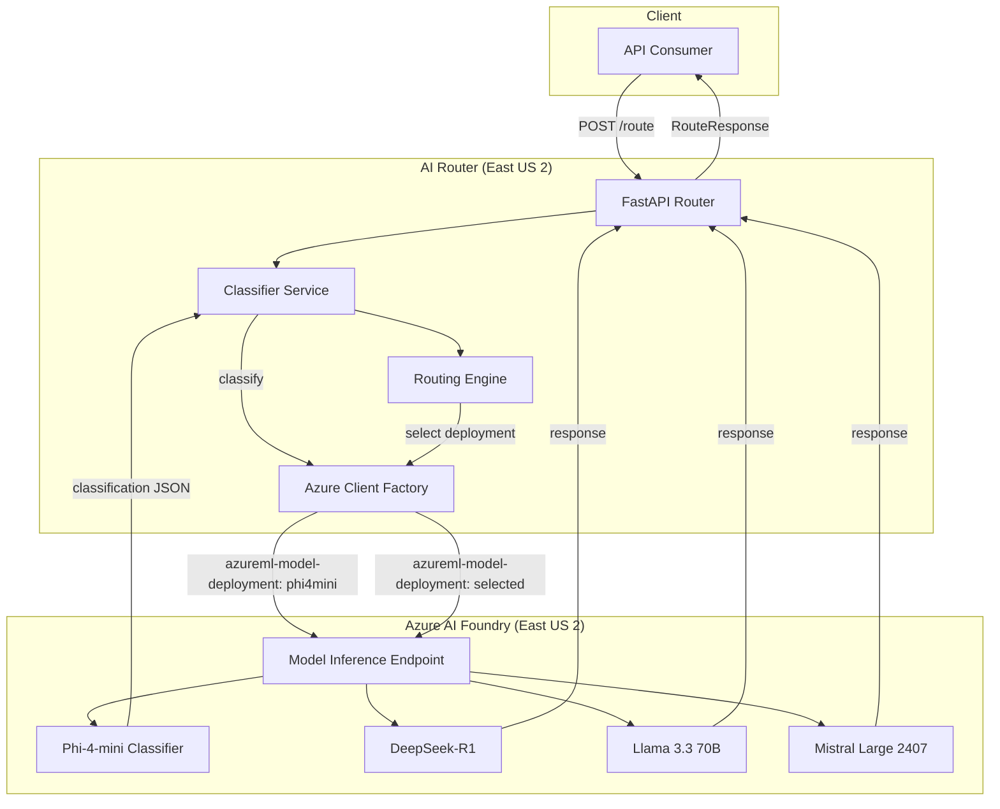

# Design Document: AI Router Azure US

## Overview

Le AI Router Huntaze est un service FastAPI qui route intelligemment les requêtes utilisateur vers différents modèles AI déployés sur Azure AI Foundry dans la région East US 2. Le système utilise un classifieur léger (Phi-4-mini) pour analyser les prompts entrants et les diriger vers le modèle optimal parmi DeepSeek-R1, Llama 3.3 70B, et Mistral Large 2407.

L'architecture repose sur l'endpoint unifié Azure AI Model Inference, permettant d'accéder à tous les modèles via une seule URL et clé API, en spécifiant le déploiement cible via le header HTTP `azureml-model-deployment`.

## Architecture



## Components and Interfaces

### 1. FastAPI Application (`main.py`)

Point d'entrée principal exposant les endpoints REST.

```typescript
interface RouteRequest {
  prompt: string;
  client_tier: "standard" | "vip";
}

interface RouteResponse {
  model: string;
  deployment: string;
  region: string;
  routing: ClassificationResult;
  output: string;
  usage: UsageStats | null;
}
```

### 2. Classifier Service

Analyse les prompts via Phi-4-mini et retourne une classification structurée.

```typescript
interface ClassificationResult {
  type: "math" | "coding" | "creative" | "chat";
  complexity: "high" | "low";
  language: "fr" | "en" | "other";
}
```

### 3. Routing Engine

Applique les règles de routage basées sur la classification et le tier client.

```typescript
interface RoutingRule {
  condition: (classification: ClassificationResult, tier: string) => boolean;
  deployment: string;
  priority: number;
}
```

### 4. Azure Client Factory

Crée des clients ChatCompletions configurés avec le header de déploiement approprié.

```typescript
interface AzureClientConfig {
  endpoint: string;
  apiKey: string;
  deploymentName: string;
}

interface DeploymentResponse {
  text: string;
  raw: object;
  usage: UsageStats | null;
}

interface UsageStats {
  prompt_tokens: number;
  completion_tokens: number;
  total_tokens: number;
}
```

## Data Models

### ClassificationResult

```python
@dataclass
class ClassificationResult:
    type: Literal["math", "coding", "creative", "chat"]
    complexity: Literal["high", "low"]
    language: Literal["fr", "en", "other"]
    
    @classmethod
    def from_json(cls, data: dict) -> "ClassificationResult":
        return cls(
            type=data.get("type", "chat"),
            complexity=data.get("complexity", "low"),
            language=data.get("language", "other")
        )
    
    def to_json(self) -> dict:
        return {
            "type": self.type,
            "complexity": self.complexity,
            "language": self.language
        }
```

### RouteRequest / RouteResponse (Pydantic)

```python
class RouteRequest(BaseModel):
    prompt: str
    client_tier: str = Field(default="standard")

class RouteResponse(BaseModel):
    model: str
    deployment: str
    region: str
    routing: Dict[str, Any]
    output: str
    usage: Optional[Dict[str, Any]] = None
```

### Configuration

```python
@dataclass
class RouterConfig:
    azure_endpoint: str
    azure_key: str
    deploy_deepseek: str = "deepseek-r1-us"
    deploy_llama: str = "llama33-70b-us"
    deploy_mistral: str = "mistral-large-2407-us"
    deploy_classifier: str = "phi4mini-classifier-us"
    
    @classmethod
    def from_env(cls) -> "RouterConfig":
        return cls(
            azure_endpoint=os.getenv("AZURE_AI_CHAT_ENDPOINT", ""),
            azure_key=os.getenv("AZURE_AI_CHAT_KEY", ""),
            deploy_deepseek=os.getenv("DEPLOY_DEEPSEEK", "deepseek-r1-us"),
            deploy_llama=os.getenv("DEPLOY_LLAMA", "llama33-70b-us"),
            deploy_mistral=os.getenv("DEPLOY_MISTRAL", "mistral-large-2407-us"),
            deploy_classifier=os.getenv("DEPLOY_PHI_CLASSIFIER", "phi4mini-classifier-us"),
        )
```

## Correctness Properties

*A property is a characteristic or behavior that should hold true across all valid executions of a system-essentially, a formal statement about what the system should do. Properties serve as the bridge between human-readable specifications and machine-verifiable correctness guarantees.*

### Property 1: Classification Result Round-Trip

*For any* valid ClassificationResult object, serializing it to JSON and then deserializing that JSON SHALL produce an equivalent ClassificationResult object.

**Validates: Requirements 1.5**

### Property 2: Classification Schema Validity

*For any* response from the Classifier, the parsed ClassificationResult SHALL contain a type in {math, coding, creative, chat}, a complexity in {high, low}, and a language in {fr, en, other}.

**Validates: Requirements 1.2, 1.4**

### Property 3: JSON Extraction from Malformed Response

*For any* string containing a valid JSON object between curly braces (with arbitrary text before/after), the JSON extraction function SHALL successfully parse and return the embedded JSON object.

**Validates: Requirements 1.3**

### Property 4: Routing Rules Consistency

*For any* ClassificationResult and client_tier combination, the routing engine SHALL return exactly one deployment name, and that deployment SHALL match the highest-priority applicable rule:
- math/coding + high complexity → DeepSeek-R1
- creative OR vip tier → Llama 3.3 70B
- chat type → Llama 3.3 70B
- fr language (no higher rule) → Mistral Large 2407
- fallback → Llama 3.3 70B

**Validates: Requirements 2.1, 2.2, 2.3, 2.4, 2.5**

### Property 5: Azure Header Inclusion

*For any* deployment call, the HTTP request SHALL include the `azureml-model-deployment` header with the correct deployment name.

**Validates: Requirements 3.1, 3.2**

### Property 6: Response Structure Completeness

*For any* successful routing request, the RouteResponse SHALL contain non-null values for model, deployment, region, routing, and output fields.

**Validates: Requirements 4.1**

### Property 7: Configuration Loading with Defaults

*For any* set of environment variables (including missing ones), the RouterConfig SHALL load with valid values, using defaults for any missing deployment names.

**Validates: Requirements 6.1, 6.2, 6.3**

## Error Handling

### Classification Errors

1. **Invalid JSON Response**: Attempt to extract JSON between `{` and `}` characters
2. **Unparseable Response**: Return default classification `{type: "chat", complexity: "low", language: "other"}`
3. **Missing Fields**: Use defaults for any missing field in the classification

### API Errors

1. **Empty Prompt**: Return HTTP 400 with `{"detail": "prompt vide"}`
2. **Missing Configuration**: Raise `RuntimeError` with descriptive message
3. **Azure API Failure**: Return HTTP 500 with error description
4. **Timeout**: Let Azure SDK handle with default timeout, propagate as 500

### Deployment Errors

1. **Model Unavailable**: Azure returns error, propagate as 500
2. **Rate Limited**: Azure returns 429, propagate with retry-after header

## Testing Strategy

### Unit Testing

Les tests unitaires couvrent:
- Parsing et validation des ClassificationResult
- Logique de routage isolée
- Extraction JSON depuis des réponses malformées
- Chargement de configuration

### Property-Based Testing

Nous utilisons **Hypothesis** (Python) pour les tests property-based.

Configuration minimale:
```python
from hypothesis import given, strategies as st, settings

@settings(max_examples=100)
```

Chaque test property-based:
- Exécute minimum 100 itérations
- Est annoté avec le numéro de propriété du design document
- Utilise des générateurs intelligents pour les types de données

### Test Annotations

Format requis pour chaque test property-based:
```python
# **Feature: ai-router-azure-us, Property 1: Classification Result Round-Trip**
```

### Générateurs Hypothesis

```python
classification_type = st.sampled_from(["math", "coding", "creative", "chat"])
complexity = st.sampled_from(["high", "low"])
language = st.sampled_from(["fr", "en", "other"])

classification_result = st.builds(
    ClassificationResult,
    type=classification_type,
    complexity=complexity,
    language=language
)

client_tier = st.sampled_from(["standard", "vip"])
```
