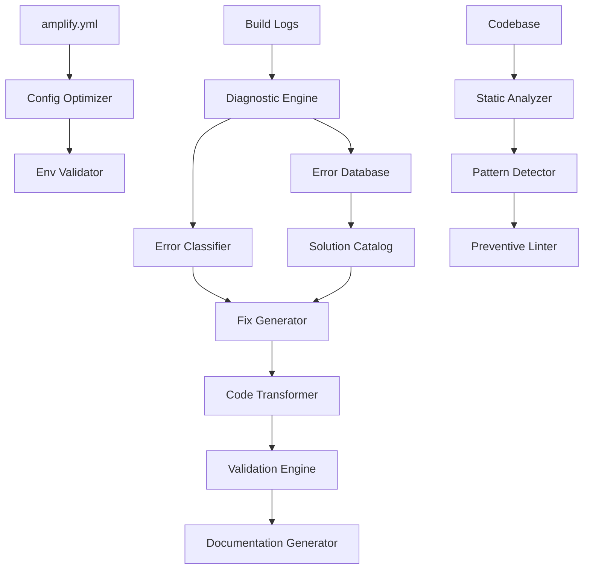

# Design Document - Amplify Build Fixes

## Overview

Ce document décrit l'architecture d'un système complet pour diagnostiquer, corriger et prévenir les erreurs de build sur AWS Amplify. Le système est conçu en trois phases : diagnostic, correction et prévention, avec des outils automatisés pour chaque phase.

## Architecture

### High-Level Architecture



### Component Layers

1. **Diagnostic Layer** - Analyse des erreurs et classification
2. **Correction Layer** - Application automatique des fixes
3. **Validation Layer** - Vérification des corrections
4. **Prevention Layer** - Garde-fous et linting
5. **Documentation Layer** - Génération de guides et références

## Components and Interfaces

### 1. Diagnostic Engine

**Responsabilité** : Analyser les logs de build et identifier les erreurs

**Interface** :
```typescript
interface DiagnosticEngine {
  analyzeBuildLogs(logs: string): BuildDiagnostic;
  classifyErrors(errors: BuildError[]): ErrorClassification;
  prioritizeErrors(classification: ErrorClassification): PrioritizedErrors;
  generateReport(diagnostic: BuildDiagnostic): DiagnosticReport;
}

interface BuildDiagnostic {
  buildId: string;
  timestamp: Date;
  errors: BuildError[];
  warnings: BuildWarning[];
  phase: BuildPhase;
  duration: number;
}

interface BuildError {
  type: ErrorType;
  message: string;
  file?: string;
  line?: number;
  stack?: string;
  severity: 'critical' | 'high' | 'medium' | 'low';
}

enum ErrorType {
  IMPORT_ERROR = 'import',
  EXPORT_ERROR = 'export',
  PRERENDER_ERROR = 'prerender',
  ENV_VAR_ERROR = 'env',
  OAUTH_ERROR = 'oauth',
  DIRECTIVE_ERROR = 'directive',
  TYPE_ERROR = 'type',
  RUNTIME_ERROR = 'runtime'
}
```

**Implementation Details** :
- Parse les logs Amplify ligne par ligne
- Utilise des regex patterns pour identifier les types d'erreurs
- Maintient une base de données d'erreurs connues
- Calcule la fréquence et l'impact de chaque erreur

### 2. Error Classifier

**Responsabilité** : Catégoriser les erreurs et identifier les patterns

**Interface** :
```typescript
interface ErrorClassifier {
  classify(error: BuildError): ErrorCategory;
  detectPattern(errors: BuildError[]): ErrorPattern[];
  findSimilarErrors(error: BuildError): BuildError[];
  suggestRootCause(errors: BuildError[]): RootCause;
}

interface ErrorCategory {
  type: ErrorType;
  subtype: string;
  affectedFiles: string[];
  relatedErrors: string[];
  knownSolution?: Solution;
}

interface ErrorPattern {
  name: string;
  frequency: number;
  examples: BuildError[];
  commonCause: string;
  recommendedFix: string;
}
```

**Implementation Details** :
- Utilise un système de règles pour la classification
- Détecte les patterns récurrents (ex: toutes les erreurs OAuth)
- Groupe les erreurs liées (ex: import manquant → multiples fichiers affectés)
- Suggère la cause racine basée sur l'historique

### 3. Fix Generator

**Responsabilité** : Générer les corrections appropriées pour chaque type d'erreur

**Interface** :
```typescript
interface FixGenerator {
  generateFix(error: BuildError): Fix;
  generateBatchFixes(errors: BuildError[]): Fix[];
  validateFix(fix: Fix): ValidationResult;
  applyFix(fix: Fix): ApplyResult;
}

interface Fix {
  id: string;
  errorId: string;
  type: FixType;
  description: string;
  files: FileChange[];
  commands?: string[];
  envVars?: EnvVarChange[];
  priority: number;
  estimatedImpact: 'low' | 'medium' | 'high';
}

enum FixType {
  ADD_EXPORT = 'add_export',
  ADD_IMPORT = 'add_import',
  ADD_DIRECTIVE = 'add_directive',
  MOVE_DIRECTIVE = 'move_directive',
  ADD_GUARD = 'add_guard',
  LAZY_INSTANTIATION = 'lazy_instantiation',
  SPLIT_COMPONENT = 'split_component',
  ADD_ENV_VAR = 'add_env_var',
  UPDATE_CONFIG = 'update_config'
}

interface FileChange {
  path: string;
  operation: 'create' | 'update' | 'delete';
  content?: string;
  patches?: Patch[];
}

interface Patch {
  type: 'insert' | 'replace' | 'delete';
  line?: number;
  oldText?: string;
  newText: string;
}
```

**Implementation Details** :
- Maintient un catalogue de solutions pour chaque type d'erreur
- Génère des patches AST-aware pour les modifications de code
- Valide les fixes avant application
- Supporte les fixes en batch pour les erreurs liées

### 4. Code Transformer

**Responsabilité** : Appliquer les transformations de code de manière sûre

**Interface** :
```typescript
interface CodeTransformer {
  transform(file: string, patches: Patch[]): TransformResult;
  addExport(file: string, exportName: string, exportValue: string): void;
  addImport(file: string, importPath: string, imports: string[]): void;
  addDirective(file: string, directive: string, position: 'top' | 'after-imports'): void;
  wrapInGuard(file: string, code: string, guardType: 'window' | 'document'): void;
  splitComponent(file: string): { server: string; client: string };
}

interface TransformResult {
  success: boolean;
  originalContent: string;
  transformedContent: string;
  changes: Change[];
  errors?: string[];
}

interface Change {
  type: string;
  line: number;
  description: string;
}
```

**Implementation Details** :
- Utilise TypeScript Compiler API pour les transformations AST
- Préserve le formatage et les commentaires
- Crée des backups avant modification
- Supporte le rollback en cas d'erreur

### 5. Lazy Instantiation Transformer

**Responsabilité** : Convertir les services externes en lazy instantiation

**Interface** :
```typescript
interface LazyInstantiationTransformer {
  detectTopLevelInstantiation(file: string): InstantiationSite[];
  transformToLazy(site: InstantiationSite): LazyPattern;
  generateGetterFunction(className: string, config: ServiceConfig): string;
  updateCallSites(file: string, oldPattern: string, newPattern: string): void;
}

interface InstantiationSite {
  file: string;
  line: number;
  className: string;
  variableName: string;
  config: Record<string, any>;
}

interface LazyPattern {
  privateVariable: string;
  getterFunction: string;
  errorHandling: string;
}
```

**Pattern Template** :
```typescript
// Template pour lazy instantiation
const LAZY_PATTERN = `
let {variableName}: {className} | null = null;

function get{ClassName}(): {className} {
  if (!{variableName}) {
    if (!process.env.{ENV_VAR}) {
      throw new Error('{serviceName} not configured. Please set {ENV_VAR}');
    }
    {variableName} = new {className}({
      {config}
    });
  }
  return {variableName};
}
`;
```

### 6. Directive Manager

**Responsabilité** : Gérer les directives Next.js ('use client', dynamic)

**Interface** :
```typescript
interface DirectiveManager {
  detectDirectives(file: string): Directive[];
  validateDirectivePosition(file: string, directive: Directive): ValidationResult;
  moveDirective(file: string, directive: string, position: 'top'): void;
  resolveConflict(file: string, directives: Directive[]): ConflictResolution;
}

interface Directive {
  type: 'use client' | 'use server' | 'dynamic' | 'runtime';
  line: number;
  value?: string;
}

interface ConflictResolution {
  strategy: 'split' | 'remove' | 'reorder';
  serverFile?: string;
  clientFile?: string;
  changes: FileChange[];
}
```

**Conflict Resolution Strategies** :

1. **'use client' + export const dynamic** → Split en Server + Client Components
2. **Multiple 'use client'** → Garder seulement le premier
3. **'use client' après imports** → Déplacer en première ligne

### 7. Environment Validator

**Responsabilité** : Valider et gérer les variables d'environnement

**Interface** :
```typescript
interface EnvironmentValidator {
  validateEnvVars(required: EnvVarSpec[]): ValidationResult;
  generateEnvExample(vars: EnvVarSpec[]): string;
  syncEnvFiles(source: '.env', targets: ['.env.example', '.env.production']): void;
  detectMissingVars(amplifyYml: string): string[];
}

interface EnvVarSpec {
  name: string;
  required: boolean;
  defaultValue?: string;
  description: string;
  usedIn: string[];
  validationPattern?: RegExp;
}

interface EnvVarValidation {
  name: string;
  present: boolean;
  valid: boolean;
  error?: string;
  suggestion?: string;
}
```

**Implementation Details** :
- Parse amplify.yml pour extraire les variables
- Compare avec .env.example pour détecter les manquantes
- Génère des valeurs par défaut appropriées
- Valide le format des URLs, secrets, etc.

### 8. Prerender Guard Injector

**Responsabilité** : Ajouter des guards pour le code browser-only

**Interface** :
```typescript
interface PrerenderGuardInjector {
  detectBrowserCode(file: string): BrowserCodeSite[];
  injectGuards(sites: BrowserCodeSite[]): GuardInjection[];
  addDynamicDirective(file: string): void;
  wrapInUseEffect(file: string, code: string): void;
}

interface BrowserCodeSite {
  file: string;
  line: number;
  code: string;
  type: 'window' | 'document' | 'localStorage' | 'navigator';
  context: 'top-level' | 'function' | 'component';
}

interface GuardInjection {
  site: BrowserCodeSite;
  strategy: 'guard' | 'useEffect' | 'dynamic-directive' | 'client-component';
  code: string;
}
```

**Guard Patterns** :

```typescript
// Pattern 1: Conditional guard
if (typeof window !== 'undefined') {
  // browser code
}

// Pattern 2: useEffect
useEffect(() => {
  // browser code
}, []);

// Pattern 3: Dynamic directive
export const dynamic = 'force-dynamic';

// Pattern 4: Client component split
'use client';
```

### 9. Static Analyzer

**Responsabilité** : Analyser le code statiquement pour détecter les problèmes

**Interface** :
```typescript
interface StaticAnalyzer {
  analyzeImports(file: string): ImportAnalysis;
  analyzeExports(file: string): ExportAnalysis;
  detectAntiPatterns(file: string): AntiPattern[];
  validateTypeScript(files: string[]): TypeScriptError[];
}

interface ImportAnalysis {
  imports: Import[];
  missingExports: MissingExport[];
  unusedImports: string[];
  circularDependencies: string[][];
}

interface ExportAnalysis {
  exports: Export[];
  unusedExports: string[];
  missingTypes: string[];
}

interface AntiPattern {
  type: string;
  file: string;
  line: number;
  description: string;
  fix: string;
  severity: 'error' | 'warning' | 'info';
}
```

**Anti-Patterns Detected** :
- Top-level instantiation de services externes
- 'use client' mal placé
- Code browser sans guards
- Imports circulaires
- Exports manquants

### 10. Build Validator

**Responsabilité** : Valider le build avant déploiement

**Interface** :
```typescript
interface BuildValidator {
  validateLocal(): BuildValidationResult;
  simulateAmplifyBuild(): SimulationResult;
  checkDependencies(): DependencyCheck;
  validateRoutes(): RouteValidation[];
}

interface BuildValidationResult {
  success: boolean;
  errors: BuildError[];
  warnings: BuildWarning[];
  duration: number;
  recommendations: string[];
}

interface SimulationResult {
  phases: {
    preBuild: PhaseResult;
    build: PhaseResult;
    postBuild: PhaseResult;
  };
  envVars: EnvVarCheck[];
  artifacts: string[];
}
```

**Validation Steps** :
1. TypeScript compilation
2. ESLint checks
3. Import/export validation
4. Environment variable checks
5. Next.js build simulation
6. Route validation

## Data Models

### Error Database Schema

```typescript
interface ErrorRecord {
  id: string;
  buildId: string;
  timestamp: Date;
  type: ErrorType;
  message: string;
  file?: string;
  line?: number;
  stack?: string;
  resolved: boolean;
  solution?: Solution;
  occurrences: number;
}

interface Solution {
  id: string;
  errorType: ErrorType;
  description: string;
  fixes: Fix[];
  successRate: number;
  lastApplied: Date;
  documentation: string;
}

interface BuildHistory {
  buildId: string;
  timestamp: Date;
  status: 'success' | 'failure';
  duration: number;
  errors: ErrorRecord[];
  commit: string;
  branch: string;
}
```

### Configuration Models

```typescript
interface AmplifyConfig {
  version: number;
  frontend: {
    phases: {
      preBuild: Phase;
      build: Phase;
      postBuild?: Phase;
    };
    artifacts: Artifacts;
    cache: Cache;
  };
}

interface Phase {
  commands: string[];
}

interface EnvConfig {
  required: EnvVarSpec[];
  optional: EnvVarSpec[];
  defaults: Record<string, string>;
}
```

## Error Handling

### Error Recovery Strategies

1. **Import/Export Errors**
   - Analyze module structure
   - Add missing exports
   - Update import statements
   - Validate with TypeScript compiler

2. **Prerender Errors**
   - Detect browser-only code
   - Add appropriate guards
   - Force dynamic rendering if needed
   - Split components if necessary

3. **Environment Variable Errors**
   - Identify missing variables
   - Add to amplify.yml with defaults
   - Update .env.example
   - Document in README

4. **OAuth/External Service Errors**
   - Convert to lazy instantiation
   - Add runtime checks
   - Implement graceful degradation
   - Document configuration

5. **Directive Errors**
   - Validate directive position
   - Move to correct location
   - Resolve conflicts by splitting
   - Update component structure

### Rollback Mechanism

```typescript
interface RollbackManager {
  createBackup(files: string[]): Backup;
  rollback(backupId: string): void;
  listBackups(): Backup[];
  cleanOldBackups(olderThan: Date): void;
}

interface Backup {
  id: string;
  timestamp: Date;
  files: BackupFile[];
  reason: string;
}

interface BackupFile {
  path: string;
  content: string;
  hash: string;
}
```

## Testing Strategy

### Unit Tests

1. **Diagnostic Engine Tests**
   - Test error parsing from logs
   - Test error classification
   - Test pattern detection

2. **Fix Generator Tests**
   - Test fix generation for each error type
   - Test batch fix generation
   - Test fix validation

3. **Code Transformer Tests**
   - Test AST transformations
   - Test directive management
   - Test lazy instantiation conversion

### Integration Tests

1. **End-to-End Fix Application**
   - Create intentional errors
   - Run diagnostic → fix → validate
   - Verify build succeeds

2. **Build Simulation Tests**
   - Simulate Amplify environment
   - Test with missing env vars
   - Test with various error scenarios

3. **Rollback Tests**
   - Apply fixes
   - Trigger rollback
   - Verify original state restored

### Validation Tests

1. **Build Validation**
   - Run local build
   - Check for errors
   - Validate artifacts

2. **Static Analysis**
   - Run TypeScript compiler
   - Run ESLint
   - Check import/export consistency

## Performance Considerations

### Optimization Strategies

1. **Caching**
   - Cache parsed ASTs
   - Cache error classifications
   - Cache fix templates

2. **Parallel Processing**
   - Analyze multiple files in parallel
   - Apply independent fixes concurrently
   - Run validation checks in parallel

3. **Incremental Analysis**
   - Only analyze changed files
   - Reuse previous build diagnostics
   - Skip validation for unchanged code

### Performance Metrics

- Diagnostic time: < 30 seconds
- Fix generation time: < 10 seconds per error
- Code transformation time: < 5 seconds per file
- Full validation time: < 2 minutes

## Security Considerations

1. **Code Transformation Safety**
   - Always create backups before modifications
   - Validate transformations with TypeScript compiler
   - Never execute arbitrary code
   - Sanitize all inputs

2. **Environment Variable Security**
   - Never log sensitive values
   - Validate env var formats
   - Warn about exposed secrets
   - Use secure defaults

3. **External Service Integration**
   - Validate API credentials format
   - Implement rate limiting
   - Handle authentication errors gracefully
   - Never expose credentials in logs

## Documentation Strategy

### Generated Documentation

1. **Error Catalog**
   - All known errors with solutions
   - Frequency and impact data
   - Step-by-step fix guides

2. **Pattern Guide**
   - Best practices for each pattern
   - Anti-patterns to avoid
   - Code examples

3. **Configuration Guide**
   - amplify.yml setup
   - Environment variables
   - Build optimization

4. **Troubleshooting Guide**
   - Common issues
   - Diagnostic steps
   - Quick fixes

### Documentation Format

```markdown
# Error: [Error Type]

## Description
[Clear description of the error]

## Cause
[Root cause explanation]

## Solution
[Step-by-step fix]

## Prevention
[How to avoid in the future]

## Examples
[Code examples before/after]

## Related Errors
[Links to related errors]
```

## Monitoring and Alerting

### Metrics to Track

1. **Build Metrics**
   - Build success rate
   - Average build duration
   - Error frequency by type
   - Time to resolution

2. **Fix Metrics**
   - Fix success rate
   - Average fix time
   - Rollback frequency
   - Manual intervention rate

3. **Code Quality Metrics**
   - Anti-pattern occurrences
   - Import/export consistency
   - TypeScript error count
   - Test coverage

### Alert Conditions

1. **Critical Alerts**
   - Build failure rate > 50%
   - Same error recurring > 3 times
   - Fix application failure
   - Security vulnerability detected

2. **Warning Alerts**
   - Build duration > 10 minutes
   - New error type detected
   - Anti-pattern count increasing
   - Environment variable missing

## Implementation Phases

### Phase 1: Diagnostic (Week 1)
- Implement error parsing
- Build error database
- Create classification system
- Generate diagnostic reports

### Phase 2: Automated Fixes (Week 2)
- Implement fix generators
- Build code transformers
- Add lazy instantiation converter
- Create directive manager

### Phase 3: Validation (Week 3)
- Implement build validator
- Add static analyzer
- Create test suite
- Build rollback system

### Phase 4: Prevention (Week 4)
- Create custom ESLint rules
- Build pre-commit hooks
- Generate documentation
- Setup monitoring

### Phase 5: Optimization (Week 5)
- Optimize performance
- Add caching
- Improve error messages
- Refine fix strategies
