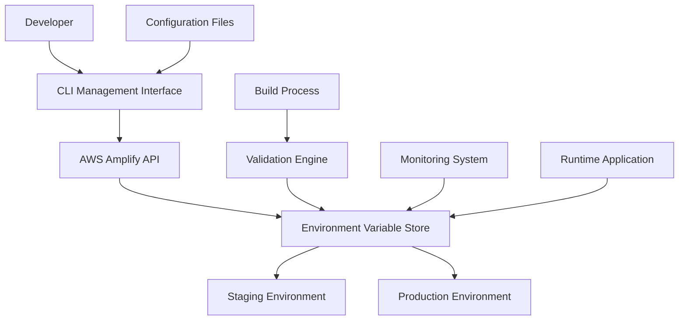
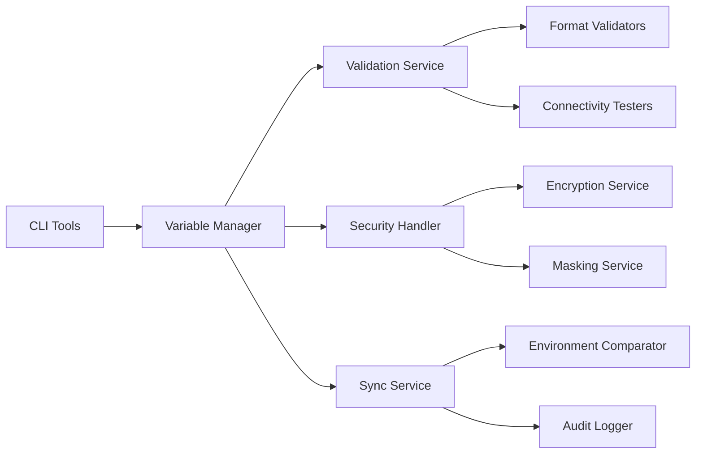

# Design Document

## Overview

The AWS Amplify Environment Variables Management system provides a comprehensive solution for configuring, validating, and maintaining environment variables across different deployment environments. The system combines AWS CLI automation, validation frameworks, and monitoring capabilities to ensure reliable configuration management.

## Architecture

### High-Level Architecture



### Component Architecture



## Components and Interfaces

### 1. CLI Management Interface

**Purpose**: Provides command-line tools for managing environment variables programmatically.

**Key Features**:
- Bulk variable operations using AWS CLI
- Configuration file support (JSON/YAML)
- Interactive prompts for sensitive data
- Diff preview before applying changes

**Interface**:
```typescript
interface CLIManager {
  setVariables(appId: string, branchName: string, variables: Record<string, string>): Promise<void>
  getVariables(appId: string, branchName?: string): Promise<Record<string, string>>
  compareEnvironments(appId: string, branch1: string, branch2: string): Promise<VariableDiff>
  applyConfigFile(appId: string, configPath: string): Promise<void>
  validateConfiguration(appId: string, branchName: string): Promise<ValidationResult>
}
```

### 2. Variable Validation Engine

**Purpose**: Ensures all environment variables meet format requirements and connectivity standards.

**Key Features**:
- Format validation for different variable types
- Connectivity testing for external services
- Required variable presence checking
- Custom validation rules

**Interface**:
```typescript
interface ValidationEngine {
  validateDatabaseUrl(url: string): ValidationResult
  validateJwtSecret(secret: string): ValidationResult
  validateAzureOpenAI(config: AzureOpenAIConfig): ValidationResult
  validateConnectivity(variables: Record<string, string>): Promise<ValidationResult>
  generateReport(appId: string, branchName: string): Promise<ValidationReport>
}
```

### 3. Security Handler

**Purpose**: Manages secure storage and access of sensitive environment variables.

**Key Features**:
- Automatic masking of sensitive values
- Encryption validation
- Secure logging practices
- Access control verification

**Interface**:
```typescript
interface SecurityHandler {
  maskSensitiveValues(variables: Record<string, string>): Record<string, string>
  validateEncryption(appId: string): Promise<boolean>
  auditAccess(appId: string, branchName: string, action: string): Promise<void>
  rotateSensitiveVariables(appId: string, rotationConfig: RotationConfig): Promise<void>
}
```

### 4. Environment Synchronization Service

**Purpose**: Manages consistency and synchronization between different environments.

**Key Features**:
- Environment comparison and diff generation
- Selective variable promotion
- Configuration drift detection
- Backup and restore capabilities

**Interface**:
```typescript
interface SyncService {
  compareEnvironments(appId: string, sourceEnv: string, targetEnv: string): Promise<EnvironmentDiff>
  promoteVariables(appId: string, sourceEnv: string, targetEnv: string, variables: string[]): Promise<void>
  detectDrift(appId: string, expectedConfig: Record<string, string>): Promise<DriftReport>
  createBackup(appId: string, branchName: string): Promise<BackupInfo>
}
```

### 5. Monitoring and Alerting System

**Purpose**: Provides real-time monitoring and alerting for environment variable issues.

**Key Features**:
- Runtime variable monitoring
- Build failure analysis
- Configuration health checks
- Alert notifications

**Interface**:
```typescript
interface MonitoringSystem {
  monitorVariableAccess(appId: string, branchName: string): Promise<void>
  analyzeBuilds(appId: string, buildIds: string[]): Promise<BuildAnalysis>
  performHealthCheck(appId: string): Promise<HealthReport>
  configureAlerts(appId: string, alertConfig: AlertConfiguration): Promise<void>
}
```

## Data Models

### Environment Variable Configuration

```typescript
interface EnvironmentVariable {
  key: string
  value: string
  isSensitive: boolean
  isRequired: boolean
  validationRules: ValidationRule[]
  lastModified: Date
  modifiedBy: string
}

interface EnvironmentConfig {
  appId: string
  branchName: string
  variables: EnvironmentVariable[]
  metadata: {
    version: string
    createdAt: Date
    lastValidated: Date
  }
}
```

### Validation Results

```typescript
interface ValidationResult {
  isValid: boolean
  errors: ValidationError[]
  warnings: ValidationWarning[]
  suggestions: string[]
}

interface ValidationError {
  variable: string
  message: string
  expectedFormat?: string
  severity: 'critical' | 'error' | 'warning'
}
```

### Configuration Management

```typescript
interface ConfigurationFile {
  version: string
  environments: {
    [branchName: string]: {
      variables: Record<string, string>
      overrides?: Record<string, string>
    }
  }
  validation: {
    required: string[]
    formats: Record<string, string>
  }
}
```

## Error Handling

### Error Categories

1. **Configuration Errors**
   - Missing required variables
   - Invalid variable formats
   - Connectivity failures

2. **Security Errors**
   - Insufficient permissions
   - Encryption failures
   - Access violations

3. **Synchronization Errors**
   - Environment conflicts
   - Network timeouts
   - API rate limits

### Error Recovery Strategies

```typescript
interface ErrorHandler {
  handleConfigurationError(error: ConfigurationError): Promise<RecoveryAction>
  handleSecurityError(error: SecurityError): Promise<SecurityAction>
  handleSyncError(error: SyncError): Promise<SyncAction>
  generateErrorReport(errors: Error[]): ErrorReport
}
```

## Testing Strategy

### Unit Testing

- **Variable Validation**: Test all validation rules and formats
- **Security Functions**: Test masking and encryption utilities
- **CLI Commands**: Test command parsing and execution
- **Configuration Parsing**: Test file format handling

### Integration Testing

- **AWS Amplify API**: Test actual API interactions
- **Environment Synchronization**: Test cross-environment operations
- **Build Integration**: Test variable injection during builds
- **Monitoring Integration**: Test alert and notification systems

### End-to-End Testing

- **Complete Workflows**: Test full variable management lifecycle
- **Multi-Environment**: Test staging to production promotion
- **Failure Scenarios**: Test error handling and recovery
- **Performance**: Test bulk operations and large configurations

### Test Data Management

```typescript
interface TestEnvironment {
  mockAmplifyAPI(): void
  createTestVariables(): Record<string, string>
  simulateFailures(type: FailureType): void
  cleanupTestData(): Promise<void>
}
```

## Security Considerations

### Data Protection

- All sensitive variables encrypted at rest
- Secure transmission using HTTPS/TLS
- Access logging and audit trails
- Regular security assessments

### Access Control

- Role-based access to environment variables
- Multi-factor authentication for sensitive operations
- API key rotation policies
- Principle of least privilege

### Compliance

- GDPR compliance for user data
- SOC 2 compliance for security controls
- Regular penetration testing
- Security incident response procedures

## Performance Optimization

### Caching Strategy

- Cache frequently accessed variables
- Implement cache invalidation on updates
- Use Redis for distributed caching
- Optimize API call patterns

### Scalability

- Support for multiple applications
- Batch operations for bulk updates
- Asynchronous processing for large operations
- Rate limiting and throttling

## Deployment Strategy

### Phased Rollout

1. **Phase 1**: CLI tools and basic validation
2. **Phase 2**: Security enhancements and monitoring
3. **Phase 3**: Advanced synchronization features
4. **Phase 4**: Full automation and integration

### Rollback Plan

- Maintain configuration backups
- Version control for all changes
- Quick rollback procedures
- Emergency access protocols

## Monitoring and Observability

### Metrics

- Variable access frequency
- Validation success rates
- Build failure correlation
- Performance metrics

### Logging

- Structured logging with correlation IDs
- Security event logging
- Performance monitoring
- Error tracking and alerting

### Dashboards

- Real-time configuration status
- Environment health overview
- Security compliance metrics
- Performance analytics