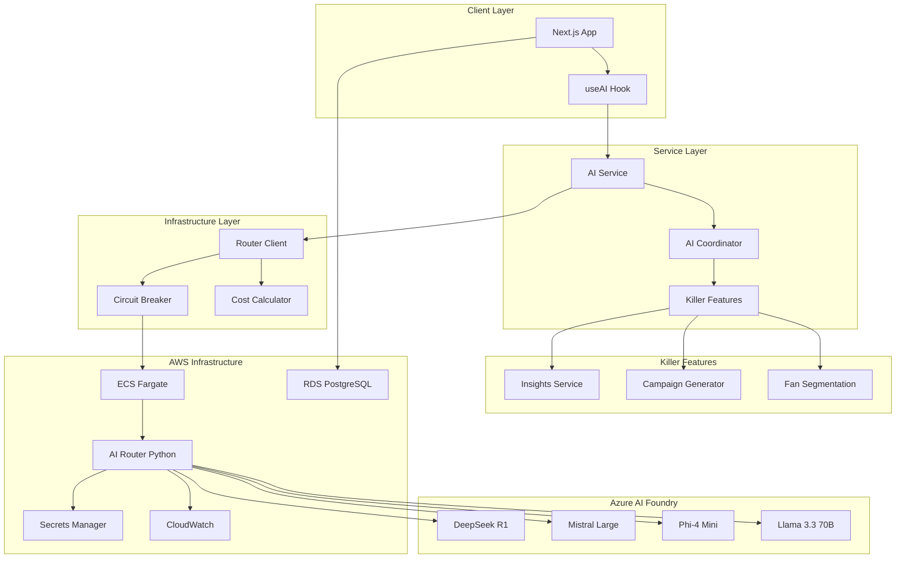

# Design Document: AWS AI System Validation

## Overview

Ce document décrit l'architecture et la stratégie de validation pour vérifier que le système AI Huntaze et ses killer features sont correctement configurés et fonctionnels sur l'infrastructure AWS. La validation couvre le AI Router déployé sur ECS, les trois killer features (Insights, Campaign Generator, Fan Segmentation), la connectivité AWS, et les mécanismes de résilience.

## Architecture



## Components and Interfaces

### 1. AI Router Health Validator

Vérifie la santé du AI Router déployé sur AWS ECS.

```typescript
interface HealthCheckResult {
  healthy: boolean;
  responseTimeMs: number;
  region: string;
  service: string;
  timestamp: Date;
}

interface AIRouterHealthValidator {
  checkHealth(): Promise<HealthCheckResult>;
  checkEndpointAccessibility(): Promise<boolean>;
  getRouterUrl(): string;
}
```

### 2. Killer Features Validator

Valide les trois killer features AI.

```typescript
interface InsightsValidationResult {
  success: boolean;
  responseTimeMs: number;
  model: string;
  hasRequiredFields: boolean;
  tokenUsage: TokenUsage;
}

interface CampaignValidationResult {
  success: boolean;
  responseTimeMs: number;
  hasSubjectLine: boolean;
  hasBodyContent: boolean;
  hasVariations: boolean;
  correlationId: string;
}

interface SegmentationValidationResult {
  success: boolean;
  responseTimeMs: number;
  model: string;
  validSegments: boolean;
  churnProbabilityValid: boolean;
  hasRecommendations: boolean;
}

interface KillerFeaturesValidator {
  validateInsights(metrics: MetricsData): Promise<InsightsValidationResult>;
  validateCampaignGenerator(request: CampaignRequest): Promise<CampaignValidationResult>;
  validateFanSegmentation(fans: Fan[]): Promise<SegmentationValidationResult>;
}
```

### 3. AWS Connectivity Validator

Vérifie la connectivité aux services AWS.

```typescript
interface AWSConnectivityResult {
  rdsConnected: boolean;
  secretsManagerAccessible: boolean;
  cloudWatchWritable: boolean;
  routerAccessible: boolean;
  errors: string[];
}

interface AWSConnectivityValidator {
  validateAll(): Promise<AWSConnectivityResult>;
  checkRDSConnection(): Promise<boolean>;
  checkSecretsManager(): Promise<boolean>;
  checkRouterEndpoint(): Promise<boolean>;
}
```

### 4. Fallback and Resilience Validator

Valide les mécanismes de fallback et circuit breaker.

```typescript
interface FallbackValidationResult {
  fallbackTriggered: boolean;
  fallbackTimeMs: number;
  fallbackReason: string;
  legacyProviderUsed: boolean;
}

interface CircuitBreakerValidationResult {
  circuitOpen: boolean;
  failureCount: number;
  blockedRequests: number;
  resetTimeMs: number;
}

interface ResilienceValidator {
  testFallbackMechanism(): Promise<FallbackValidationResult>;
  testCircuitBreaker(): Promise<CircuitBreakerValidationResult>;
  testErrorHandling(): Promise<boolean>;
}
```

### 5. Cost Tracking Validator

Valide le tracking des coûts AI.

```typescript
interface CostValidationResult {
  costCalculated: boolean;
  hasModelName: boolean;
  hasInputTokens: boolean;
  hasOutputTokens: boolean;
  hasTotalCostUsd: boolean;
  calculatedCost: number;
}

interface CostTrackingValidator {
  validateCostCalculation(usage: TokenUsage): Promise<CostValidationResult>;
  validateCostBreakdown(response: AIResult): Promise<boolean>;
}
```

## Data Models

### Token Usage

```typescript
interface TokenUsage {
  inputTokens: number;
  outputTokens: number;
  totalTokens: number;
}
```

### Cost Breakdown

```typescript
interface CostBreakdown {
  model: string;
  inputCost: number;
  outputCost: number;
  totalCost: number;
  usedDefaultPricing: boolean;
}
```

### Validation Report

```typescript
interface ValidationReport {
  timestamp: Date;
  environment: string;
  routerHealth: HealthCheckResult;
  killerFeatures: {
    insights: InsightsValidationResult;
    campaignGenerator: CampaignValidationResult;
    fanSegmentation: SegmentationValidationResult;
  };
  awsConnectivity: AWSConnectivityResult;
  resilience: {
    fallback: FallbackValidationResult;
    circuitBreaker: CircuitBreakerValidationResult;
  };
  costTracking: CostValidationResult;
  overallStatus: 'PASS' | 'PARTIAL' | 'FAIL';
  errors: string[];
}
```

## Correctness Properties

*A property is a characteristic or behavior that should hold true across all valid executions of a system-essentially, a formal statement about what the system should do. Properties serve as the bridge between human-readable specifications and machine-verifiable correctness guarantees.*

### Property 1: Health Check Response Time

*For any* health check request to the AI Router, the response time SHALL be less than 1000 milliseconds and the status SHALL be "healthy".

**Validates: Requirements 1.1**

### Property 2: Insights Response Structure

*For any* valid metrics data submitted to the Insights service, the response SHALL contain type, severity, recommendations fields AND include token usage data for billing.

**Validates: Requirements 2.3, 2.4**

### Property 3: Campaign Response Completeness

*For any* campaign generation request, the response SHALL contain subject lines, body content, and A/B variations with predicted engagement scores.

**Validates: Requirements 3.2, 3.3**

### Property 4: Segmentation Output Validity

*For any* fan data submitted for segmentation, the result SHALL categorize each fan into one of the valid segments (Whales, Regulars, At-risk, New, Dormant), return a churn probability in range [0, 1], and include personalized recommendations.

**Validates: Requirements 4.1, 4.3, 4.4**

### Property 5: Fallback Timing Guarantee

*For any* primary provider failure, the system SHALL complete fallback to the legacy provider within 5000 milliseconds and include fallback metadata in the response.

**Validates: Requirements 6.1, 6.2**

### Property 6: Circuit Breaker Behavior

*For any* sequence of failures exceeding the threshold (5 failures), the circuit breaker SHALL open and block subsequent requests for the configured reset period (30 seconds).

**Validates: Requirements 6.3**

### Property 7: Cost Calculation Completeness

*For any* AI request with token usage, the cost calculation SHALL include model name, input tokens, output tokens, and total cost in USD.

**Validates: Requirements 7.1, 7.2**

### Property 8: AI Service Response Metadata

*For any* request processed through the AI Service, the response SHALL include model metadata (model name, deployment, region) and route to the appropriate model based on request type.

**Validates: Requirements 8.1, 8.2, 8.3**

### Property 9: Coordinator Multi-Agent Orchestration

*For any* request processed by the AI Coordinator, the response SHALL include the list of agents involved and combine their outputs correctly.

**Validates: Requirements 8.4**

## Error Handling

### Router Connection Errors

```typescript
// Handle router unavailability
try {
  const result = await routerClient.route(request);
} catch (error) {
  if (error instanceof RouterError) {
    switch (error.code) {
      case RouterErrorCode.CONNECTION_ERROR:
        // Router not reachable - check ECS deployment
        logger.error('AI Router not reachable', { endpoint: error.endpoint });
        break;
      case RouterErrorCode.TIMEOUT_ERROR:
        // Request timed out - may need to increase timeout
        logger.warn('AI Router timeout', { timeoutMs: 60000 });
        break;
      case RouterErrorCode.SERVICE_ERROR:
        // Router returned error - check Azure credentials
        logger.error('AI Router service error', { status: error.statusCode });
        break;
    }
  }
  // Trigger fallback if enabled
  if (providerConfig.isFallbackEnabled()) {
    return await fallbackToLegacy(request);
  }
  throw error;
}
```

### Validation Errors

```typescript
// Handle validation failures
interface ValidationError {
  component: string;
  requirement: string;
  expected: string;
  actual: string;
  severity: 'critical' | 'warning' | 'info';
}

function handleValidationError(error: ValidationError): void {
  if (error.severity === 'critical') {
    // Alert immediately
    alertService.sendCriticalAlert(error);
  }
  // Log for analysis
  logger.error('Validation failed', error);
}
```

## Testing Strategy

### Dual Testing Approach

Cette validation utilise à la fois des tests unitaires et des tests property-based pour assurer une couverture complète.

### Unit Tests

Les tests unitaires couvrent:
- Health check endpoint response parsing
- Cost calculation for known token counts
- Segment categorization logic
- Error handling edge cases

### Property-Based Tests

Les tests property-based utilisent **fast-check** pour générer des inputs aléatoires et vérifier les propriétés invariantes:

```typescript
// Example: Property test for cost calculation
import * as fc from 'fast-check';

/**
 * **Feature: aws-ai-system-validation, Property 7: Cost Calculation Completeness**
 * **Validates: Requirements 7.1, 7.2**
 */
test('cost calculation includes all required fields', () => {
  fc.assert(
    fc.property(
      fc.record({
        inputTokens: fc.nat({ max: 100000 }),
        outputTokens: fc.nat({ max: 100000 }),
      }),
      (usage) => {
        const cost = calculateCostBreakdown('mistral-large', usage);
        return (
          typeof cost.model === 'string' &&
          typeof cost.inputCost === 'number' &&
          typeof cost.outputCost === 'number' &&
          typeof cost.totalCost === 'number' &&
          cost.totalCost >= 0
        );
      }
    ),
    { numRuns: 100 }
  );
});
```

### Integration Tests

Les tests d'intégration vérifient:
- Connectivité réelle au AI Router sur ECS
- Appels aux killer features avec données réelles
- Fallback mechanism avec simulation de pannes
- Cost tracking end-to-end

### Test Configuration

```typescript
// vitest.config.validation.ts
export default defineConfig({
  test: {
    include: ['tests/validation/**/*.test.ts'],
    testTimeout: 30000, // 30s for integration tests
    hookTimeout: 10000,
    globals: true,
  },
});
```
