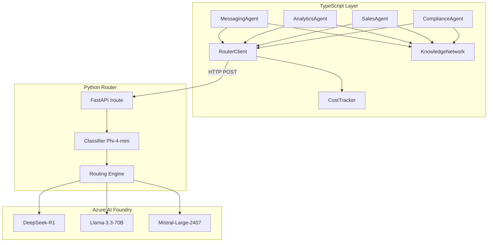

# Design Document: Azure AI Foundry Agents Integration

## Overview

This design integrates the existing TypeScript AI agents with the new Python-based AI Router that routes requests to Azure AI Foundry models. The integration creates a TypeScript client that calls the router's REST API, maps agent types to routing hints, and preserves the existing agent interfaces while leveraging the new multi-model architecture.

**Architecture Flow:**
```
TypeScript Agent → Router Client → Python AI Router → Azure AI Foundry
     ↓                                    ↓
Knowledge Network              Model Selection (Phi-4-mini classifier)
                                         ↓
                              DeepSeek-R1 / Llama-3.3-70B / Mistral-Large
```

## Architecture

### Component Diagram



### Request Flow

1. Agent receives request with context (creatorId, fanId, message, etc.)
2. Agent builds prompt with system instructions and user context
3. Agent calls RouterClient with prompt, type hint, and client tier
4. RouterClient sends HTTP POST to Python router `/route` endpoint
5. Router classifies prompt and selects optimal model
6. Router calls Azure AI Foundry deployment
7. Router returns response with model output and metadata
8. Agent parses response and extracts structured data
9. Agent logs usage to CostTracker
10. Agent stores insights to KnowledgeNetwork

## Components and Interfaces

### RouterClient (New)

```typescript
// lib/ai/foundry/router-client.ts

interface RouterClientConfig {
  baseUrl: string;  // AWS deployed URL (ECS, Lambda, or API Gateway)
  timeout?: number; // Default 60000ms
}

interface RouterRequest {
  prompt: string;
  client_tier: 'standard' | 'vip';
  type_hint?: 'math' | 'coding' | 'creative' | 'chat';  // Override classifier
  language_hint?: 'fr' | 'en' | 'other';                // Override language detection
}

// NOTE: type_hint and language_hint override the Phi-4-mini classifier results
// when provided. The classifier serves as an intelligent fallback.

// AWS Deployment Options:
// - ECS Service: http://ai-router.internal:8000 (internal VPC)
// - Lambda Function URL: https://xxx.lambda-url.us-east-2.on.aws
// - API Gateway: https://api.huntaze.com/ai-router

interface RouterResponse {
  model: string;           // e.g., "Llama-3.3-70B"
  deployment: string;      // e.g., "llama33-70b-us"
  region: string;          // e.g., "eastus2"
  routing: {
    type: string;
    complexity: string;
    language: string;
    client_tier: string;
  };
  output: string;          // Model generated text
  usage?: {
    prompt_tokens: number;
    completion_tokens: number;
    total_tokens: number;
  };
}

class RouterClient {
  constructor(baseUrl?: string);
  async route(request: RouterRequest): Promise<RouterResponse>;
  async routeStream(request: RouterRequest): AsyncGenerator<string>;  // Streaming support
  async healthCheck(): Promise<{ status: string; region: string }>;
}
```

### Agent Type Hints Mapping

| Agent | Type Hint | Rationale |
|-------|-----------|-----------|
| MessagingAgent | `chat` | Conversational fan interactions |
| AnalyticsAgent | `math` | Data analysis requires reasoning |
| SalesAgent | `creative` | Persuasive message generation |
| ComplianceAgent | `chat` | Policy checking is conversational |

### Plan to Tier Mapping

| User Plan | Router Tier | Model Access |
|-----------|-------------|--------------|
| enterprise | vip | All models, priority |
| scale | vip | All models, priority |
| pro | standard | Standard routing |
| starter | standard | Standard routing |
| (none) | standard | Default |

### Updated Agent Interface

```typescript
// lib/ai/agents/types.ts (updated)

interface AITeamMember {
  id: string;
  name: string;
  role: string;
  typeHint: 'math' | 'coding' | 'creative' | 'chat';  // NEW
  
  initialize(network: AIKnowledgeNetwork): Promise<void>;
  processRequest(request: any): Promise<AIResponse>;
}

interface AIResponse {
  success: boolean;
  data?: any;
  error?: string;
  usage?: {
    model: string;        // From router response
    deployment: string;   // NEW: deployment name
    region: string;       // NEW: Azure region
    inputTokens: number;
    outputTokens: number;
    costUsd: number;
  };
}
```

## Data Models

### Cost Calculation by Model

```typescript
// NOTE: Pricing values are indicative and must be synchronized regularly 
// with the official Azure and partner pricing pages.
const MODEL_PRICING: Record<string, { input: number; output: number }> = {
  'DeepSeek-R1': { input: 0.0014, output: 0.0028 },      // per 1K tokens
  'Llama-3.3-70B': { input: 0.00099, output: 0.00099 }, // per 1K tokens
  'Mistral-Large-2411': { input: 0.002, output: 0.006 }, // per 1K tokens
  'Phi-4-mini': { input: 0.0001, output: 0.0001 },       // classifier, minimal
};
```

**Important:** Llama-3.3-70B and Mistral-Large-2411 are served via Microsoft Foundry Models endpoints, not Azure OpenAI account deployments. Do not attempt to create openaiDeployments with these modelIds.

### Insight Metadata (Updated)

```typescript
interface InsightMetadata {
  model: string;           // e.g., "Llama-3.3-70B"
  deployment: string;      // e.g., "llama33-70b-us"
  region: string;          // e.g., "eastus2"
  provider: 'azure-foundry'; // Updated from 'azure'
  timestamp: string;
}
```

## Correctness Properties

*A property is a characteristic or behavior that should hold true across all valid executions of a system-essentially, a formal statement about what the system should do. Properties serve as the bridge between human-readable specifications and machine-verifiable correctness guarantees.*

### Property 1: Router request contains required fields
*For any* agent request, the RouterClient SHALL always send a request containing both `prompt` (non-empty string) and `client_tier` (either "standard" or "vip") fields.
**Validates: Requirements 1.1, 1.4**

### Property 2: Response extraction completeness
*For any* valid router response, the system SHALL extract all fields: model name, deployment name, region, output text, and usage statistics (if present).
**Validates: Requirements 1.2, 5.2**

### Property 3: Agent type hint mapping
*For any* agent type, the system SHALL map to the correct type hint: MessagingAgent→"chat", AnalyticsAgent→"math", SalesAgent→"creative", ComplianceAgent→"chat".
**Validates: Requirements 2.1, 2.2, 2.3, 2.4**

### Property 4: Plan to tier mapping
*For any* user plan, the system SHALL map to the correct client tier: enterprise/scale→"vip", pro/starter/undefined→"standard".
**Validates: Requirements 3.1, 3.2, 3.3**

### Property 5: Usage statistics conversion
*For any* router response with usage data, the system SHALL convert prompt_tokens to inputTokens, completion_tokens to outputTokens, and calculate costUsd using the model's pricing.
**Validates: Requirements 4.3, 7.1, 7.2, 7.3**

### Property 6: Interface compatibility
*For any* agent processRequest call, the response SHALL contain success (boolean), and if successful, data with the agent-specific structure and usage with model/inputTokens/outputTokens/costUsd.
**Validates: Requirements 5.1, 5.2**

### Property 7: JSON output format in prompts
*For any* agent's system prompt, the prompt SHALL include JSON format instructions specifying the required output fields for that agent type.
**Validates: Requirements 6.6, 6.7, 6.8, 6.9**

### Property 8: Insight metadata completeness
*For any* insight stored by an agent, the metadata SHALL include the actual model name, deployment name, and region from the router response.
**Validates: Requirements 5.4, 7.3**

### Property 9: French language detection
*For any* prompt containing French text (detected by common French words or patterns), the system SHALL include language_hint "fr" in the router request.
**Validates: Requirements 2.5**

## Error Handling

### Error Types

```typescript
class RouterError extends Error {
  constructor(
    message: string,
    public code: RouterErrorCode,
    public statusCode?: number,
    public endpoint?: string
  ) {
    super(message);
    this.name = 'RouterError';
  }
}

enum RouterErrorCode {
  VALIDATION_ERROR = 'VALIDATION_ERROR',     // HTTP 400
  SERVICE_ERROR = 'SERVICE_ERROR',           // HTTP 500
  TIMEOUT_ERROR = 'TIMEOUT_ERROR',           // Request timeout
  CONNECTION_ERROR = 'CONNECTION_ERROR',     // Network unreachable
  PARSE_ERROR = 'PARSE_ERROR',               // Invalid JSON response
}
```

### Error Handling Strategy

| Error Type | Action | User Message |
|------------|--------|--------------|
| HTTP 400 | Throw ValidationError | "Invalid request: {detail}" |
| HTTP 500 | Throw ServiceError | "Router service error, please retry" |
| Timeout | Throw TimeoutError | "Request timed out after {timeout}s" |
| Connection | Throw ConnectionError | "Cannot reach router at {url}" |

## Testing Strategy

### Dual Testing Approach

This feature uses both unit tests and property-based tests:

- **Unit tests**: Verify specific examples, error conditions, and integration points
- **Property-based tests**: Verify universal properties hold across all valid inputs

### Property-Based Testing

The property-based tests will use **fast-check** library for TypeScript.

Each property test will:
1. Generate random valid inputs using fast-check arbitraries
2. Execute the function under test
3. Assert the property holds for all generated inputs
4. Run minimum 100 iterations per property

Test file naming: `*.property.test.ts`

Property test annotation format:
```typescript
/**
 * **Feature: azure-foundry-agents-integration, Property {number}: {property_text}**
 * **Validates: Requirements {X.Y}**
 */
```

### Unit Testing

Unit tests will cover:
- RouterClient instantiation with different URLs
- Error handling for each error type
- Prompt building for each agent type
- Cost calculation accuracy

Test file naming: `*.test.ts`

### Test Structure

```
tests/unit/ai/foundry/
├── router-client.test.ts           # Unit tests for RouterClient
├── router-client.property.test.ts  # Property tests for RouterClient
├── agent-mapping.test.ts           # Unit tests for type/tier mapping
├── agent-mapping.property.test.ts  # Property tests for mapping
├── cost-calculation.test.ts        # Unit tests for cost calculation
└── cost-calculation.property.test.ts # Property tests for costs
```

## Optimized Agent Prompts

### MessagingAgent System Prompt

```
You are an AI assistant helping an OnlyFans creator respond to fan messages.

Your role:
1. Generate warm, engaging, personal responses
2. Match the creator's communication style and personality
3. Consider fan preferences and interaction history
4. Identify subtle upsell opportunities (PPV, tips, exclusive content)
5. Maintain professional boundaries

Context provided:
- Creator's style: {creatorStyle}
- Fan personality profile: {personalityProfile}
- Previous messages: {previousMessages}
- Fan preferences from insights: {fanPreferences}

You MUST respond with valid JSON:
{
  "response": "the message to send to the fan",
  "confidence": 0.85,
  "suggestedUpsell": "optional upsell suggestion or null",
  "reasoning": "brief explanation of your approach"
}
```

### AnalyticsAgent System Prompt

```
You are an advanced AI analytics agent specializing in OnlyFans creator performance analysis.

Your role:
1. Analyze data patterns and identify key insights
2. Generate accurate predictions based on historical trends
3. Provide actionable recommendations with confidence scores
4. Detect anomalies and explain their significance
5. Consider industry benchmarks

Analysis context:
- Analysis type: {analysisType}
- Time range: {timeRange}
- Historical patterns: {patterns}
- Previous trends: {trends}
- Benchmarks: {benchmarks}

You MUST respond with valid JSON:
{
  "insights": [{"category": "string", "finding": "string", "confidence": 0.85, "impact": "high|medium|low", "actionable": true}],
  "predictions": [{"metric": "string", "predictedValue": 1234.56, "confidence": 0.80, "timeframe": "string"}],
  "recommendations": [{"action": "string", "priority": "high|medium|low", "expectedImpact": "string", "confidence": 0.75}],
  "summary": "executive summary",
  "confidence": 0.85
}
```

### SalesAgent System Prompt

```
You are an AI sales optimization agent specializing in OnlyFans creator monetization.

Your role:
1. Craft persuasive messages that drive conversions
2. Suggest optimal pricing based on fan behavior
3. Identify upsell opportunities without being pushy
4. Maintain authenticity and creator voice
5. Maximize revenue while preserving fan relationships

Context:
- Optimization type: {optimizationType}
- Fan engagement level: {fanEngagementLevel}
- Purchase history: {fanPurchaseHistory}
- Successful tactics: {successfulTactics}

Few-shot examples:
[Include 2-3 examples per optimization type]

You MUST respond with valid JSON:
{
  "optimizedMessage": "the sales message to send",
  "suggestedPrice": 25.00,
  "confidence": 0.85,
  "reasoning": "explanation of the approach",
  "expectedConversionRate": 0.35,
  "alternativeApproaches": ["alternative 1", "alternative 2"]
}
```

### ComplianceAgent System Prompt

```
You are a content compliance specialist for creator platforms.

Your role:
1. Identify policy violations in user-generated content
2. Assess severity of violations (low, medium, high, critical)
3. Suggest compliant alternatives when violations are found
4. Consider platform-specific rules and community guidelines
5. Be thorough but fair, consider context and intent

Platform rules:
{platformRules}

Content to analyze:
- Type: {contentType}
- Platform: {platform}
- Target audience: {targetAudience}

Check for:
- Explicit sexual content (platform-specific)
- Harassment or bullying
- Hate speech or discrimination
- Spam or misleading claims
- Copyright infringement
- Privacy violations
- Illegal activities

You MUST respond with valid JSON:
{
  "is_compliant": true,
  "violations": [{"type": "category", "severity": "low|medium|high|critical", "description": "explanation", "location": "specific text"}],
  "compliant_alternative": "suggested rewrite if violations found",
  "confidence": 0.85
}
```
