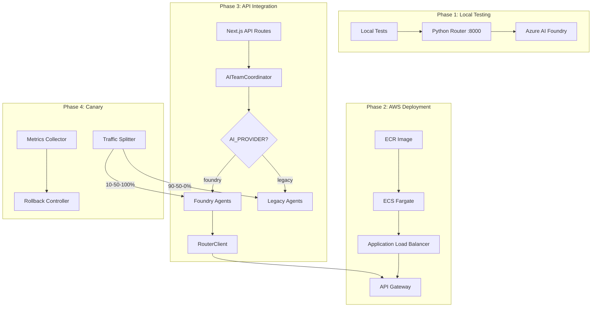
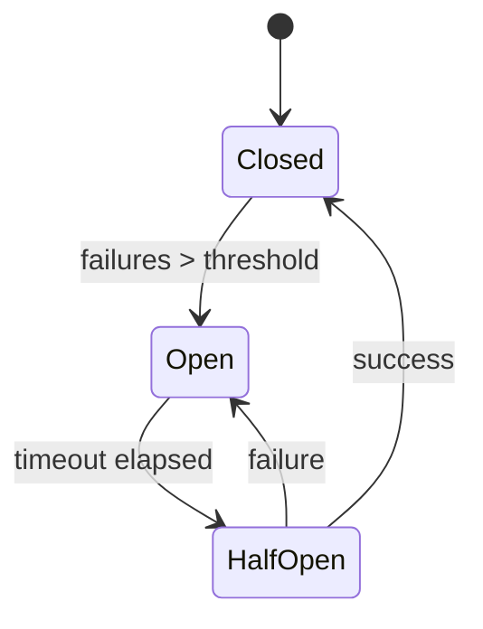

# Design Document: Azure AI Foundry Production Rollout

## Overview

This design describes the multi-phase production rollout of Azure AI Foundry integration for Huntaze. The system migrates from the current AI implementation to use Foundry agents with intelligent model routing. The architecture supports feature flags, canary deployments, automatic rollback, and comprehensive monitoring.

## Architecture



## Components and Interfaces

### 1. AITeamCoordinator (Updated)

```typescript
interface AIProviderConfig {
  provider: 'foundry' | 'legacy' | 'canary';
  canaryPercentage?: number;  // 0-100
  fallbackEnabled?: boolean;
  routerUrl?: string;
}

class AITeamCoordinator {
  private config: AIProviderConfig;
  private foundryAgents: FoundryAgentRegistry;
  private legacyAgents: LegacyAgentRegistry;
  private metricsCollector: MetricsCollector;
  
  async route(request: AIRequest): Promise<CoordinatorResponse>;
  private selectProvider(): 'foundry' | 'legacy';
  private handleFallback(error: Error, request: AIRequest): Promise<CoordinatorResponse>;
}
```

### 2. FoundryAgentRegistry

```typescript
interface FoundryAgentRegistry {
  messaging: MessagingFoundryAgent;
  analytics: AnalyticsFoundryAgent;
  sales: SalesFoundryAgent;
  compliance: ComplianceFoundryAgent;
  
  getAgent(type: RequestType): FoundryAgent;
  initialize(routerUrl: string): Promise<void>;
}
```

### 3. TrafficSplitter

```typescript
interface TrafficSplitter {
  percentage: number;  // Foundry traffic percentage
  
  shouldUseFoundry(requestId: string): boolean;
  updatePercentage(newPercentage: number): void;
  getMetrics(): TrafficMetrics;
}
```

### 4. RollbackController

```typescript
interface RollbackController {
  errorThreshold: number;      // 5%
  latencyThreshold: number;    // 5000ms
  costThreshold: number;       // USD per request
  
  checkHealth(metrics: HealthMetrics): RollbackDecision;
  executeRollback(): Promise<void>;
  getStatus(): RollbackStatus;
}
```

### 5. Python Router Deployment

```yaml
# AWS ECS Task Definition
containerDefinitions:
  - name: ai-router
    image: ${ECR_REPO}/ai-router:latest
    cpu: 512
    memory: 1024
    portMappings:
      - containerPort: 8000
    environment:
      - AZURE_DEEPSEEK_ENDPOINT
      - AZURE_LLAMA_ENDPOINT
      - AZURE_MISTRAL_ENDPOINT
      - AZURE_PHI_ENDPOINT
    healthCheck:
      command: ["CMD-SHELL", "curl -f http://localhost:8000/health"]
      interval: 30
      timeout: 5
      retries: 3
```

## Data Models

### ProviderMetrics

```typescript
interface ProviderMetrics {
  provider: 'foundry' | 'legacy';
  requestCount: number;
  errorCount: number;
  errorRate: number;
  latencyP50: number;
  latencyP95: number;
  latencyP99: number;
  totalCostUsd: number;
  avgCostPerRequest: number;
  modelBreakdown: Record<string, ModelMetrics>;
}

interface ModelMetrics {
  model: string;
  requestCount: number;
  avgLatency: number;
  avgCost: number;
  errorRate: number;
}
```

### CanaryState

```typescript
interface CanaryState {
  phase: 'initial' | 'canary_10' | 'canary_50' | 'full' | 'rollback';
  percentage: number;
  startedAt: Date;
  lastHealthCheck: Date;
  healthyDuration: number;  // seconds
  metrics: {
    foundry: ProviderMetrics;
    legacy: ProviderMetrics;
  };
}
```

## Correctness Properties

*A property is a characteristic or behavior that should hold true across all valid executions of a system-essentially, a formal statement about what the system should do. Properties serve as the bridge between human-readable specifications and machine-verifiable correctness guarantees.*

### Property 1: Feature flag routing correctness
*For any* AI request and any AI_PROVIDER value, the coordinator SHALL route to the correct agent implementation (Foundry when 'foundry', Legacy when 'legacy', split when 'canary')
**Validates: Requirements 3.1, 3.2**

### Property 2: Agent type routing correctness
*For any* request type (fan_message, analyze_performance, optimize_sales, compliance_check) when using Foundry provider, the coordinator SHALL invoke the corresponding Foundry agent
**Validates: Requirements 3.3, 3.4, 3.5, 3.6**

### Property 3: Response metadata completeness
*For any* successful Foundry agent response, the usage statistics SHALL include model name, deployment name, region, and cost
**Validates: Requirements 3.8, 5.1**

### Property 4: Fallback on failure
*For any* Foundry agent failure when fallback is enabled, the system SHALL invoke the legacy agent and return a valid response
**Validates: Requirements 3.7, 6.1**

### Property 5: Canary traffic distribution
*For any* set of N requests during canary deployment, the percentage routed to Foundry SHALL be within ±5% of the configured canary percentage
**Validates: Requirements 4.1**

### Property 6: Rollback trigger correctness
*For any* error rate exceeding 5% OR latency p95 exceeding 5 seconds OR cost exceeding threshold, the rollback controller SHALL trigger automatic rollback
**Validates: Requirements 4.4, 4.5, 4.6**

### Property 7: Retry with exponential backoff
*For any* transient error from Azure AI Foundry, the system SHALL retry up to 3 times with exponential backoff (delays increasing by factor of 2)
**Validates: Requirements 6.2**

### Property 8: Circuit breaker state machine
*For any* sequence of failures exceeding threshold, the circuit breaker SHALL transition to open state, then to half-open after timeout, then to closed on success
**Validates: Requirements 6.4, 6.5**

### Property 9: Logging completeness
*For any* processed request, the logs SHALL contain correlation ID, provider used, model used, latency, and cost
**Validates: Requirements 2.5, 5.1**

### Property 10: Authentication enforcement
*For any* request to the Python router without valid API key, the router SHALL return 401 Unauthorized
**Validates: Requirements 2.3**

## Error Handling

### Fallback Chain

```
Foundry Agent → (on failure) → Legacy Agent → (on failure) → Graceful Error
```

### Circuit Breaker States



### Error Response Format

```typescript
interface ErrorResponse {
  success: false;
  error: {
    code: 'FOUNDRY_UNAVAILABLE' | 'FALLBACK_FAILED' | 'RATE_LIMITED' | 'TIMEOUT';
    message: string;
    retryable: boolean;
    fallbackUsed: boolean;
    correlationId: string;
  };
}
```

## Testing Strategy

### Unit Testing

- Test AITeamCoordinator routing logic with mocked agents
- Test TrafficSplitter percentage distribution
- Test RollbackController threshold detection
- Test CircuitBreaker state transitions

### Property-Based Testing

Using `fast-check` library for TypeScript property tests:

- **Property 1-2**: Generate random requests and verify routing
- **Property 3**: Generate random responses and verify metadata presence
- **Property 4**: Simulate failures and verify fallback behavior
- **Property 5**: Generate N requests and verify distribution
- **Property 6**: Generate metrics and verify rollback triggers
- **Property 7**: Simulate errors and verify retry behavior
- **Property 8**: Generate failure sequences and verify state transitions
- **Property 9**: Generate requests and verify log contents
- **Property 10**: Generate requests without API key and verify rejection

Each property test MUST:
- Run minimum 100 iterations
- Be tagged with format: `**Feature: azure-foundry-production-rollout, Property {N}: {description}**`
- Reference the requirements it validates

### Integration Testing

- Local integration: Python router + TypeScript agents + Azure AI Foundry
- AWS integration: Deployed router + production endpoints
- End-to-end: Full request flow through API routes

### Load Testing

- Verify auto-scaling triggers at 70% CPU
- Verify latency under load stays within SLA
- Verify cost tracking accuracy under load
