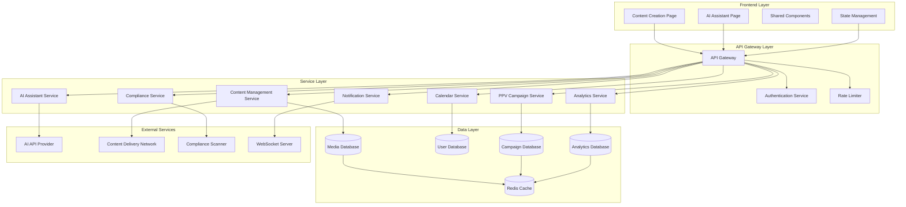
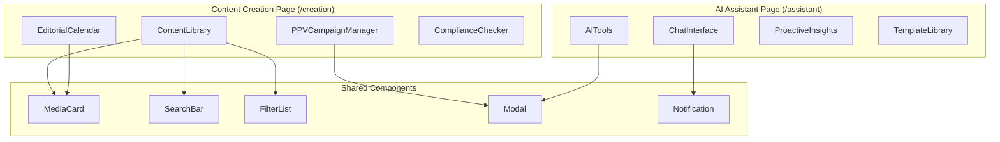

# Design Document

## Overview

The Content Creation and AI Assistant feature provides creators with a comprehensive content management ecosystem. The system consists of two main pages: `/creation` for content library management, editorial planning, and PPV campaigns, and `/assistant` for AI-powered optimization tools and insights. The design emphasizes modularity, responsive layouts, and seamless integration between content management and AI assistance.

## Architecture

### High-Level Architecture



### Component Hierarchy



## Components and Interfaces

### Content Creation Page Components

#### ContentLibrary Component
```typescript
interface ContentLibraryProps {
  mediaAssets: MediaAsset[]
  filters: FilterOptions
  onFilterChange: (filters: FilterOptions) => void
  onAssetSelect: (asset: MediaAsset) => void
  onAssetAction: (action: AssetAction, assetId: string) => void
}

interface MediaAsset {
  id: string
  title: string
  type: 'photo' | 'video' | 'story' | 'ppv'
  status: 'draft' | 'scheduled' | 'published'
  thumbnailUrl: string
  createdAt: Date
  metrics: AssetMetrics
  tags: string[]
}

interface AssetMetrics {
  views: number
  engagement: number
  revenue: number
  roi: number
}
```

#### EditorialCalendar Component
```typescript
interface EditorialCalendarProps {
  view: 'monthly' | 'weekly'
  scheduledContent: ScheduledContent[]
  onContentDrop: (content: MediaAsset, date: Date) => void
  onQuickAction: (action: QuickAction) => void
  aiSuggestions: OptimalTimeSlot[]
}

interface ScheduledContent {
  id: string
  mediaAsset: MediaAsset
  scheduledDate: Date
  priority: 'high' | 'medium' | 'low'
  contentType: ContentType
}

interface OptimalTimeSlot {
  date: Date
  time: string
  engagementPrediction: number
  confidence: number
}
```

#### PPVCampaignManager Component
```typescript
interface PPVCampaignManagerProps {
  campaigns: PPVCampaign[]
  onCampaignAction: (action: CampaignAction, campaignId: string) => void
  aiInsights: CampaignInsight[]
}

interface PPVCampaign {
  id: string
  name: string
  launchDate: Date
  targetAudience: AudienceSegment
  status: 'active' | 'paused' | 'completed'
  metrics: CampaignMetrics
  content: MediaAsset[]
}

interface CampaignMetrics {
  openRate: number
  purchaseRate: number
  revenue: number
  roi: number
  conversions: number
}
```

### AI Assistant Page Components

#### ChatInterface Component
```typescript
interface ChatInterfaceProps {
  conversationHistory: ChatMessage[]
  onSendMessage: (message: string) => void
  onExportConversation: () => void
  contextData: PageContext
}

interface ChatMessage {
  id: string
  content: string
  sender: 'user' | 'ai'
  timestamp: Date
  context?: PageContext
}

interface PageContext {
  currentPage: string
  recentMetrics: any
  selectedAssets: MediaAsset[]
}
```

#### AITools Component
```typescript
interface AIToolsProps {
  availableTools: AITool[]
  onToolSelect: (toolId: string) => void
  toolResults: ToolResult[]
}

interface AITool {
  id: string
  name: string
  description: string
  icon: string
  category: 'content' | 'pricing' | 'timing' | 'messaging'
  inputSchema: JSONSchema
}

interface ToolResult {
  toolId: string
  input: any
  output: string
  timestamp: Date
  actions: ResultAction[]
}
```

#### ProactiveInsights Component
```typescript
interface ProactiveInsightsProps {
  alerts: AIAlert[]
  recommendations: AIRecommendation[]
  opportunities: OpportunityCard[]
  onActionTaken: (actionId: string) => void
}

interface AIAlert {
  id: string
  type: 'revenue_drop' | 'engagement_spike' | 'compliance_issue'
  severity: 'low' | 'medium' | 'high'
  message: string
  actions: RecommendedAction[]
  timestamp: Date
}

interface OpportunityCard {
  id: string
  title: string
  description: string
  potentialImpact: string
  effort: 'low' | 'medium' | 'high'
  actions: string[]
}
```

### Shared Components

#### MediaCard Component
```typescript
interface MediaCardProps {
  asset: MediaAsset
  variant: 'grid' | 'list' | 'calendar'
  showMetrics: boolean
  actions: CardAction[]
  onAction: (action: CardAction) => void
}

interface CardAction {
  id: string
  label: string
  icon: string
  variant: 'primary' | 'secondary' | 'danger'
}
```

## Data Models

### API Response Models

```typescript
// API Response Wrappers
interface APIResponse<T> {
  success: boolean
  data: T
  error?: APIError
  timestamp: Date
  requestId: string
}

interface APIError {
  code: string
  message: string
  details?: any
  retryable: boolean
}

// Pagination for large datasets
interface PaginatedResponse<T> {
  items: T[]
  pagination: {
    page: number
    limit: number
    total: number
    hasNext: boolean
    hasPrev: boolean
  }
}
```

### Core Data Models

```typescript
// User and Content Models
interface Creator {
  id: string
  username: string
  email: string
  subscription: SubscriptionTier
  preferences: CreatorPreferences
  metrics: CreatorMetrics
  createdAt: Date
  updatedAt: Date
}

interface CreatorPreferences {
  timezone: string
  defaultContentType: ContentType
  aiAssistanceLevel: 'minimal' | 'moderate' | 'aggressive'
  notificationSettings: NotificationSettings
  language: string
}

// Enhanced MediaAsset with backend sync
interface MediaAsset {
  id: string
  creatorId: string
  title: string
  description?: string
  type: 'photo' | 'video' | 'story' | 'ppv'
  status: 'draft' | 'scheduled' | 'published' | 'archived'
  thumbnailUrl: string
  originalUrl: string
  fileSize: number
  duration?: number // for videos
  dimensions: { width: number; height: number }
  createdAt: Date
  updatedAt: Date
  publishedAt?: Date
  metrics: AssetMetrics
  tags: string[]
  compliance: ComplianceStatus
  uploadProgress?: number
}

interface ComplianceStatus {
  status: 'pending' | 'approved' | 'rejected' | 'review_required'
  checkedAt: Date
  violations: ComplianceViolation[]
  score: number
}

// AI and Analytics Models
interface AIInsight {
  id: string
  creatorId: string
  type: InsightType
  confidence: number
  data: any
  recommendations: AIRecommendation[]
  createdAt: Date
  expiresAt?: Date
  applied: boolean
}

interface AIRecommendation {
  id: string
  title: string
  description: string
  action: string
  priority: 'low' | 'medium' | 'high'
  estimatedImpact: string
  category: 'content' | 'pricing' | 'timing' | 'engagement'
}

interface PerformanceMetrics {
  creatorId: string
  period: DateRange
  revenue: number
  engagement: EngagementMetrics
  contentPerformance: ContentMetrics[]
  audienceGrowth: number
  conversionRate: number
  lastUpdated: Date
}

// Campaign and Scheduling Models with backend sync
interface ContentSchedule {
  id: string
  creatorId: string
  entries: ScheduleEntry[]
  aiOptimizations: OptimizationSuggestion[]
  createdAt: Date
  updatedAt: Date
  syncStatus: 'synced' | 'pending' | 'conflict'
}

interface ScheduleEntry {
  id: string
  mediaAssetId: string
  scheduledDate: Date
  platform: Platform[]
  status: ScheduleStatus
  createdAt: Date
  updatedAt: Date
  publishResult?: PublishResult
}

interface PublishResult {
  success: boolean
  publishedAt?: Date
  error?: string
  platformResults: PlatformPublishResult[]
}
```

### API Endpoints Structure

```typescript
// Content Management API
interface ContentAPI {
  // Media Assets
  getAssets: (params: AssetQueryParams) => Promise<PaginatedResponse<MediaAsset>>
  uploadAsset: (file: File, metadata: AssetMetadata) => Promise<APIResponse<MediaAsset>>
  updateAsset: (id: string, updates: Partial<MediaAsset>) => Promise<APIResponse<MediaAsset>>
  deleteAsset: (id: string) => Promise<APIResponse<void>>
  
  // Scheduling
  getSchedule: (dateRange: DateRange) => Promise<APIResponse<ContentSchedule>>
  scheduleContent: (entry: ScheduleEntry) => Promise<APIResponse<ScheduleEntry>>
  updateSchedule: (id: string, updates: Partial<ScheduleEntry>) => Promise<APIResponse<ScheduleEntry>>
  
  // PPV Campaigns
  getCampaigns: (params: CampaignQueryParams) => Promise<PaginatedResponse<PPVCampaign>>
  createCampaign: (campaign: CreateCampaignRequest) => Promise<APIResponse<PPVCampaign>>
  updateCampaign: (id: string, updates: Partial<PPVCampaign>) => Promise<APIResponse<PPVCampaign>>
  getCampaignMetrics: (id: string, period: DateRange) => Promise<APIResponse<CampaignMetrics>>
}

// AI Assistant API
interface AIAPI {
  // Chat Interface
  sendMessage: (message: string, context: PageContext) => Promise<APIResponse<ChatMessage>>
  getConversation: (conversationId: string) => Promise<APIResponse<ChatMessage[]>>
  
  // AI Tools
  generateContent: (tool: string, params: any) => Promise<APIResponse<ToolResult>>
  optimizePricing: (campaignId: string, params: PricingParams) => Promise<APIResponse<PricingRecommendation>>
  suggestTiming: (contentType: string, audienceData: any) => Promise<APIResponse<OptimalTimeSlot[]>>
  
  // Insights
  getInsights: (creatorId: string) => Promise<APIResponse<AIInsight[]>>
  getRecommendations: (creatorId: string) => Promise<APIResponse<AIRecommendation[]>>
  markInsightApplied: (insightId: string) => Promise<APIResponse<void>>
}

// Real-time WebSocket Events
interface WebSocketEvents {
  // Content updates
  'asset:uploaded': MediaAsset
  'asset:processed': { assetId: string; status: string }
  'schedule:updated': ScheduleEntry
  
  // AI notifications
  'ai:insight': AIInsight
  'ai:recommendation': AIRecommendation
  'ai:alert': AIAlert
  
  // Campaign updates
  'campaign:metrics': { campaignId: string; metrics: CampaignMetrics }
  'campaign:status': { campaignId: string; status: string }
}
```

## Backend-Frontend Integration

### State Management and Data Flow

```typescript
// Frontend State Management
interface AppState {
  user: Creator
  mediaAssets: {
    items: MediaAsset[]
    loading: boolean
    error: APIError | null
    pagination: PaginationState
    filters: FilterOptions
  }
  schedule: {
    entries: ScheduleEntry[]
    loading: boolean
    error: APIError | null
    syncStatus: 'synced' | 'pending' | 'conflict'
  }
  campaigns: {
    items: PPVCampaign[]
    loading: boolean
    error: APIError | null
    selectedCampaign: PPVCampaign | null
  }
  ai: {
    conversation: ChatMessage[]
    insights: AIInsight[]
    recommendations: AIRecommendation[]
    toolResults: ToolResult[]
    loading: boolean
    error: APIError | null
  }
  ui: {
    notifications: Notification[]
    modals: ModalState[]
    theme: ThemeSettings
  }
}

// Data Synchronization Patterns
interface SyncManager {
  // Optimistic updates
  optimisticUpdate: <T>(entity: T, update: Partial<T>) => void
  revertOptimisticUpdate: <T>(entity: T) => void
  
  // Conflict resolution
  resolveConflict: <T>(local: T, remote: T) => T
  
  // Offline queue
  queueAction: (action: OfflineAction) => void
  processQueue: () => Promise<void>
  
  // Real-time sync
  subscribeToUpdates: (entityType: string, callback: (update: any) => void) => void
}
```

### API Client Implementation

```typescript
// Centralized API client with error handling
class APIClient {
  private baseURL: string
  private authToken: string | null = null
  private requestQueue: RequestQueue = new RequestQueue()
  
  constructor(baseURL: string) {
    this.baseURL = baseURL
  }
  
  // Authentication
  setAuthToken(token: string) {
    this.authToken = token
  }
  
  // Generic request method with retry logic
  async request<T>(
    endpoint: string, 
    options: RequestOptions = {}
  ): Promise<APIResponse<T>> {
    const config = {
      ...options,
      headers: {
        'Content-Type': 'application/json',
        'Authorization': this.authToken ? `Bearer ${this.authToken}` : '',
        ...options.headers
      }
    }
    
    try {
      const response = await this.makeRequest(endpoint, config)
      return this.handleResponse<T>(response)
    } catch (error) {
      return this.handleError(error, endpoint, config)
    }
  }
  
  // File upload with progress tracking
  async uploadFile(
    file: File, 
    metadata: AssetMetadata,
    onProgress?: (progress: number) => void
  ): Promise<APIResponse<MediaAsset>> {
    const formData = new FormData()
    formData.append('file', file)
    formData.append('metadata', JSON.stringify(metadata))
    
    return this.request<MediaAsset>('/api/assets/upload', {
      method: 'POST',
      body: formData,
      onUploadProgress: onProgress
    })
  }
  
  // WebSocket connection management
  connectWebSocket(): WebSocket {
    const ws = new WebSocket(`${this.baseURL.replace('http', 'ws')}/ws`)
    
    ws.onopen = () => {
      console.log('WebSocket connected')
      this.authenticateWebSocket(ws)
    }
    
    ws.onmessage = (event) => {
      const message = JSON.parse(event.data)
      this.handleWebSocketMessage(message)
    }
    
    ws.onerror = (error) => {
      console.error('WebSocket error:', error)
      this.handleWebSocketError(error)
    }
    
    return ws
  }
}
```

### Data Validation and Type Safety

```typescript
// Runtime type validation
import { z } from 'zod'

// Schema definitions
const MediaAssetSchema = z.object({
  id: z.string(),
  creatorId: z.string(),
  title: z.string().min(1).max(255),
  type: z.enum(['photo', 'video', 'story', 'ppv']),
  status: z.enum(['draft', 'scheduled', 'published', 'archived']),
  thumbnailUrl: z.string().url(),
  originalUrl: z.string().url(),
  fileSize: z.number().positive(),
  createdAt: z.date(),
  updatedAt: z.date(),
  metrics: z.object({
    views: z.number().nonnegative(),
    engagement: z.number().nonnegative(),
    revenue: z.number().nonnegative(),
    roi: z.number()
  }),
  tags: z.array(z.string()),
  compliance: z.object({
    status: z.enum(['pending', 'approved', 'rejected', 'review_required']),
    checkedAt: z.date(),
    violations: z.array(z.any()),
    score: z.number().min(0).max(100)
  })
})

// Type-safe API responses
function validateAPIResponse<T>(
  data: unknown, 
  schema: z.ZodSchema<T>
): APIResponse<T> {
  try {
    const validatedData = schema.parse(data)
    return {
      success: true,
      data: validatedData,
      timestamp: new Date(),
      requestId: generateRequestId()
    }
  } catch (error) {
    return {
      success: false,
      data: null as any,
      error: {
        code: 'VALIDATION_ERROR',
        message: 'Invalid data format',
        details: error,
        retryable: false
      },
      timestamp: new Date(),
      requestId: generateRequestId()
    }
  }
}
```

## Error Handling

### Comprehensive Error Management

#### Content Management Errors
- **Upload Failures**: Display retry options with progress indicators, queue for offline retry
- **Compliance Violations**: Show specific violation details with correction suggestions and resubmission flow
- **Scheduling Conflicts**: Highlight conflicts with resolution options and alternative time suggestions
- **Asset Not Found**: Graceful fallback with search suggestions and cache invalidation
- **File Size/Format Errors**: Clear validation messages with format conversion options

#### AI Service Errors
- **API Rate Limits**: Queue requests with user notification and estimated wait time
- **Generation Failures**: Provide alternative suggestions, fallback to templates, or manual input options
- **Context Loss**: Maintain conversation state with recovery mechanisms and context reconstruction
- **Invalid Prompts**: Guide users with template suggestions and prompt improvement tips
- **Service Unavailable**: Graceful degradation with cached responses and offline mode

#### Data Synchronization Errors
- **Network Issues**: Offline mode with sync queue and automatic retry when connection restored
- **Concurrent Modifications**: Conflict resolution with user choice and merge options
- **Cache Invalidation**: Automatic refresh with user notification and data consistency checks
- **Authentication Errors**: Automatic token refresh with seamless re-authentication
- **Version Conflicts**: Show diff view and allow user to choose resolution strategy

### Error Recovery Patterns

```typescript
interface ErrorBoundary {
  fallbackComponent: React.ComponentType
  onError: (error: Error, errorInfo: ErrorInfo) => void
  retryMechanism: RetryStrategy
  errorReporting: ErrorReportingService
}

interface RetryStrategy {
  maxAttempts: number
  backoffMultiplier: number
  retryableErrors: ErrorType[]
  exponentialBackoff: boolean
  jitterEnabled: boolean
}

// Global error handler
class ErrorHandler {
  static handleAPIError(error: APIError, context: ErrorContext): ErrorAction {
    switch (error.code) {
      case 'NETWORK_ERROR':
        return { type: 'RETRY_WITH_BACKOFF', delay: 1000 }
      case 'RATE_LIMIT':
        return { type: 'QUEUE_REQUEST', retryAfter: error.details.retryAfter }
      case 'VALIDATION_ERROR':
        return { type: 'SHOW_VALIDATION_ERRORS', errors: error.details }
      case 'UNAUTHORIZED':
        return { type: 'REFRESH_TOKEN_AND_RETRY' }
      default:
        return { type: 'SHOW_ERROR_MESSAGE', message: error.message }
    }
  }
}
```

## Testing Strategy

### Unit Testing Approach

#### Component Testing
- **Isolated Component Rendering**: Test each component in isolation with mock props
- **User Interaction Testing**: Simulate clicks, drags, form submissions
- **State Management Testing**: Verify state updates and side effects
- **Accessibility Testing**: Ensure keyboard navigation and screen reader compatibility

#### Service Testing
- **API Integration Testing**: Mock external services with realistic responses
- **Data Transformation Testing**: Verify data mapping and validation
- **Error Handling Testing**: Test error scenarios and recovery mechanisms
- **Performance Testing**: Measure component render times and memory usage

### Integration Testing Strategy

#### Cross-Component Integration
- **Content Flow Testing**: Verify data flow between library, calendar, and campaigns
- **AI Integration Testing**: Test AI service integration with real and mock responses
- **Navigation Testing**: Ensure smooth transitions between pages and states
- **Real-time Updates**: Test live data synchronization and notifications

#### End-to-End User Journeys
- **Content Creation Workflow**: Upload → Edit → Schedule → Publish
- **Campaign Management Flow**: Create → Configure → Launch → Monitor → Optimize
- **AI Assistant Usage**: Query → Generate → Apply → Measure Results
- **Cross-Platform Consistency**: Desktop and mobile experience validation

### Performance Testing

#### Load Testing Scenarios
- **Large Media Libraries**: Test with 1000+ assets
- **Concurrent AI Requests**: Multiple simultaneous AI tool usage
- **Real-time Calendar Updates**: High-frequency scheduling changes
- **Mobile Performance**: Touch interactions and responsive layouts

#### Optimization Targets
- **Initial Page Load**: < 2 seconds for critical content
- **AI Response Time**: < 5 seconds for content generation
- **Search Performance**: < 500ms for library searches
- **Calendar Interactions**: < 100ms for drag-and-drop operations

### Accessibility Testing

#### WCAG 2.1 AA Compliance
- **Color Contrast**: Minimum 4.5:1 ratio for normal text
- **Keyboard Navigation**: Full functionality without mouse
- **Screen Reader Support**: Proper ARIA labels and semantic HTML
- **Focus Management**: Clear focus indicators and logical tab order

#### Assistive Technology Testing
- **Screen Reader Testing**: NVDA, JAWS, VoiceOver compatibility
- **Voice Control**: Dragon NaturallySpeaking support
- **High Contrast Mode**: Windows high contrast compatibility
- **Zoom Testing**: 200% zoom functionality preservation