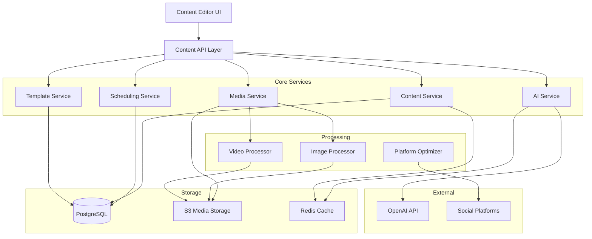

# Design Document - Content Creation System

## Overview

The Content Creation System is a comprehensive content production platform that enables creators to produce, edit, optimize, and schedule multimedia content for multiple social media platforms. The system integrates AI-powered assistance, collaborative editing, media management, and platform-specific optimization to streamline the content creation workflow.

### Key Design Principles

1. **Intuitive Workflow**: Minimize clicks and cognitive load with a streamlined creation process
2. **Real-time Feedback**: Provide immediate validation and preview capabilities
3. **Platform Agnostic**: Support content creation for any social platform with automatic optimization
4. **Performance First**: Ensure fast media processing and responsive UI interactions
5. **Collaboration Ready**: Enable seamless team workflows with conflict resolution

## Architecture

### High-Level Architecture



### Technology Stack

- **Frontend**: Next.js 14, React, TailwindCSS, Tiptap (rich text editor)
- **Backend**: Next.js API Routes, Node.js
- **Database**: PostgreSQL (content metadata, drafts, schedules)
- **Storage**: AWS S3 (media files)
- **Cache**: Redis (AI responses, templates, user sessions)
- **Media Processing**: Sharp (images), FFmpeg (videos)
- **AI**: OpenAI GPT-4 API
- **Queue**: Bull (background jobs for media processing)

## Components and Interfaces

### 1. Content Editor Component

**Purpose**: Main interface for creating and editing content

**Key Features**:
- Rich text editor with formatting toolbar
- Drag-and-drop media insertion
- Real-time character counter with platform limits
- Auto-save functionality
- Multi-platform preview tabs

**Interface**:
```typescript
interface ContentEditorProps {
  contentId?: string;
  initialContent?: ContentDraft;
  onSave: (content: ContentDraft) => Promise<void>;
  onPublish: (content: PublishableContent) => Promise<void>;
  platforms: Platform[];
}

interface ContentDraft {
  id: string;
  userId: string;
  text: string;
  mediaIds: string[];
  tags: string[];
  category: ContentCategory;
  platforms: Platform[];
  scheduledAt?: Date;
  status: 'draft' | 'scheduled' | 'published';
  createdAt: Date;
  updatedAt: Date;
}
```

### 2. Media Library Component

**Purpose**: Centralized media asset management

**Key Features**:
- Grid/list view toggle
- Search and filter by type, date, tags
- Bulk selection and operations
- Storage quota visualization
- Upload progress tracking

**Interface**:
```typescript
interface MediaLibraryProps {
  onSelect?: (media: MediaAsset[]) => void;
  selectionMode: 'single' | 'multiple';
  filterType?: 'image' | 'video' | 'all';
}

interface MediaAsset {
  id: string;
  userId: string;
  type: 'image' | 'video';
  filename: string;
  url: string;
  thumbnailUrl: string;
  size: number;
  dimensions: { width: number; height: number };
  duration?: number; // for videos
  tags: string[];
  uploadedAt: Date;
}
```

### 3. Image Editor Component

**Purpose**: In-platform image editing capabilities

**Key Features**:
- Crop with aspect ratio presets
- Filters and adjustments
- Text overlay with font selection
- Undo/redo functionality
- Non-destructive editing

**Interface**:
```typescript
interface ImageEditorProps {
  imageId: string;
  onSave: (editedImage: EditedImage) => Promise<void>;
  onCancel: () => void;
}

interface ImageEdit {
  crop?: { x: number; y: number; width: number; height: number };
  rotate?: number;
  flip?: 'horizontal' | 'vertical';
  adjustments?: {
    brightness?: number;
    contrast?: number;
    saturation?: number;
  };
  filters?: string[];
  textOverlays?: TextOverlay[];
}

interface TextOverlay {
  text: string;
  x: number;
  y: number;
  fontSize: number;
  fontFamily: string;
  color: string;
  backgroundColor?: string;
}
```

### 4. Video Editor Component

**Purpose**: Basic video editing functionality

**Key Features**:
- Timeline-based trimming
- Frame-by-frame navigation
- Caption/subtitle addition
- Thumbnail selection
- Progress indicator for processing

**Interface**:
```typescript
interface VideoEditorProps {
  videoId: string;
  onSave: (editedVideo: EditedVideo) => Promise<void>;
  onCancel: () => void;
}

interface VideoEdit {
  trim?: { startTime: number; endTime: number };
  captions?: Caption[];
  thumbnailTimestamp?: number;
}

interface Caption {
  text: string;
  startTime: number;
  endTime: number;
  position: 'top' | 'center' | 'bottom';
}
```

### 5. AI Assistant Component

**Purpose**: AI-powered content generation and suggestions

**Key Features**:
- Content idea generation
- Caption writing with tone selection
- Hashtag suggestions
- Content improvement recommendations
- Context-aware suggestions based on performance data

**Interface**:
```typescript
interface AIAssistantProps {
  context: AIContext;
  onSuggestionSelect: (suggestion: string) => void;
}

interface AIContext {
  userId: string;
  contentType: 'post' | 'caption' | 'hashtags' | 'ideas';
  existingContent?: string;
  targetPlatforms: Platform[];
  tone?: 'professional' | 'casual' | 'humorous' | 'inspirational';
}

interface AISuggestion {
  id: string;
  type: 'idea' | 'caption' | 'hashtags' | 'improvement';
  content: string;
  confidence: number;
  reasoning?: string;
}
```

### 6. Template Selector Component

**Purpose**: Browse and apply content templates

**Key Features**:
- Category-based browsing
- Template preview
- Custom template creation
- Template favorites
- Usage statistics

**Interface**:
```typescript
interface TemplateSelectorProps {
  onSelect: (template: Template) => void;
  category?: TemplateCategory;
}

interface Template {
  id: string;
  name: string;
  description: string;
  category: TemplateCategory;
  structure: TemplateStructure;
  previewUrl: string;
  isCustom: boolean;
  userId?: string;
  usageCount: number;
  createdAt: Date;
}

interface TemplateStructure {
  text: string;
  placeholders: Placeholder[];
  mediaSlots: MediaSlot[];
  suggestedPlatforms: Platform[];
}

type TemplateCategory = 
  | 'announcement' 
  | 'promotion' 
  | 'story' 
  | 'educational' 
  | 'engagement' 
  | 'custom';
```

### 7. Platform Optimizer Component

**Purpose**: Adapt content for platform-specific requirements

**Key Features**:
- Platform requirement display
- Automatic format conversion
- Validation warnings
- Multi-platform preview
- Optimization suggestions

**Interface**:
```typescript
interface PlatformOptimizerProps {
  content: ContentDraft;
  platforms: Platform[];
  onOptimize: (optimized: OptimizedContent[]) => void;
}

interface PlatformRequirements {
  platform: Platform;
  textMaxLength: number;
  imageSpecs: ImageSpecs;
  videoSpecs: VideoSpecs;
  hashtagLimit: number;
  mentionLimit: number;
}

interface ImageSpecs {
  maxSize: number;
  formats: string[];
  minDimensions: { width: number; height: number };
  maxDimensions: { width: number; height: number };
  aspectRatios: string[];
}

interface VideoSpecs {
  maxSize: number;
  formats: string[];
  maxDuration: number;
  minDuration: number;
  aspectRatios: string[];
  resolutions: string[];
}

interface OptimizedContent {
  platform: Platform;
  text: string;
  mediaUrls: string[];
  warnings: ValidationWarning[];
  isValid: boolean;
}
```

### 8. Content Calendar Component

**Purpose**: Visual scheduling and content planning

**Key Features**:
- Month/week/day views
- Drag-and-drop rescheduling
- Color-coded by platform
- Quick preview on hover
- Bulk scheduling

**Interface**:
```typescript
interface ContentCalendarProps {
  userId: string;
  view: 'month' | 'week' | 'day';
  onSchedule: (contentId: string, date: Date) => Promise<void>;
  onReschedule: (contentId: string, newDate: Date) => Promise<void>;
}

interface ScheduledContent {
  contentId: string;
  scheduledAt: Date;
  platforms: Platform[];
  status: 'scheduled' | 'publishing' | 'published' | 'failed';
  previewText: string;
  thumbnailUrl?: string;
}
```

### 9. Collaboration Panel Component

**Purpose**: Team collaboration features

**Key Features**:
- Share draft with team members
- Comment threads
- Revision history
- Real-time presence indicators
- Approval workflow

**Interface**:
```typescript
interface CollaborationPanelProps {
  contentId: string;
  currentUserId: string;
}

interface Collaborator {
  userId: string;
  name: string;
  email: string;
  role: 'owner' | 'editor' | 'viewer';
  isActive: boolean;
  lastSeen: Date;
}

interface Comment {
  id: string;
  userId: string;
  contentId: string;
  text: string;
  position?: { start: number; end: number };
  replies: Comment[];
  createdAt: Date;
  resolved: boolean;
}

interface Revision {
  id: string;
  contentId: string;
  userId: string;
  changes: ContentDraft;
  timestamp: Date;
  description: string;
}
```

## Data Models

### Database Schema

```sql
-- Content drafts and published content
CREATE TABLE content_items (
  id UUID PRIMARY KEY DEFAULT gen_random_uuid(),
  user_id UUID NOT NULL REFERENCES users(id) ON DELETE CASCADE,
  text TEXT NOT NULL,
  status VARCHAR(20) NOT NULL CHECK (status IN ('draft', 'scheduled', 'published', 'archived')),
  category VARCHAR(50),
  scheduled_at TIMESTAMP,
  published_at TIMESTAMP,
  created_at TIMESTAMP DEFAULT NOW(),
  updated_at TIMESTAMP DEFAULT NOW(),
  metadata JSONB DEFAULT '{}'::jsonb
);

CREATE INDEX idx_content_items_user_status ON content_items(user_id, status);
CREATE INDEX idx_content_items_scheduled ON content_items(scheduled_at) WHERE status = 'scheduled';

-- Media assets
CREATE TABLE media_assets (
  id UUID PRIMARY KEY DEFAULT gen_random_uuid(),
  user_id UUID NOT NULL REFERENCES users(id) ON DELETE CASCADE,
  type VARCHAR(10) NOT NULL CHECK (type IN ('image', 'video')),
  filename VARCHAR(255) NOT NULL,
  original_url TEXT NOT NULL,
  thumbnail_url TEXT,
  size_bytes BIGINT NOT NULL,
  width INTEGER,
  height INTEGER,
  duration_seconds INTEGER,
  mime_type VARCHAR(100),
  uploaded_at TIMESTAMP DEFAULT NOW(),
  metadata JSONB DEFAULT '{}'::jsonb
);

CREATE INDEX idx_media_assets_user_type ON media_assets(user_id, type);

-- Content-media relationships
CREATE TABLE content_media (
  content_id UUID REFERENCES content_items(id) ON DELETE CASCADE,
  media_id UUID REFERENCES media_assets(id) ON DELETE CASCADE,
  position INTEGER NOT NULL,
  PRIMARY KEY (content_id, media_id)
);

-- Platform associations
CREATE TABLE content_platforms (
  content_id UUID REFERENCES content_items(id) ON DELETE CASCADE,
  platform VARCHAR(50) NOT NULL,
  platform_specific_data JSONB DEFAULT '{}'::jsonb,
  published_url TEXT,
  published_at TIMESTAMP,
  PRIMARY KEY (content_id, platform)
);

CREATE INDEX idx_content_platforms_platform ON content_platforms(platform);

-- Tags
CREATE TABLE content_tags (
  content_id UUID REFERENCES content_items(id) ON DELETE CASCADE,
  tag VARCHAR(100) NOT NULL,
  PRIMARY KEY (content_id, tag)
);

CREATE INDEX idx_content_tags_tag ON content_tags(tag);

-- Templates
CREATE TABLE templates (
  id UUID PRIMARY KEY DEFAULT gen_random_uuid(),
  user_id UUID REFERENCES users(id) ON DELETE CASCADE,
  name VARCHAR(255) NOT NULL,
  description TEXT,
  category VARCHAR(50) NOT NULL,
  structure JSONB NOT NULL,
  preview_url TEXT,
  is_public BOOLEAN DEFAULT FALSE,
  usage_count INTEGER DEFAULT 0,
  created_at TIMESTAMP DEFAULT NOW()
);

CREATE INDEX idx_templates_category ON templates(category);
CREATE INDEX idx_templates_user ON templates(user_id) WHERE user_id IS NOT NULL;

-- Collaboration
CREATE TABLE content_collaborators (
  content_id UUID REFERENCES content_items(id) ON DELETE CASCADE,
  user_id UUID REFERENCES users(id) ON DELETE CASCADE,
  role VARCHAR(20) NOT NULL CHECK (role IN ('owner', 'editor', 'viewer')),
  invited_at TIMESTAMP DEFAULT NOW(),
  PRIMARY KEY (content_id, user_id)
);

-- Comments
CREATE TABLE content_comments (
  id UUID PRIMARY KEY DEFAULT gen_random_uuid(),
  content_id UUID NOT NULL REFERENCES content_items(id) ON DELETE CASCADE,
  user_id UUID NOT NULL REFERENCES users(id) ON DELETE CASCADE,
  parent_comment_id UUID REFERENCES content_comments(id) ON DELETE CASCADE,
  text TEXT NOT NULL,
  position_start INTEGER,
  position_end INTEGER,
  resolved BOOLEAN DEFAULT FALSE,
  created_at TIMESTAMP DEFAULT NOW()
);

CREATE INDEX idx_content_comments_content ON content_comments(content_id);

-- Revisions
CREATE TABLE content_revisions (
  id UUID PRIMARY KEY DEFAULT gen_random_uuid(),
  content_id UUID NOT NULL REFERENCES content_items(id) ON DELETE CASCADE,
  user_id UUID NOT NULL REFERENCES users(id) ON DELETE CASCADE,
  snapshot JSONB NOT NULL,
  description TEXT,
  created_at TIMESTAMP DEFAULT NOW()
);

CREATE INDEX idx_content_revisions_content ON content_revisions(content_id, created_at DESC);

-- A/B Testing
CREATE TABLE content_variations (
  id UUID PRIMARY KEY DEFAULT gen_random_uuid(),
  parent_content_id UUID NOT NULL REFERENCES content_items(id) ON DELETE CASCADE,
  variation_name VARCHAR(100) NOT NULL,
  text TEXT NOT NULL,
  media_ids UUID[],
  audience_percentage INTEGER NOT NULL CHECK (audience_percentage > 0 AND audience_percentage <= 100),
  created_at TIMESTAMP DEFAULT NOW()
);

-- Storage quota tracking
CREATE TABLE user_storage_quota (
  user_id UUID PRIMARY KEY REFERENCES users(id) ON DELETE CASCADE,
  used_bytes BIGINT DEFAULT 0,
  quota_bytes BIGINT NOT NULL,
  updated_at TIMESTAMP DEFAULT NOW()
);
```

## Error Handling

### Error Categories

1. **Validation Errors** (400)
   - Invalid content format
   - Platform requirement violations
   - File size/type restrictions
   - Character limit exceeded

2. **Processing Errors** (500)
   - Media upload failures
   - Image/video processing failures
   - AI service unavailable
   - Storage quota exceeded

3. **Authorization Errors** (403)
   - Insufficient permissions for collaboration
   - Template access denied
   - Content ownership validation

4. **Not Found Errors** (404)
   - Content not found
   - Media asset not found
   - Template not found

### Error Response Format

```typescript
interface ErrorResponse {
  error: {
    code: string;
    message: string;
    details?: Record<string, any>;
    field?: string;
  };
}
```

### Error Handling Strategy

1. **Client-Side Validation**: Validate inputs before API calls
2. **Graceful Degradation**: Disable features if services unavailable
3. **Retry Logic**: Automatic retry for transient failures (3 attempts)
4. **User Feedback**: Clear error messages with actionable steps
5. **Logging**: Comprehensive error logging for debugging

## Testing Strategy

### Unit Tests

- Content service CRUD operations
- Media processing functions
- Platform optimizer validation logic
- Template rendering
- AI prompt generation
- Collaboration permission checks

### Integration Tests

- End-to-end content creation flow
- Media upload and processing pipeline
- Scheduling and publication workflow
- Multi-platform optimization
- Collaboration features
- Import/export functionality

### UI Tests

- Content editor interactions
- Media library operations
- Calendar drag-and-drop
- Template selection
- Preview rendering
- Real-time collaboration

### Performance Tests

- Media upload speed (target: <5s for 10MB)
- Image processing time (target: <3s)
- Video processing time (target: <60s for 2min video)
- AI response time (target: <10s)
- Auto-save latency (target: <500ms)
- Calendar rendering (target: <2s for 100 items)

### Load Tests

- Concurrent content creation (100 users)
- Simultaneous media uploads (50 uploads)
- Bulk operations (50 items)
- Real-time collaboration (10 users per document)

## Performance Optimization

### Caching Strategy

1. **Template Cache**: Redis cache for frequently used templates (TTL: 1 hour)
2. **AI Response Cache**: Cache AI suggestions by prompt hash (TTL: 24 hours)
3. **Media Thumbnail Cache**: CDN caching for thumbnails
4. **Platform Requirements**: In-memory cache for platform specs

### Database Optimization

1. **Indexes**: Strategic indexes on user_id, status, scheduled_at
2. **Partitioning**: Partition content_items by created_at (monthly)
3. **Archival**: Move published content older than 6 months to archive table
4. **Connection Pooling**: Maintain connection pool (min: 10, max: 50)

### Media Optimization

1. **Progressive Upload**: Chunked upload for large files
2. **Lazy Loading**: Load media thumbnails on scroll
3. **Image Optimization**: Automatic compression and format conversion
4. **CDN**: Serve all media through CloudFront CDN
5. **Background Processing**: Queue-based processing for video edits

### Frontend Optimization

1. **Code Splitting**: Lazy load editor components
2. **Virtual Scrolling**: For media library and calendar
3. **Debouncing**: Auto-save with 2-second debounce
4. **Optimistic Updates**: Immediate UI feedback before API response
5. **Service Worker**: Cache static assets and templates

## Security Considerations

1. **File Upload Validation**: Strict MIME type and size validation
2. **Content Sanitization**: Sanitize all user-generated text
3. **Access Control**: Row-level security for content ownership
4. **Rate Limiting**: Limit API calls (100 req/min per user)
5. **Media Scanning**: Virus scan all uploaded files
6. **CORS**: Restrict API access to authorized domains
7. **Encryption**: Encrypt sensitive data at rest
8. **Audit Logging**: Log all content modifications

## Scalability Considerations

1. **Horizontal Scaling**: Stateless API design for load balancing
2. **Queue System**: Bull queues for background jobs
3. **Database Replication**: Read replicas for analytics queries
4. **CDN**: Global CDN for media delivery
5. **Microservices**: Separate media processing service
6. **Auto-scaling**: Scale based on CPU and queue depth
