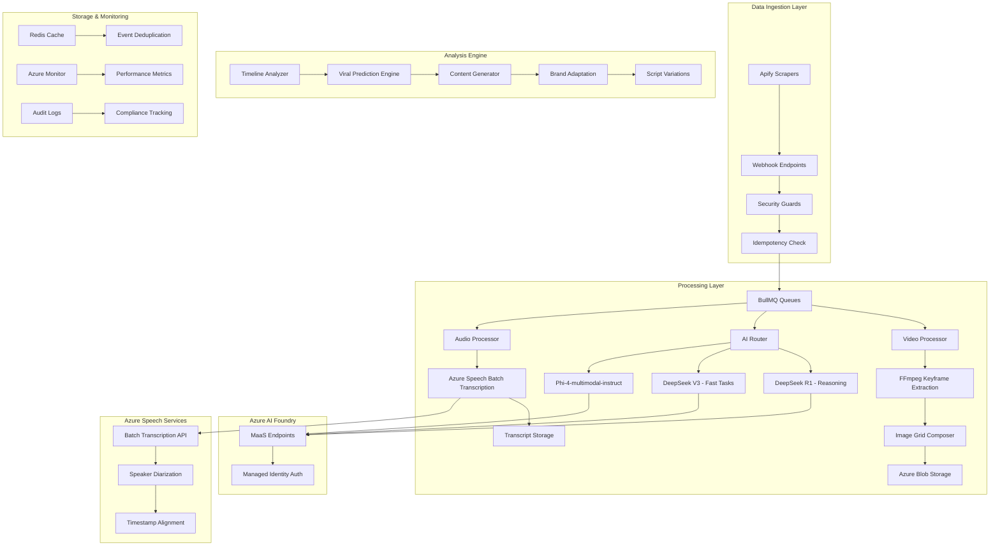

# Design Document: Content & Trends AI Engine

## Overview

The Content & Trends AI Engine is a sophisticated multimodal AI system designed to analyze viral content, predict trends, and generate optimized marketing content. Built on Azure AI Foundry, the system leverages advanced reasoning models (DeepSeek R1/V3), unified multimodal capabilities (Phi-4-multimodal-instruct), and cost-efficient audio transcription (Azure Speech Batch) to understand the deep mechanisms behind viral success and translate them into actionable content strategies.

The system operates as a "Machine de Guerre" (War Machine) for content creation, providing unprecedented insights into viral mechanics through cognitive analysis, visual understanding, audio analysis, and predictive modeling. It transforms raw social media data into strategic content recommendations with scientific precision, including "timeline seconde par seconde" analysis for shorts.

## Architecture

### High-Level Architecture



### Component Architecture

The system follows a microservices architecture with clear separation of concerns:

1. **Ingestion Layer**: Secure webhook processing with cryptographic verification
2. **Processing Layer**: Asynchronous job orchestration with intelligent model routing
3. **AI Layer**: Quadrimodal analysis combining reasoning, generation, multimodal vision, and audio transcription
4. **Analysis Engine**: Viral prediction, timeline analysis, and content generation algorithms
5. **Infrastructure Layer**: Monitoring, caching, and compliance systems

## Components and Interfaces

### 1. Apify Integration System

**Purpose**: Comprehensive web scraping system for social media platforms with secure data ingestion.

#### 1.1 Apify Actor Management

**Interface**:
```typescript
interface ApifyActorManager {
  createActor(config: ActorConfig): Promise<ActorId>;
  scheduleRun(actorId: ActorId, input: ActorInput): Promise<RunId>;
  monitorRun(runId: RunId): Promise<RunStatus>;
  getResults(runId: RunId): Promise<ScrapedData[]>;
  configureWebhook(actorId: ActorId, webhookUrl: string): Promise<void>;
}

interface ActorConfig {
  name: string;
  platform: 'tiktok' | 'instagram' | 'youtube' | 'twitter';
  sourceCode: string;
  buildTag: string;
  memoryMbytes: number;
  timeoutSecs: number;
}

interface ActorInput {
  searchTerms: string[];
  maxResults: number;
  dateRange: {
    from: Date;
    to: Date;
  };
  filters: {
    minViews?: number;
    minLikes?: number;
    contentType?: 'video' | 'image' | 'all';
    language?: string;
  };
}
```

#### 1.2 Platform-Specific Scrapers

**TikTok Scraper Configuration**:
```typescript
interface TikTokScraperConfig extends ActorConfig {
  platform: 'tiktok';
  input: {
    hashtags: string[];
    usernames: string[];
    searchQueries: string[];
    resultsPerQuery: number;
    includeVideoData: boolean;
    includeComments: boolean;
    proxyConfiguration: ProxyConfig;
  };
}

interface TikTokScrapedData {
  id: string;
  url: string;
  videoUrl: string;
  thumbnailUrl: string;
  description: string;
  hashtags: string[];
  mentions: string[];
  author: {
    username: string;
    displayName: string;
    followerCount: number;
    verified: boolean;
  };
  stats: {
    viewCount: number;
    likeCount: number;
    shareCount: number;
    commentCount: number;
  };
  music: {
    title: string;
    author: string;
    duration: number;
  };
  createdAt: Date;
  scrapedAt: Date;
}
```

**Instagram Scraper Configuration**:
```typescript
interface InstagramScraperConfig extends ActorConfig {
  platform: 'instagram';
  input: {
    hashtags: string[];
    locations: string[];
    usernames: string[];
    postTypes: ('photo' | 'video' | 'carousel')[];
    includeStories: boolean;
    includeReels: boolean;
    proxyConfiguration: ProxyConfig;
  };
}

interface InstagramScrapedData {
  id: string;
  shortcode: string;
  url: string;
  mediaType: 'photo' | 'video' | 'carousel';
  mediaUrls: string[];
  caption: string;
  hashtags: string[];
  mentions: string[];
  location?: {
    name: string;
    coordinates: { lat: number; lng: number };
  };
  author: {
    username: string;
    fullName: string;
    followerCount: number;
    verified: boolean;
  };
  engagement: {
    likeCount: number;
    commentCount: number;
    viewCount?: number;
  };
  createdAt: Date;
  scrapedAt: Date;
}
```

#### 1.3 Proxy and Anti-Detection System

**Interface**:
```typescript
interface ProxyManager {
  getProxyPool(platform: string): Promise<ProxyPool>;
  rotateProxy(sessionId: string): Promise<ProxyConfig>;
  validateProxy(proxy: ProxyConfig): Promise<boolean>;
  getHealthyProxies(): Promise<ProxyConfig[]>;
}

interface ProxyConfig {
  type: 'datacenter' | 'residential' | 'mobile';
  host: string;
  port: number;
  username?: string;
  password?: string;
  country: string;
  provider: string;
  healthScore: number;
}

interface AntiDetectionConfig {
  userAgentRotation: boolean;
  headerRandomization: boolean;
  requestDelayRange: { min: number; max: number };
  sessionPersistence: boolean;
  cookieManagement: boolean;
  fingerprintSpoofing: boolean;
}
```

#### 1.4 Webhook Security Controller

**Purpose**: Secure ingestion of data from Apify scrapers with cryptographic verification.

**Interface**:
```typescript
interface WebhookController {
  validateSignature(rawBody: Buffer, signature: string): boolean;
  processApifyWebhook(payload: ApifyWebhookPayload): Promise<JobId>;
  checkIdempotency(eventId: string): Promise<boolean>;
  handleWebhookFailure(error: Error, payload: ApifyWebhookPayload): Promise<void>;
}

interface ApifyWebhookPayload {
  eventType: 'ACTOR.RUN.SUCCEEDED' | 'ACTOR.RUN.FAILED' | 'ACTOR.RUN.TIMED_OUT';
  eventData: {
    actorId: string;
    actorRunId: string;
    resourceId: string;
    userId: string;
  };
  createdAt: string;
}

interface WebhookSecurityGuard {
  verifyTimestamp(timestamp: string): boolean;
  checkRateLimit(clientId: string): boolean;
  validatePayloadStructure(payload: unknown): boolean;
  logSecurityEvent(event: SecurityEvent): void;
}
```

**Security Features**:
- HMAC signature verification using timing-safe comparison
- Raw body preservation for signature validation
- Redis-based idempotency with 24-48 hour TTL
- Rate limiting and DDoS protection
- Timestamp validation to prevent replay attacks
- Payload structure validation

#### 1.5 Data Quality and Validation

**Interface**:
```typescript
interface DataQualityValidator {
  validateScrapedContent(data: ScrapedData): ValidationResult;
  detectDuplicates(newData: ScrapedData[], existing: ScrapedData[]): DuplicateReport;
  enrichMetadata(data: ScrapedData): Promise<EnrichedData>;
  filterLowQuality(data: ScrapedData[]): ScrapedData[];
}

interface ValidationResult {
  isValid: boolean;
  errors: ValidationError[];
  warnings: ValidationWarning[];
  qualityScore: number;
}

interface ValidationError {
  field: string;
  message: string;
  severity: 'critical' | 'major' | 'minor';
}

interface DataEnrichmentService {
  extractAdditionalMetadata(url: string): Promise<AdditionalMetadata>;
  analyzeContentQuality(media: MediaFile): Promise<QualityMetrics>;
  detectLanguage(text: string): Promise<LanguageDetection>;
  categorizeContent(data: ScrapedData): Promise<ContentCategory[]>;
}
```

#### 1.6 Scraping Orchestration and Scheduling

**Interface**:
```typescript
interface ScrapingOrchestrator {
  scheduleTrendAnalysis(config: TrendAnalysisConfig): Promise<ScheduleId>;
  executeImmediateScrape(targets: ScrapeTarget[]): Promise<ScrapeJobId>;
  monitorScrapingHealth(): Promise<HealthReport>;
  optimizeScrapingStrategy(platform: string, results: ScrapingResults): Promise<OptimizedConfig>;
}

interface TrendAnalysisConfig {
  platforms: string[];
  keywords: string[];
  schedule: CronExpression;
  priority: 'low' | 'medium' | 'high' | 'urgent';
  maxConcurrentJobs: number;
  retryPolicy: RetryPolicy;
}

interface ScrapeTarget {
  platform: string;
  type: 'hashtag' | 'user' | 'location' | 'trending';
  value: string;
  depth: number;
  filters: ContentFilters;
}

interface ScrapingResults {
  totalItems: number;
  successRate: number;
  averageLatency: number;
  errorTypes: Record<string, number>;
  dataQualityScore: number;
  costPerItem: number;
}
```

### 2. AI Model Router

**Purpose**: Intelligent routing of tasks to appropriate AI models based on complexity and requirements.

**Interface**:
```typescript
interface AIRouter {
  routeTask(task: AnalysisTask): Promise<ModelEndpoint>;
  determineComplexity(content: Content): TaskComplexity;
  getOptimalModel(complexity: TaskComplexity, modality: Modality): ModelType;
}

enum TaskComplexity {
  SIMPLE = 'simple',        // Classification, formatting
  MODERATE = 'moderate',    // Summarization, extraction
  COMPLEX = 'complex'       // Deep reasoning, prediction
}

enum ModelType {
  DEEPSEEK_V3 = 'deepseek-v3',
  DEEPSEEK_R1 = 'deepseek-r1',
  PHI4_MULTIMODAL = 'phi-4-multimodal-instruct',
  AZURE_SPEECH = 'azure-speech-batch'
}
```

**Routing Logic**:
- DeepSeek R1: Complex reasoning, viral analysis, strategy generation ($0.00135/1K input, $0.0054/1K output)
- DeepSeek V3: Fast classification, text processing, formatting ($0.00114/1K input, $0.00456/1K output)
- Phi-4-multimodal-instruct: Unified image/video/audio analysis via Chat Completions (128K context)
- Azure Speech Batch: Audio transcription at $0.18/hour

### 2.1 Audio Transcription Service

**Purpose**: Cost-efficient audio transcription using Azure Speech Batch Transcription.

**Interface**:
```typescript
interface AudioTranscriptionService {
  submitBatchJob(audioUrls: string[]): Promise<BatchJobId>;
  getTranscriptionStatus(jobId: BatchJobId): Promise<TranscriptionStatus>;
  getTranscriptionResult(jobId: BatchJobId): Promise<TranscriptionResult>;
  extractAudioFromVideo(videoUrl: string): Promise<AudioFile>;
}

interface TranscriptionResult {
  jobId: string;
  audioUrl: string;
  transcript: string;
  segments: TranscriptSegment[];
  speakers: SpeakerInfo[];
  duration: number;
  confidence: number;
  costUsd: number;
}

interface TranscriptSegment {
  startTime: number;
  endTime: number;
  text: string;
  speakerId?: string;
  confidence: number;
}

interface SpeakerInfo {
  speakerId: string;
  totalSpeakingTime: number;
  segmentCount: number;
}
```

**Features**:
- Batch processing for cost efficiency ($0.18/hour)
- Speaker diarization for multi-speaker content
- Timestamp alignment for timeline analysis
- Integration with video processing pipeline

### 3. Video Processing Pipeline

**Purpose**: Extract and process visual and audio information from social media videos.

**Interface**:
```typescript
interface VideoProcessor {
  extractKeyframes(videoUrl: string): Promise<Keyframe[]>;
  createImageGrid(keyframes: Keyframe[]): Promise<CompositeImage>;
  uploadToBlob(image: CompositeImage): Promise<BlobUrl>;
  extractAudio(videoUrl: string): Promise<AudioFile>;
  analyzeVisualContent(blobUrl: BlobUrl): Promise<VisualAnalysis>;
  analyzeAudioContent(audioFile: AudioFile): Promise<AudioAnalysis>;
}

interface Keyframe {
  timestamp: number;
  imageData: Buffer;
  sceneChangeScore: number;
}

interface CompositeImage {
  gridData: Buffer;
  dimensions: { width: number; height: number };
  keyframePositions: GridPosition[];
}

interface AudioFile {
  url: string;
  duration: number;
  format: string;
  sampleRate: number;
}
```

**Processing Steps**:
1. Scene change detection using FFmpeg
2. Keyframe extraction (beginning, 25%, 50%, 75%, end)
3. Grid composition (2x2 or 3x3 layout)
4. Image optimization (max 2048x2048)
5. Azure Blob Storage upload with SAS tokens
6. Audio extraction for transcription
7. Azure Speech Batch Transcription submission

### 3.1 Phi-4 Multimodal Service

**Purpose**: Unified multimodal analysis using Phi-4-multimodal-instruct for text, images, and audio context.

**Interface**:
```typescript
interface Phi4MultimodalService {
  analyzeContent(request: MultimodalAnalysisRequest): Promise<MultimodalAnalysisResult>;
  analyzeVideoKeyframes(keyframes: Keyframe[], transcript?: TranscriptionResult): Promise<TimelineAnalysis>;
  generateDenseCaption(imageUrl: string, audioContext?: string): Promise<string>;
}

interface MultimodalAnalysisRequest {
  imageUrls?: string[];
  text?: string;
  audioTranscript?: string;
  analysisTypes: AnalysisType[];
  context?: string;
  language?: string;
}

interface MultimodalAnalysisResult {
  analysisId: string;
  ocr: OCRResult;
  facialExpressions: FacialExpressionResult[];
  editingDynamics: EditingDynamicsResult;
  visualElements: VisualElement[];
  audioAnalysis?: AudioContentAnalysis;
  sceneDescription: string;
  timelineInsights?: TimelineInsight[];
  confidence: number;
  processingTimeMs: number;
  tokenConsumption: number;
}

interface TimelineAnalysis {
  segments: TimelineSegment[];
  engagementPeaks: EngagementPeak[];
  hookMoments: HookMoment[];
  retentionDropoffs: RetentionDropoff[];
}

interface TimelineSegment {
  startTime: number;
  endTime: number;
  visualDescription: string;
  audioContent: string;
  engagementScore: number;
  viralPotential: number;
}

interface EngagementPeak {
  timestamp: number;
  type: 'hook' | 'reveal' | 'payoff' | 'cliffhanger';
  description: string;
  strength: number;
}
```

**Features**:
- Single Chat Completions call for unified text + images + audio analysis
- 128K context window for comprehensive content analysis
- Timeline "seconde par seconde" analysis for shorts
- Integration with Azure Speech transcription results

### 4. Viral Prediction Engine

**Purpose**: Analyze content to identify viral mechanisms and predict replicability.

**Interface**:
```typescript
interface ViralPredictionEngine {
  analyzeViralMechanisms(content: MultimodalContent): Promise<ViralAnalysis>;
  calculateReplicabilityScore(analysis: ViralAnalysis): Promise<number>;
  identifyEmotionalTriggers(content: Content): Promise<EmotionalTrigger[]>;
  generateInsights(analysis: ViralAnalysis): Promise<ActionableInsight[]>;
}

interface ViralAnalysis {
  cognitiveDissonance: DissonanceAnalysis;
  emotionalTriggers: EmotionalTrigger[];
  visualElements: VisualElement[];
  engagementMetrics: EngagementData;
  replicabilityScore: number;
  viralMechanisms: ViralMechanism[];
}

interface ViralMechanism {
  type: 'authenticity' | 'controversy' | 'humor' | 'surprise' | 'social_proof';
  strength: number;
  description: string;
  replicabilityFactor: number;
}
```

### 5. Content Generation System

**Purpose**: Generate brand-adapted content based on identified viral mechanisms.

**Interface**:
```typescript
interface ContentGenerator {
  generateScriptVariations(
    viralMechanisms: ViralMechanism[],
    brandContext: BrandContext
  ): Promise<ScriptVariation[]>;
  adaptToPersona(script: Script, persona: BrandPersona): Promise<Script>;
  generateHooks(triggers: EmotionalTrigger[]): Promise<Hook[]>;
  createCallToAction(context: BrandContext): Promise<CallToAction>;
}

interface ScriptVariation {
  id: string;
  hook: Hook;
  narrative: NarrativeStructure;
  callToAction: CallToAction;
  viralElements: ViralElement[];
  brandAdaptation: AdaptationStrategy;
}

interface BrandContext {
  industry: string;
  tone: 'professional' | 'casual' | 'humorous' | 'authoritative';
  targetAudience: AudienceProfile;
  brandValues: string[];
  contentGoals: ContentGoal[];
}
```

## Data Models

### Core Data Structures

```typescript
// Social Media Content
interface SocialMediaContent {
  id: string;
  platform: 'tiktok' | 'instagram' | 'youtube' | 'twitter';
  url: string;
  mediaType: 'video' | 'image' | 'text';
  metadata: {
    title?: string;
    description?: string;
    hashtags: string[];
    mentions: string[];
    duration?: number;
  };
  engagement: EngagementMetrics;
  createdAt: Date;
  scrapedAt: Date;
}

// Engagement Metrics
interface EngagementMetrics {
  views: number;
  likes: number;
  shares: number;
  comments: number;
  velocity: {
    viewsPerHour: number;
    likesPerHour: number;
    sharesPerHour: number;
  };
  demographics?: {
    ageGroups: Record<string, number>;
    genders: Record<string, number>;
    locations: Record<string, number>;
  };
}

// AI Analysis Results
interface AIAnalysisResult {
  contentId: string;
  modelUsed: ModelType;
  analysisType: 'visual' | 'textual' | 'reasoning' | 'prediction';
  result: {
    insights: Insight[];
    confidence: number;
    processingTime: number;
    tokenConsumption: number;
  };
  reasoning?: ChainOfThought;
  createdAt: Date;
}

// Chain of Thought (for DeepSeek R1)
interface ChainOfThought {
  steps: ReasoningStep[];
  conclusion: string;
  confidence: number;
}

interface ReasoningStep {
  step: number;
  thought: string;
  evidence: string[];
  conclusion: string;
}
```

### Database Schema

```sql
-- Content Analysis Results
CREATE TABLE content_analyses (
    id UUID PRIMARY KEY,
    content_id VARCHAR(255) NOT NULL,
    analysis_type VARCHAR(50) NOT NULL,
    model_used VARCHAR(50) NOT NULL,
    insights JSONB NOT NULL,
    viral_score DECIMAL(3,2),
    replicability_score DECIMAL(3,2),
    processing_time_ms INTEGER,
    token_consumption INTEGER,
    reasoning_chain JSONB,
    created_at TIMESTAMP DEFAULT NOW(),
    INDEX idx_content_id (content_id),
    INDEX idx_analysis_type (analysis_type),
    INDEX idx_viral_score (viral_score DESC)
);

-- Generated Content
CREATE TABLE generated_content (
    id UUID PRIMARY KEY,
    source_analysis_id UUID REFERENCES content_analyses(id),
    brand_context JSONB NOT NULL,
    script_variations JSONB NOT NULL,
    generation_strategy VARCHAR(100),
    quality_score DECIMAL(3,2),
    created_at TIMESTAMP DEFAULT NOW(),
    INDEX idx_source_analysis (source_analysis_id),
    INDEX idx_quality_score (quality_score DESC)
);

-- Processing Jobs
CREATE TABLE processing_jobs (
    id UUID PRIMARY KEY,
    job_type VARCHAR(50) NOT NULL,
    status VARCHAR(20) NOT NULL,
    priority INTEGER DEFAULT 0,
    payload JSONB NOT NULL,
    result JSONB,
    error_message TEXT,
    attempts INTEGER DEFAULT 0,
    max_attempts INTEGER DEFAULT 3,
    scheduled_at TIMESTAMP,
    started_at TIMESTAMP,
    completed_at TIMESTAMP,
    created_at TIMESTAMP DEFAULT NOW(),
    INDEX idx_status_priority (status, priority DESC),
    INDEX idx_job_type (job_type),
    INDEX idx_scheduled_at (scheduled_at)
);
```

## Correctness Properties

*A property is a characteristic or behavior that should hold true across all valid executions of a system—essentially, a formal statement about what the system should do. Properties serve as the bridge between human-readable specifications and machine-verifiable correctness guarantees.*

### Property Reflection

After analyzing all acceptance criteria, several properties can be consolidated to eliminate redundancy:

- Properties 2.1 and 2.2 (routing logic) can be combined into a single comprehensive routing property
- Properties 4.2 and 4.4 (queue management) can be unified into queue behavior property  
- Properties 5.1, 5.3, and 5.5 (webhook security) can be consolidated into webhook validation property
- Properties 7.3 and 7.5 (analysis output) can be combined into analysis completeness property

### Core Properties

**Property 1: AI Model Routing Consistency**
*For any* analysis task with determined complexity level, the system should route simple tasks to DeepSeek V3, complex reasoning tasks to DeepSeek R1, and visual tasks to Llama Vision, ensuring optimal resource utilization and cost efficiency.
**Validates: Requirements 2.1, 2.2**

**Property 2: Reasoning Chain Isolation**
*For any* DeepSeek R1 interaction, reasoning tokens should be captured and stored separately but never reinjected into conversation history, preventing contamination of future reasoning processes.
**Validates: Requirements 2.3**

**Property 3: Video Processing Consistency**
*For any* input video, keyframe extraction should produce a composite grid image resized to maximum 2048x2048 pixels and stored in Azure Blob Storage with proper SAS tokens.
**Validates: Requirements 3.1, 3.2, 3.3, 3.4**

**Property 4: Asynchronous Queue Behavior**
*For any* submitted AI inference task, the system should immediately place it in Redis-backed BullMQ queues with appropriate priority and respect concurrency limits to prevent API rate limit violations.
**Validates: Requirements 4.1, 4.2, 4.3, 4.4**

**Property 5: Webhook Security Validation**
*For any* incoming Apify webhook, the system should verify cryptographic signatures using timing-safe comparison, validate payload structure, and implement idempotency to prevent duplicate processing.
**Validates: Requirements 5.1, 5.2, 5.3, 5.5**

**Property 6: Exponential Backoff Retry**
*For any* failed API call to Azure AI services, the system should implement exponential backoff retry strategy with increasing delays (2s, 4s, 8s, 16s) up to maximum attempts.
**Validates: Requirements 4.5, 6.1**

**Property 7: Circuit Breaker Activation**
*For any* service experiencing error rates above threshold, the circuit breaker should activate and queue requests for later processing instead of immediate failure, preventing cascading failures.
**Validates: Requirements 6.2, 6.4**

**Property 8: Viral Analysis Completeness**
*For any* content analysis, the system should combine visual analysis from Llama Vision with engagement metrics, generate dense captions including all required elements, and output structured JSON with insights, triggers, and recommendations.
**Validates: Requirements 7.1, 7.2, 7.3, 7.5**

**Property 9: Content Generation Consistency**
*For any* identified viral mechanism, the system should generate exactly 3 script variations adapted to brand context, maintaining core viral triggers while adapting surface elements using persona prompting.
**Validates: Requirements 8.1, 8.2, 8.4, 8.5**

**Property 10: Monitoring and Metrics Collection**
*For any* AI model invocation, the system should track token consumption, latency, and success rates, storing metrics in Azure Monitor for performance analysis and SLA compliance.
**Validates: Requirements 10.2, 10.5**

## Error Handling

### Error Categories and Strategies

1. **AI Model Errors**
   - Rate limiting (429): Exponential backoff with jitter
   - Service unavailable (503): Circuit breaker activation
   - Invalid input (400): Input validation and sanitization
   - Timeout: Retry with increased timeout limits

2. **Video Processing Errors**
   - Corrupt video files: Graceful degradation to metadata analysis
   - Unsupported formats: Format conversion or rejection
   - Large file sizes: Streaming processing or compression

3. **Webhook Security Errors**
   - Invalid signatures: Immediate rejection with audit logging
   - Malformed payloads: Validation error response
   - Replay attacks: Idempotency check failure

4. **Infrastructure Errors**
   - Redis unavailability: Fallback to in-memory queuing
   - Blob storage errors: Retry with alternative storage regions
   - Network partitions: Graceful degradation and recovery

### Error Recovery Mechanisms

```typescript
interface ErrorRecoveryStrategy {
  retryPolicy: RetryPolicy;
  circuitBreaker: CircuitBreakerConfig;
  fallbackStrategy: FallbackStrategy;
  alerting: AlertingConfig;
}

interface RetryPolicy {
  maxAttempts: number;
  backoffStrategy: 'exponential' | 'linear' | 'fixed';
  baseDelay: number;
  maxDelay: number;
  jitter: boolean;
}

interface CircuitBreakerConfig {
  failureThreshold: number;
  recoveryTimeout: number;
  monitoringWindow: number;
  halfOpenMaxCalls: number;
}
```

## Testing Strategy

### Dual Testing Approach

The system requires both unit testing and property-based testing to ensure comprehensive coverage:

**Unit Tests**: Verify specific examples, edge cases, and error conditions
- Authentication flow validation
- Webhook signature verification
- Video processing edge cases
- Error handling scenarios

**Property Tests**: Verify universal properties across all inputs
- AI model routing consistency across task types
- Queue behavior under various load conditions
- Content generation quality across different inputs
- Security validation across all webhook variations

### Property-Based Testing Configuration

Each property test should run a minimum of 100 iterations to ensure statistical confidence. Tests will use the fast-check library for TypeScript with custom generators for:

- Social media content with realistic engagement patterns
- Video files with various formats and durations
- Webhook payloads with different signature schemes
- Brand contexts across industries and personas

### Test Tags and Organization

Each property-based test must reference its design document property:
- **Feature: content-trends-ai-engine, Property 1**: AI Model Routing Consistency
- **Feature: content-trends-ai-engine, Property 2**: Reasoning Chain Isolation
- **Feature: content-trends-ai-engine, Property 3**: Video Processing Consistency

### Integration Testing

Critical integration points require dedicated testing:
- Azure AI Foundry model endpoints
- Apify webhook integration
- Redis queue persistence
- Blob storage operations
- Monitoring and alerting systems

The testing strategy ensures that the Content & Trends AI Engine maintains reliability, security, and performance standards while delivering accurate viral analysis and content generation capabilities.