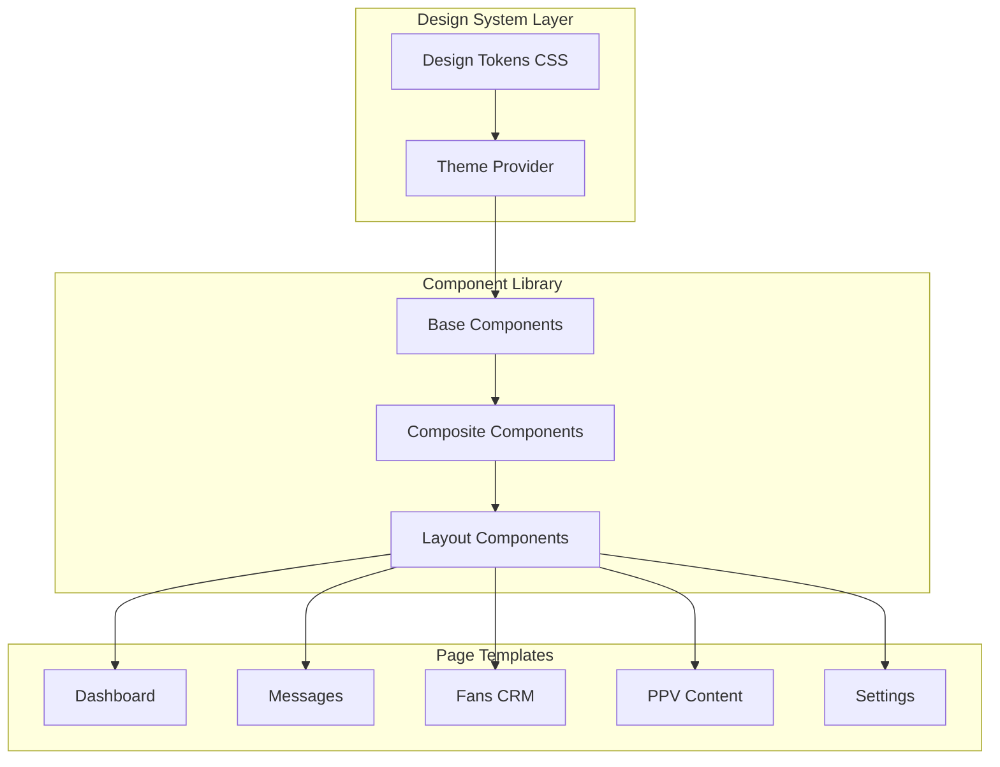
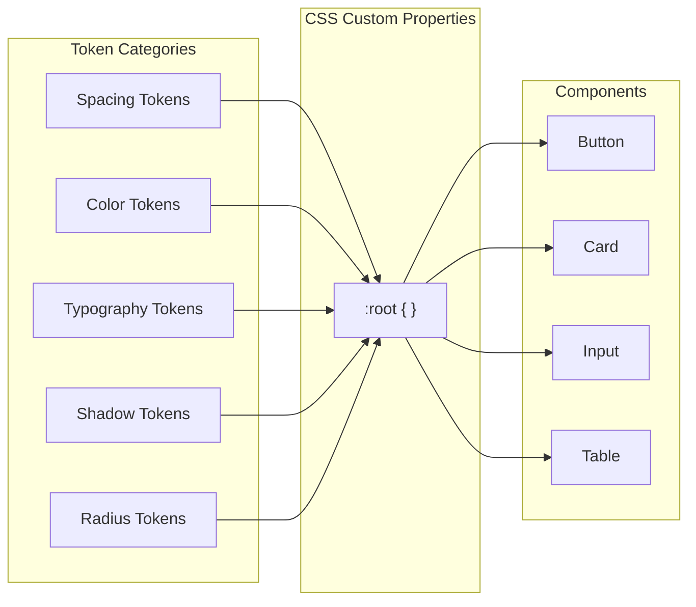

# Design Document: Dashboard Design Refactor

## Overview

Cette refonte vise à transformer le dashboard Huntaze d'une interface perçue comme "buggée" et incohérente vers un design professionnel de classe Shopify Polaris. L'approche repose sur trois piliers fondamentaux :

1. **Système de Design Tokens** - Variables CSS centralisées pour garantir la cohérence mathématique
2. **Grille de 4px** - Tous les espacements sont des multiples de 4 pour éliminer la "vibration visuelle"
3. **Composants Modulaires** - Bibliothèque de composants réutilisables avec états définis

Le résultat attendu est une interface qui inspire confiance, améliore la productivité des power users (agences) et réduit la charge cognitive des créateurs.

## Architecture



### Architecture des Tokens



## Components and Interfaces

### 1. Design Tokens Module

```typescript
// lib/design-system/tokens.ts
export interface DesignTokens {
  spacing: {
    '1': string;  // 4px
    '2': string;  // 8px
    '3': string;  // 12px
    '4': string;  // 16px
    '5': string;  // 20px
    '6': string;  // 24px
    '8': string;  // 32px
  };
  colors: {
    surface: {
      base: string;      // #F6F6F7
      card: string;      // #FFFFFF
      subdued: string;   // #FAFBFB
    };
    text: {
      primary: string;   // #202223
      secondary: string; // #6D7175
      subdued: string;   // #8C9196
    };
    action: {
      primary: string;   // #7C3AED (violet)
      secondary: string; // #E4E5E7
    };
    status: {
      success: string;   // #008060
      warning: string;   // #B98900
      critical: string;  // #D72C0D
      info: string;      // #2C6ECB
    };
    border: {
      default: string;   // #E1E3E5
      subdued: string;   // #EDEEEF
    };
  };
  typography: {
    fontFamily: string;
    sizes: {
      xs: string;   // 12px
      sm: string;   // 14px
      base: string; // 16px
      lg: string;   // 20px
      xl: string;   // 24px
      '2xl': string; // 28px
    };
    weights: {
      regular: number;  // 400
      medium: number;   // 500
      semibold: number; // 600
    };
  };
  shadows: {
    card: string;    // 0px 1px 3px rgba(0,0,0,0.1)
    elevated: string; // 0px 4px 12px rgba(0,0,0,0.15)
    focus: string;   // 0 0 0 2px var(--color-action-primary)
  };
  radius: {
    sm: string;   // 4px
    base: string; // 8px
    lg: string;   // 12px
    full: string; // 9999px
  };
}

export interface TokenSerializer {
  toJSON(tokens: DesignTokens): string;
  fromJSON(json: string): DesignTokens;
  toCSSVariables(tokens: DesignTokens): string;
}
```

### 2. Card Component

```typescript
// components/ui/Card.tsx
export interface CardProps {
  children: React.ReactNode;
  padding?: 'none' | 'sm' | 'base' | 'lg';
  shadow?: 'none' | 'card' | 'elevated';
  footer?: React.ReactNode;
  className?: string;
}

export interface StatCardProps {
  label: string;
  value: string | number;
  trend?: {
    direction: 'up' | 'down' | 'neutral';
    value: string;
  };
  isEmpty?: boolean;
  emptyMessage?: string;
  loading?: boolean;
}
```

### 3. Banner Component

```typescript
// components/ui/Banner.tsx
export interface BannerProps {
  status: 'info' | 'warning' | 'critical' | 'success';
  title: string;
  description?: string;
  icon?: React.ReactNode;
  action?: {
    label: string;
    onClick: () => void;
  };
  onDismiss?: () => void;
}
```

### 4. IndexTable Component

```typescript
// components/ui/IndexTable.tsx
export interface Column<T> {
  key: keyof T;
  header: string;
  width?: string;
  align?: 'left' | 'center' | 'right';
  render?: (value: T[keyof T], row: T) => React.ReactNode;
  truncate?: boolean;
}

export interface IndexTableProps<T> {
  data: T[];
  columns: Column<T>[];
  rowHeight?: 'compact' | 'default' | 'relaxed';
  loading?: boolean;
  emptyState?: React.ReactNode;
  onRowClick?: (row: T) => void;
  onRowHover?: (row: T | null) => void;
}
```

### 5. Badge Component

```typescript
// components/ui/Badge.tsx
export interface BadgeProps {
  status: 'success' | 'warning' | 'critical' | 'info' | 'neutral';
  children: string;
  size?: 'sm' | 'base';
}
```

### 6. ConversationList Component

```typescript
// components/messages/ConversationList.tsx
export interface Conversation {
  id: string;
  name: string;
  avatar: string;
  lastMessage: string;
  timestamp: Date;
  unread: boolean;
  ltv?: number;
}

export interface ConversationListProps {
  conversations: Conversation[];
  selectedId?: string;
  onSelect: (id: string) => void;
  density?: 'compact' | 'default';
  loading?: boolean;
}
```

### 7. FanContextSidebar Component

```typescript
// components/messages/FanContextSidebar.tsx
export interface FanContext {
  id: string;
  name: string;
  ltv: number;
  status: 'vip' | 'active' | 'at-risk' | 'churned';
  notes: string[];
  purchaseHistory: {
    date: Date;
    amount: number;
    item: string;
  }[];
}

export interface FanContextSidebarProps {
  fan: FanContext | null;
  loading?: boolean;
}
```

### 8. ContentGrid Component

```typescript
// components/ppv/ContentGrid.tsx
export interface ContentItem {
  id: string;
  thumbnail: string;
  title: string;
  price: number;
  stats: {
    sent: number;
    opened: number;
    purchased: number;
  };
}

export interface ContentGridProps {
  items: ContentItem[];
  aspectRatio?: '16:9' | '1:1' | '4:3';
  gap?: 'sm' | 'base' | 'lg';
  loading?: boolean;
  onSend: (id: string) => void;
  onEdit: (id: string) => void;
}
```

### 9. Input Component

```typescript
// components/ui/Input.tsx
export interface InputProps extends React.InputHTMLAttributes<HTMLInputElement> {
  label?: string;
  error?: string;
  helpText?: string;
  prefix?: React.ReactNode;
  suffix?: React.ReactNode;
}

export interface ToggleProps {
  checked: boolean;
  onChange: (checked: boolean) => void;
  label: string;
  description?: string;
  disabled?: boolean;
}
```

### 10. Skeleton Component

```typescript
// components/ui/Skeleton.tsx
export interface SkeletonProps {
  variant: 'text' | 'circular' | 'rectangular' | 'card';
  width?: string | number;
  height?: string | number;
  animation?: 'pulse' | 'wave' | 'none';
}

export interface SkeletonTableProps {
  rows: number;
  columns: number;
}
```

## Data Models

### Design Token Schema

```typescript
interface TokenValue {
  value: string;
  description?: string;
  type: 'spacing' | 'color' | 'typography' | 'shadow' | 'radius';
}

interface TokenCategory {
  [tokenName: string]: TokenValue | TokenCategory;
}

interface DesignTokenSchema {
  version: string;
  tokens: {
    spacing: TokenCategory;
    colors: TokenCategory;
    typography: TokenCategory;
    shadows: TokenCategory;
    radius: TokenCategory;
  };
}
```

### Component State Models

```typescript
interface LoadingState {
  isLoading: boolean;
  skeleton: 'card' | 'table' | 'list' | 'text';
}

interface EmptyState {
  isEmpty: boolean;
  title: string;
  description: string;
  action?: {
    label: string;
    href: string;
  };
  illustration?: string;
}

interface HoverState {
  isHovered: boolean;
  rowId?: string;
}

interface FocusState {
  isFocused: boolean;
  focusRing: boolean;
}
```

## Error Handling

### Token Validation Errors

```typescript
class TokenValidationError extends Error {
  constructor(
    public tokenPath: string,
    public expectedType: string,
    public receivedValue: unknown
  ) {
    super(`Invalid token at ${tokenPath}: expected ${expectedType}, got ${typeof receivedValue}`);
  }
}

class TokenSerializationError extends Error {
  constructor(
    public operation: 'serialize' | 'deserialize',
    public cause: Error
  ) {
    super(`Token ${operation} failed: ${cause.message}`);
  }
}
```

### Component Error Boundaries

```typescript
interface ComponentErrorState {
  hasError: boolean;
  error?: Error;
  fallback: React.ReactNode;
}
```

## Testing Strategy

### Dual Testing Approach

Cette refonte utilise une approche de test duale :

1. **Tests Unitaires** - Vérifient des exemples spécifiques et cas limites
2. **Tests Property-Based** - Vérifient des propriétés universelles sur tous les inputs

### Property-Based Testing Library

Nous utiliserons **fast-check** pour les tests property-based en TypeScript/JavaScript.

Configuration minimale : 100 itérations par propriété.

### Test Categories

1. **Token Tests**
   - Round-trip serialization (JSON export/import)
   - Spacing values are multiples of 4
   - Color values are valid CSS colors

2. **Component Tests**
   - Card padding matches token values
   - Badge colors match status semantics
   - Table row heights are uniform

3. **Layout Tests**
   - No layout shift during loading
   - Aspect ratios are preserved
   - Focus rings are visible

### Test Annotation Format

Chaque test property-based doit être annoté avec :
```typescript
/**
 * **Feature: dashboard-design-refactor, Property {number}: {property_text}**
 * **Validates: Requirements X.Y**
 */
```


## Correctness Properties

*A property is a characteristic or behavior that should hold true across all valid executions of a system-essentially, a formal statement about what the system should do. Properties serve as the bridge between human-readable specifications and machine-verifiable correctness guarantees.*

Based on the prework analysis, the following correctness properties have been identified. Properties are consolidated to eliminate redundancy while ensuring comprehensive coverage.

### Property 1: Spacing tokens are multiples of 4px

*For any* spacing token in the design system, its numeric value SHALL be a multiple of 4 pixels.

**Validates: Requirements 1.1**

### Property 2: Color tokens are valid CSS colors

*For any* color token in the design system, its value SHALL be a valid CSS color string (hex, rgb, rgba, hsl, or named color).

**Validates: Requirements 1.2**

### Property 3: Shadow tokens are valid CSS box-shadow

*For any* shadow token in the design system, its value SHALL be a valid CSS box-shadow string.

**Validates: Requirements 1.3**

### Property 4: Radius tokens are valid CSS lengths

*For any* radius token in the design system, its value SHALL be a valid CSS length value (px, rem, em, or 0).

**Validates: Requirements 1.4**

### Property 5: Typography scale is constrained

*For any* font-size token in the design system, its value SHALL be one of the allowed scale values (12px, 14px, 16px, 20px, 24px, 28px).

**Validates: Requirements 2.1**

### Property 6: Font weights are constrained

*For any* font-weight token in the design system, its value SHALL be one of the allowed weights (400, 500, 600).

**Validates: Requirements 2.2**

### Property 7: Card styling consistency

*For any* Card component, the rendered output SHALL have padding matching the --space-4 token (16px), shadow matching --shadow-card, and border-radius matching --radius-base (8px).

**Validates: Requirements 3.1, 3.2, 3.3**

### Property 8: Card with actions has footer

*For any* Card component with actions prop, the rendered output SHALL contain a footer element with subdued background.

**Validates: Requirements 3.4**

### Property 9: StatCard structure

*For any* StatCard component, the rendered output SHALL have the label element positioned before the value element in the DOM.

**Validates: Requirements 3.5**

### Property 10: Empty state completeness

*For any* StatCard or IndexTable with empty data, the rendered output SHALL NOT display "0" and SHALL display a non-empty message string.

**Validates: Requirements 4.1, 4.2, 4.3**

### Property 11: Loading state renders skeletons

*For any* component with loading=true, the rendered output SHALL contain Skeleton elements matching the expected content structure.

**Validates: Requirements 4.4, 12.1**

### Property 12: Banner color semantics

*For any* Banner component, the background color SHALL match the semantic color token for its status (info→blue, warning→yellow, critical→red, success→green).

**Validates: Requirements 5.1**

### Property 13: Banner structure completeness

*For any* Banner component, the rendered output SHALL contain an icon element and, if action prop is provided, a button element.

**Validates: Requirements 5.2, 5.3**

### Property 14: Banner WCAG contrast

*For any* Banner component, the contrast ratio between text color and background color SHALL be at least 4.5:1.

**Validates: Requirements 5.4**

### Property 15: Table row height uniformity

*For any* IndexTable with data containing varying text lengths, all rendered rows SHALL have identical height.

**Validates: Requirements 6.1**

### Property 16: Numerical column alignment

*For any* IndexTable column with numeric data, the column cells SHALL have text-align: right.

**Validates: Requirements 6.2**

### Property 17: Badge consistency

*For any* Badge component, the rendered output SHALL have font-size of 12px and border-radius of 4px.

**Validates: Requirements 6.3**

### Property 18: Conversation avatar sizing

*For any* ConversationList item, the avatar element SHALL have dimensions between 32px and 40px.

**Validates: Requirements 7.1**

### Property 19: Conversation item structure

*For any* ConversationList item, the rendered output SHALL contain name, message excerpt, and timestamp elements with distinct font sizes establishing hierarchy.

**Validates: Requirements 7.2**

### Property 20: Unread indicator visibility

*For any* ConversationList item with unread=true, the rendered output SHALL have a left border of at least 3px width with a colored value.

**Validates: Requirements 7.3**

### Property 21: Fan context sidebar completeness

*For any* FanContextSidebar with fan data, the rendered output SHALL display LTV value, notes section, and purchase history section.

**Validates: Requirements 8.1**

### Property 22: Touch target minimum size

*For any* interactive button element, the rendered dimensions SHALL be at least 44px × 44px.

**Validates: Requirements 8.4**

### Property 23: Content grid gap consistency

*For any* ContentGrid component, the CSS grid gap SHALL match the design token value (16px for base).

**Validates: Requirements 9.1**

### Property 24: Media aspect ratio enforcement

*For any* ContentGrid thumbnail, the container SHALL have aspect-ratio CSS property and the image SHALL have object-fit: cover.

**Validates: Requirements 9.2**

### Property 25: Action button hierarchy

*For any* ContentGrid card, the primary action button SHALL have a solid background and the secondary action SHALL have outline or text-only style.

**Validates: Requirements 9.3**

### Property 26: Input custom styling

*For any* Input component, the rendered input element SHALL have appearance: none and custom border/background styles.

**Validates: Requirements 10.1**

### Property 27: Focus ring visibility

*For any* Input component in focused state, the rendered output SHALL have a visible focus ring using the action-primary color.

**Validates: Requirements 10.2**

### Property 28: Toggle design system colors

*For any* Toggle component, the ON state color SHALL match the action-primary token and OFF state SHALL match a neutral gray token.

**Validates: Requirements 10.4**

### Property 29: Settings toggle proximity

*For any* settings item with a toggle, the toggle element and its label SHALL be within the same parent container.

**Validates: Requirements 11.1**

### Property 30: Settings list separators

*For any* settings list, items SHALL have either border separators or alternating background colors.

**Validates: Requirements 11.2**

### Property 31: Image space reservation

*For any* image container in loading state, the container SHALL have aspect-ratio CSS property to reserve space.

**Validates: Requirements 12.2**

### Property 32: Layout stability

*For any* component transitioning from loading to loaded state, the container dimensions SHALL remain unchanged.

**Validates: Requirements 12.3**

### Property 33: Navigation item structure

*For any* sidebar navigation item, the rendered output SHALL contain both an icon element and a text label element.

**Validates: Requirements 13.1**

### Property 34: Active navigation indicator

*For any* sidebar navigation item in active state, the rendered output SHALL have distinct styling (background highlight or border) compared to inactive items.

**Validates: Requirements 13.2**

### Property 35: Navigation item count limit

*For any* sidebar navigation, the count of first-level menu items SHALL be at most 10.

**Validates: Requirements 13.3**

### Property 36: Design token round-trip serialization

*For any* valid DesignTokens object, serializing to JSON and deserializing back SHALL produce an object equal to the original.

**Validates: Requirements 14.1, 14.2, 14.3**
