# Design Document: Dashboard UX Overhaul

## Overview

Cette refonte vise à transformer le dashboard Huntaze en une expérience utilisateur professionnelle et intuitive, centrée sur les fonctionnalités IA. L'objectif est de rendre toutes les fonctionnalités accessibles via une navigation claire, avec l'IA comme élément différenciateur visible et utilisable.

### Objectifs principaux:
1. Navigation sidebar complète et intuitive
2. Fonctionnalités IA visibles et accessibles partout
3. Pages cohérentes avec le design system
4. Expérience mobile-first responsive

## Architecture

```mermaid
graph TB
    subgraph "Dashboard Shell"
        Sidebar[Sidebar Navigation]
        Header[Page Header]
        Content[Content Area]
        AIPanel[AI Assistant Panel]
        FAB[Quick Actions FAB]
    end
    
    subgraph "Main Sections"
        Home[Home/Dashboard]
        OF[OnlyFans Section]
        Analytics[Analytics Section]
        Marketing[Marketing Section]
        ContentMgmt[Content Section]
        Automations[Automations Section]
        Integrations[Integrations]
        Settings[Settings]
    end
    
    subgraph "AI Features"
        Chat[AI Chat Assistant]
        AutoReply[Auto-Reply Engine]
        Segmentation[Fan Segmentation]
        CampaignGen[Campaign Generator]
        Insights[AI Insights]
        Pricing[Pricing Optimizer]
    end
    
    Sidebar --> Home
    Sidebar --> OF
    Sidebar --> Analytics
    Sidebar --> Marketing
    Sidebar --> ContentMgmt
    Sidebar --> Automations
    Sidebar --> Integrations
    Sidebar --> Settings
    
    AIPanel --> Chat
    AIPanel --> AutoReply
    AIPanel --> Segmentation
    AIPanel --> CampaignGen
    AIPanel --> Insights
    AIPanel --> Pricing
```



## Components and Interfaces

### 1. Sidebar Navigation Component

```typescript
interface SidebarSection {
  id: string;
  label: string;
  icon: LucideIcon;
  href?: string;
  items?: SidebarItem[];
  badge?: BadgeConfig;
}

interface SidebarItem {
  label: string;
  href: string;
  icon?: LucideIcon;
  badge?: BadgeConfig;
  isNew?: boolean;
}

interface BadgeConfig {
  type: 'count' | 'alert' | 'new';
  value?: number;
  url?: string;
}

// Navigation structure
const SIDEBAR_SECTIONS: SidebarSection[] = [
  {
    id: 'home',
    label: 'Home',
    icon: Home,
    href: '/dashboard'
  },
  {
    id: 'onlyfans',
    label: 'OnlyFans',
    icon: Heart,
    items: [
      { label: 'Overview', href: '/onlyfans' },
      { label: 'Messages', href: '/onlyfans/messages', badge: { type: 'count', url: '/api/messages/unread' } },
      { label: 'Fans', href: '/onlyfans/fans' },
      { label: 'PPV', href: '/onlyfans/ppv' },
      { label: 'Settings', href: '/onlyfans/settings' }
    ]
  },
  {
    id: 'analytics',
    label: 'Analytics',
    icon: BarChart3,
    items: [
      { label: 'Overview', href: '/analytics' },
      { label: 'Revenue', href: '/analytics/revenue' },
      { label: 'Fans', href: '/analytics/fans' },
      { label: 'Churn', href: '/analytics/churn' },
      { label: 'Pricing', href: '/analytics/pricing' },
      { label: 'Forecast', href: '/analytics/forecast' }
    ]
  },
  {
    id: 'marketing',
    label: 'Marketing',
    icon: Megaphone,
    items: [
      { label: 'Campaigns', href: '/marketing/campaigns' },
      { label: 'Social Planner', href: '/marketing/social' },
      { label: 'Calendar', href: '/marketing/calendar' }
    ]
  },
  {
    id: 'content',
    label: 'Content',
    icon: Image,
    items: [
      { label: 'Library', href: '/content' },
      { label: 'Editor', href: '/content/editor' },
      { label: 'Templates', href: '/content/templates' },
      { label: 'Schedule', href: '/content/schedule' }
    ]
  },
  {
    id: 'automations',
    label: 'Automations',
    icon: Zap,
    items: [
      { label: 'Overview', href: '/automations' },
      { label: 'Flows', href: '/automations/flows' },
      { label: 'Templates', href: '/automations/templates' },
      { label: 'Analytics', href: '/automations/analytics' }
    ]
  },
  {
    id: 'integrations',
    label: 'Integrations',
    icon: Plug,
    href: '/integrations'
  },
  {
    id: 'settings',
    label: 'Settings',
    icon: Settings,
    items: [
      { label: 'General', href: '/settings' },
      { label: 'Billing', href: '/settings/billing' },
      { label: 'Profile', href: '/settings/profile' }
    ]
  }
];
```

### 2. AI Assistant Panel Component

```typescript
interface AIAssistantState {
  isOpen: boolean;
  activeTab: 'chat' | 'tools' | 'insights';
  context: PageContext;
}

interface PageContext {
  currentPage: string;
  selectedFan?: Fan;
  selectedContent?: Content;
  recentActions: Action[];
}

interface AITool {
  id: string;
  name: string;
  description: string;
  icon: LucideIcon;
  action: () => void;
}

const AI_TOOLS: AITool[] = [
  { id: 'chat', name: 'AI Chat', description: 'Ask anything', icon: MessageSquare },
  { id: 'auto-reply', name: 'Auto-Reply', description: 'Automated responses', icon: Bot },
  { id: 'segmentation', name: 'Fan Segments', description: 'AI-powered grouping', icon: Users },
  { id: 'campaigns', name: 'Campaign Gen', description: 'Create campaigns', icon: Target },
  { id: 'insights', name: 'Insights', description: 'AI analytics', icon: Lightbulb },
  { id: 'pricing', name: 'Pricing', description: 'Optimize prices', icon: DollarSign }
];
```

### 3. Page Layout Component

```typescript
interface PageLayoutProps {
  title: string;
  subtitle?: string;
  actions?: React.ReactNode;
  breadcrumbs?: BreadcrumbItem[];
  children: React.ReactNode;
}

interface BreadcrumbItem {
  label: string;
  href?: string;
}

// Consistent page structure
const PageLayout: React.FC<PageLayoutProps> = ({
  title,
  subtitle,
  actions,
  breadcrumbs,
  children
}) => (
  <div className="page-container">
    {breadcrumbs && <Breadcrumbs items={breadcrumbs} />}
    <header className="page-header">
      <div>
        <h1 className="page-title">{title}</h1>
        {subtitle && <p className="page-subtitle">{subtitle}</p>}
      </div>
      {actions && <div className="page-actions">{actions}</div>}
    </header>
    <main className="page-content">{children}</main>
  </div>
);
```

### 4. Quick Actions FAB Component

```typescript
interface QuickAction {
  id: string;
  label: string;
  icon: LucideIcon;
  action: () => void;
  shortcut?: string;
}

const QUICK_ACTIONS: QuickAction[] = [
  { id: 'new-message', label: 'New Message', icon: Send, shortcut: 'Ctrl+M' },
  { id: 'create-ppv', label: 'Create PPV', icon: DollarSign, shortcut: 'Ctrl+P' },
  { id: 'schedule-post', label: 'Schedule Post', icon: Calendar, shortcut: 'Ctrl+S' },
  { id: 'ai-chat', label: 'AI Chat', icon: Bot, shortcut: 'Ctrl+/' }
];
```

## Data Models

### AI Chat Message

```typescript
interface ChatMessage {
  id: string;
  role: 'user' | 'assistant';
  content: string;
  timestamp: Date;
  context?: {
    page: string;
    fanId?: string;
    contentId?: string;
  };
  suggestions?: AISuggestion[];
}

interface AISuggestion {
  id: string;
  type: 'message' | 'content' | 'action';
  text: string;
  confidence: number;
  action?: () => void;
}
```

### Fan Segment

```typescript
interface FanSegment {
  id: string;
  name: string;
  description: string;
  fanCount: number;
  characteristics: {
    avgSpending: number;
    avgEngagement: number;
    topInterests: string[];
  };
  aiGenerated: boolean;
  createdAt: Date;
}

interface FanProfile {
  id: string;
  name: string;
  segments: string[];
  metrics: {
    totalSpent: number;
    messageCount: number;
    lastActive: Date;
  };
  aiPredictions: {
    ltv: number;
    churnRisk: number;
    nextPurchaseProbability: number;
  };
}
```

### Automation Flow

```typescript
interface AutomationFlow {
  id: string;
  name: string;
  description: string;
  trigger: AutomationTrigger;
  actions: AutomationAction[];
  isActive: boolean;
  stats: {
    executions: number;
    successRate: number;
    lastRun: Date;
  };
}

interface AutomationTrigger {
  type: 'new_fan' | 'message_received' | 'purchase' | 'schedule' | 'churn_risk';
  conditions?: Record<string, unknown>;
}

interface AutomationAction {
  type: 'send_message' | 'send_ppv' | 'add_to_segment' | 'notify';
  config: Record<string, unknown>;
  aiAssisted?: boolean;
}
```

## Correctness Properties

*A property is a characteristic or behavior that should hold true across all valid executions of a system-essentially, a formal statement about what the system should do. Properties serve as the bridge between human-readable specifications and machine-verifiable correctness guarantees.*

Based on the prework analysis, the following properties have been identified after reflection to eliminate redundancy:

### Property 1: Sidebar Section Completeness
*For any* rendered sidebar component, the sidebar SHALL contain all required sections: Home, OnlyFans, Analytics, Marketing, Content, Automations, Integrations, Settings.
**Validates: Requirements 1.1**

### Property 2: Active Route Highlighting
*For any* valid dashboard route, the sidebar SHALL correctly highlight the matching section and item based on the current pathname.
**Validates: Requirements 1.4**

### Property 3: OnlyFans Metrics Display
*For any* OnlyFans Overview page render with valid data, the page SHALL display all required metrics: messages count, fans count, revenue, AI quota.
**Validates: Requirements 2.2**

### Property 4: AI Button Persistence
*For any* dashboard page within the app shell, the AI assistant button SHALL be rendered in a consistent position.
**Validates: Requirements 3.1**

### Property 5: AI Tools Availability
*For any* opened AI panel, the panel SHALL display all available AI tools: Chat, Auto-Reply, Segmentation, Campaign Generator, Insights, Pricing Optimizer.
**Validates: Requirements 3.3**

### Property 6: AI Response Time
*For any* user message sent to AI Chat, the system SHALL respond within 3 seconds.
**Validates: Requirements 3.1.2**

### Property 7: AI Message Personalization
*For any* message suggestion request with fan context, the AI SHALL generate replies that reference the fan's name or history.
**Validates: Requirements 3.1.3**

### Property 8: Auto-Reply Status Indicator
*For any* Auto-Reply configuration state (enabled/disabled), the UI SHALL display the correct status indicator.
**Validates: Requirements 3.2.3**

### Property 9: Complex Message Flagging
*For any* incoming message classified as complex by the AI, the system SHALL flag it for manual review.
**Validates: Requirements 3.2.5**

### Property 10: Segment Characteristics Display
*For any* fan segment view, the UI SHALL display segment characteristics: average spending, engagement, and top interests.
**Validates: Requirements 3.3.2**

### Property 11: Fan LTV and Churn Display
*For any* fan profile view, the UI SHALL display AI-predicted lifetime value and churn risk score.
**Validates: Requirements 3.3.4**

### Property 12: Campaign Generation Completeness
*For any* campaign generation request with goals, the AI SHALL produce a complete campaign with copy, timing, and target segments.
**Validates: Requirements 3.4.2**

### Property 13: Insights Card Structure
*For any* AI Insights view, the UI SHALL display insight cards with actionable recommendations.
**Validates: Requirements 3.5.2, 3.5.3, 3.5.4**

### Property 14: Pricing Comparison Display
*For any* Pricing Optimizer view, the UI SHALL display current pricing alongside AI recommendations with projected impact.
**Validates: Requirements 3.6.1, 3.6.2**

### Property 15: PPV Price Suggestion
*For any* PPV creation with content type and fan segment, the AI SHALL suggest an optimal price.
**Validates: Requirements 3.6.4**

### Property 16: Analytics Time Range Filtering
*For any* time range selection in Analytics, all displayed metrics SHALL update to reflect the selected period.
**Validates: Requirements 4.3**

### Property 17: Churn Risk Highlighting
*For any* Churn analytics view, at-risk fans SHALL be highlighted with AI recommendations.
**Validates: Requirements 4.4**

### Property 18: AI Caption Generation
*For any* post scheduling action, the system SHALL provide AI-generated caption suggestions.
**Validates: Requirements 5.5**

### Property 19: Page Header Consistency
*For any* dashboard page, the page SHALL display a consistent header structure with title and optional actions.
**Validates: Requirements 7.1**

### Property 20: Empty State Guidance
*For any* page with no data, the UI SHALL display an empty state with helpful guidance and call-to-action.
**Validates: Requirements 7.4**

### Property 21: Loading State Skeletons
*For any* page in loading state, the UI SHALL display skeleton loaders matching the expected content layout.
**Validates: Requirements 7.5**

### Property 22: Quick Actions FAB Presence
*For any* dashboard page, the floating action button for quick actions SHALL be rendered.
**Validates: Requirements 8.1**

### Property 23: Keyboard Shortcuts
*For any* defined keyboard shortcut, pressing the shortcut SHALL trigger the corresponding action.
**Validates: Requirements 8.5**

### Property 24: Automation Status Display
*For any* Automations Overview, active automations SHALL display with correct status indicators.
**Validates: Requirements 9.2**

### Property 25: Mobile Sidebar Collapse
*For any* viewport width below 1024px, the sidebar SHALL collapse into a hamburger menu.
**Validates: Requirements 10.1**

### Property 26: Touch Target Size
*For any* interactive element on touch devices, the tap target SHALL be at least 44x44 pixels.
**Validates: Requirements 10.4**

## Error Handling

### API Error Handling
- All API calls wrapped in try-catch with user-friendly error messages
- Retry logic for transient failures (3 attempts with exponential backoff)
- Fallback to cached data when available
- Error boundaries at page level to prevent full app crashes

### AI Service Errors
- Graceful degradation when AI services unavailable
- Queue messages for retry when AI is temporarily down
- Show "AI temporarily unavailable" indicator
- Allow manual fallback for all AI-assisted features

### Network Errors
- Offline detection with appropriate UI feedback
- Local storage caching for critical data
- Sync queue for actions taken offline

## Testing Strategy

### Unit Testing
- Test individual components in isolation
- Mock API responses for predictable testing
- Test state management logic
- Test utility functions

### Property-Based Testing
Using `fast-check` library for property-based tests:

- Each correctness property will have a corresponding property-based test
- Tests will generate random valid inputs to verify properties hold
- Minimum 100 iterations per property test
- Tests tagged with format: `**Feature: dashboard-ux-overhaul, Property {number}: {property_text}**`

### Integration Testing
- Test navigation flows between pages
- Test AI panel interactions
- Test data flow from API to UI

### Visual Regression Testing
- Snapshot tests for key components
- Cross-browser testing for layout consistency
- Mobile viewport testing

