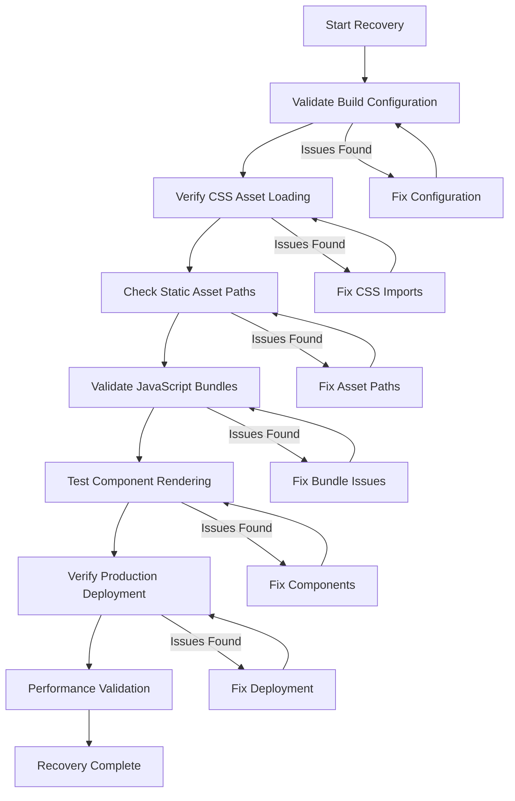

# Design Document - Full Site Recovery

## Overview

This design outlines a systematic approach to diagnose and fix all issues preventing the Huntaze application from functioning properly in production. The recovery process follows a layered approach, starting with foundational issues (build configuration, asset loading) and progressing to higher-level concerns (component rendering, user experience).

## Architecture

### Recovery Process Flow



### Diagnostic Layers

1. **Configuration Layer**: Validate all config files (next.config.ts, tailwind.config.mjs, tsconfig.json)
2. **Asset Layer**: Verify CSS files, images, fonts are properly loaded
3. **Build Layer**: Ensure Next.js build completes successfully
4. **Runtime Layer**: Validate client-side execution and hydration
5. **Deployment Layer**: Confirm AWS Amplify deployment is correct

## Components and Interfaces

### 1. Configuration Validator

**Purpose**: Validate all configuration files for correctness and completeness.

**Interface**:
```typescript
interface ConfigValidator {
  validateNextConfig(): ValidationResult;
  validateTailwindConfig(): ValidationResult;
  validatePackageJson(): ValidationResult;
  validateEnvironmentVariables(): ValidationResult;
}

interface ValidationResult {
  isValid: boolean;
  errors: string[];
  warnings: string[];
}
```

**Implementation Details**:
- Read each config file and parse it
- Check for required fields and valid syntax
- Validate that all referenced files exist
- Ensure environment variables are set

### 2. Asset Loader Diagnostic

**Purpose**: Verify that all CSS and static assets are properly loaded.

**Interface**:
```typescript
interface AssetDiagnostic {
  checkCSSImports(): CSSImportResult;
  checkStaticAssets(): StaticAssetResult;
  checkFontLoading(): FontLoadResult;
}

interface CSSImportResult {
  globals: boolean;
  animations: boolean;
  mobile: boolean;
  missingImports: string[];
}
```

**Implementation Details**:
- Scan app/layout.tsx for CSS imports
- Verify each CSS file exists and is valid
- Check public directory for static assets
- Validate font declarations in CSS

### 3. Build Validator

**Purpose**: Ensure the Next.js build process completes successfully.

**Interface**:
```typescript
interface BuildValidator {
  runBuild(): BuildResult;
  checkBuildOutput(): OutputValidation;
  validateChunks(): ChunkValidation;
}

interface BuildResult {
  success: boolean;
  duration: number;
  errors: BuildError[];
  warnings: BuildWarning[];
}
```

**Implementation Details**:
- Execute `npm run build` and capture output
- Parse build logs for errors and warnings
- Verify .next directory structure
- Check that all routes are generated

### 4. Component Renderer Test

**Purpose**: Validate that all components render correctly.

**Interface**:
```typescript
interface ComponentTest {
  testLandingPage(): RenderResult;
  testDashboard(): RenderResult;
  testAuthPages(): RenderResult;
}

interface RenderResult {
  rendered: boolean;
  hydrationErrors: HydrationError[];
  consoleErrors: ConsoleError[];
  missingElements: string[];
}
```

**Implementation Details**:
- Use React Testing Library to render components
- Check for hydration mismatches
- Verify all expected elements are present
- Capture console errors during render

### 5. Deployment Verifier

**Purpose**: Confirm that the deployment to AWS Amplify is correct.

**Interface**:
```typescript
interface DeploymentVerifier {
  checkAmplifyBuild(): AmplifyBuildStatus;
  validateEnvironmentVars(): EnvVarValidation;
  testProductionEndpoint(): EndpointTest;
}

interface AmplifyBuildStatus {
  buildId: string;
  status: 'SUCCESS' | 'FAILED' | 'IN_PROGRESS';
  logs: string[];
}
```

**Implementation Details**:
- Query AWS Amplify API for build status
- Verify environment variables are set in Amplify
- Make HTTP requests to production URL
- Check response headers and content

## Data Models

### Diagnostic Report

```typescript
interface DiagnosticReport {
  timestamp: Date;
  environment: 'local' | 'staging' | 'production';
  results: {
    configuration: ConfigValidationResult;
    assets: AssetValidationResult;
    build: BuildValidationResult;
    components: ComponentValidationResult;
    deployment: DeploymentValidationResult;
  };
  overallStatus: 'PASS' | 'FAIL' | 'WARNING';
  recommendations: Recommendation[];
}

interface Recommendation {
  severity: 'critical' | 'high' | 'medium' | 'low';
  category: string;
  issue: string;
  solution: string;
  autoFixAvailable: boolean;
}
```

### Fix Action

```typescript
interface FixAction {
  id: string;
  description: string;
  category: 'config' | 'asset' | 'code' | 'deployment';
  execute(): Promise<FixResult>;
  rollback(): Promise<void>;
}

interface FixResult {
  success: boolean;
  message: string;
  filesModified: string[];
}
```

## Error Handling

### Error Categories

1. **Configuration Errors**: Invalid or missing config files
2. **Asset Errors**: Missing CSS, images, or fonts
3. **Build Errors**: TypeScript errors, module resolution failures
4. **Runtime Errors**: JavaScript errors in the browser
5. **Deployment Errors**: AWS Amplify build or deployment failures

### Error Recovery Strategy

```typescript
class ErrorRecovery {
  async handleError(error: Error, context: ErrorContext): Promise<RecoveryAction> {
    // Log error with full context
    logger.error(error, context);
    
    // Determine error category
    const category = this.categorizeError(error);
    
    // Find applicable fix
    const fix = this.findFix(category, error);
    
    // Execute fix if available
    if (fix && fix.autoFixAvailable) {
      return await fix.execute();
    }
    
    // Return manual fix instructions
    return {
      type: 'manual',
      instructions: this.getManualFixInstructions(error)
    };
  }
}
```

## Testing Strategy

### 1. Local Testing

- Run build locally and verify success
- Test in development mode (`npm run dev`)
- Test in production mode (`npm run build && npm start`)
- Verify all pages load without errors
- Check browser console for warnings/errors

### 2. Staging Testing

- Deploy to staging environment
- Perform smoke tests on all major pages
- Test on multiple browsers (Chrome, Firefox, Safari)
- Test on mobile devices
- Verify analytics and monitoring are working

### 3. Production Validation

- Deploy to production with canary release
- Monitor error rates and performance metrics
- Perform A/B testing if needed
- Rollback plan ready if issues detected

### 4. Automated Testing

```typescript
// Example test suite
describe('Site Recovery Validation', () => {
  test('All CSS files are imported', () => {
    const layout = readFileSync('app/layout.tsx', 'utf-8');
    expect(layout).toContain("import './globals.css'");
    expect(layout).toContain("import './animations.css'");
    expect(layout).toContain("import './mobile.css'");
  });
  
  test('Build completes successfully', async () => {
    const result = await execAsync('npm run build');
    expect(result.exitCode).toBe(0);
    expect(result.stdout).toContain('Compiled successfully');
  });
  
  test('Landing page renders without errors', () => {
    const { container } = render(<HomePage />);
    expect(container.querySelector('header')).toBeInTheDocument();
    expect(container.querySelector('main')).toBeInTheDocument();
    expect(container.querySelector('footer')).toBeInTheDocument();
  });
});
```

## Implementation Phases

### Phase 1: Diagnostic (1-2 hours)
- Run comprehensive diagnostics
- Generate detailed report
- Identify all issues
- Prioritize fixes

### Phase 2: Configuration Fixes (30 minutes)
- Fix any config file issues
- Ensure all imports are correct
- Validate environment variables

### Phase 3: Asset Recovery (1 hour)
- Restore missing CSS imports
- Verify static asset paths
- Fix font loading issues
- Validate image optimization

### Phase 4: Build Validation (30 minutes)
- Run clean build
- Fix any TypeScript errors
- Resolve module dependencies
- Optimize bundle sizes

### Phase 5: Component Testing (1 hour)
- Test all major components
- Fix hydration errors
- Resolve runtime errors
- Verify interactivity

### Phase 6: Deployment (1 hour)
- Deploy to staging
- Run smoke tests
- Deploy to production
- Monitor for issues

### Phase 7: Validation (30 minutes)
- Verify all fixes are working
- Check performance metrics
- Confirm user experience is restored
- Document lessons learned

## Rollback Strategy

If any fix causes new issues:

1. **Immediate Rollback**: Revert to last known good commit
2. **Isolate Issue**: Identify which fix caused the problem
3. **Alternative Fix**: Try a different approach
4. **Incremental Deployment**: Deploy fixes one at a time

## Monitoring and Alerts

Post-recovery monitoring:

- Set up error tracking (Sentry or similar)
- Monitor Core Web Vitals
- Track user engagement metrics
- Set up alerts for critical errors
- Regular health checks every 5 minutes

## Success Criteria

Recovery is complete when:

1. ✅ Build completes successfully locally and in CI/CD
2. ✅ All CSS and animations load correctly
3. ✅ No console errors on page load
4. ✅ All components render properly
5. ✅ Site is responsive on mobile and desktop
6. ✅ Performance metrics meet targets (LCP < 2.5s)
7. ✅ No hydration errors
8. ✅ Production deployment is stable
