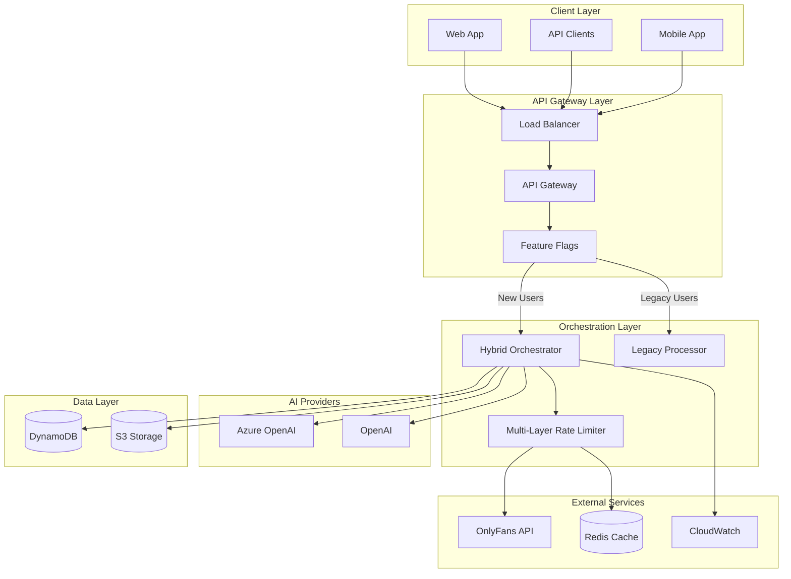

# Design Document - Huntaze Hybrid Orchestrator Integration

## Overview

This design integrates the validated Hybrid Orchestrator system into the existing Huntaze production environment. The integration follows a phased approach with feature flags, maintaining backward compatibility while introducing intelligent AI routing, advanced rate limiting, and cost optimization.

The system leverages the existing AWS infrastructure (ECS Fargate, Redis, CloudWatch) and integrates seamlessly with current OnlyFans workflows.

## Architecture

### High-Level Architecture



### Integration Strategy

The integration follows a **Strangler Fig Pattern** where new functionality gradually replaces legacy systems:

1. **Phase 1**: Deploy alongside existing system with feature flags
2. **Phase 2**: Gradual user migration (5% → 25% → 50% → 100%)
3. **Phase 3**: Legacy system deprecation and cleanup

## Components and Interfaces

### 1. Production Hybrid Orchestrator

Enhanced version of the validated orchestrator with production-specific features:

```typescript
interface ProductionHybridOrchestrator {
  // Core orchestration
  executeWorkflow(userId: string, intent: WorkflowIntent): Promise<WorkflowResult>
  
  // Production features
  executeWithFeatureFlags(userId: string, intent: WorkflowIntent): Promise<WorkflowResult>
  executeWithMetrics(userId: string, intent: WorkflowIntent): Promise<WorkflowResult>
  executeWithCircuitBreaker(userId: string, intent: WorkflowIntent): Promise<WorkflowResult>
  
  // Monitoring
  getHealthStatus(): Promise<HealthStatus>
  getMetrics(timeRange: TimeRange): Promise<Metrics>
  getCostAnalysis(timeRange: TimeRange): Promise<CostAnalysis>
}
```

### 2. Integration Middleware

Middleware layer that handles routing between legacy and new systems:

```typescript
interface IntegrationMiddleware {
  // Request routing
  routeRequest(request: APIRequest): Promise<APIResponse>
  shouldUseHybridOrchestrator(userId: string): Promise<boolean>
  
  // Backward compatibility
  transformLegacyRequest(legacyRequest: LegacyRequest): WorkflowIntent
  transformToLegacyResponse(result: WorkflowResult): LegacyResponse
  
  // Feature flag management
  checkFeatureFlag(userId: string, feature: string): Promise<boolean>
  updateFeatureFlag(feature: string, config: FeatureFlagConfig): Promise<void>
}
```

### 3. Enhanced Rate Limiter

Production-ready rate limiter with OnlyFans-specific rules:

```typescript
interface EnhancedRateLimiter {
  // Core rate limiting
  checkLimit(userId: string, action: string): Promise<RateLimitResult>
  
  // OnlyFans specific
  checkOnlyFansLimits(userId: string, recipientId: string): Promise<RateLimitResult>
  enforceMessageLimits(userId: string): Promise<RateLimitResult>
  
  // Monitoring
  getRateLimitStats(userId: string): Promise<RateLimitStats>
  getGlobalStats(): Promise<GlobalRateLimitStats>
}
```

### 4. Cost Monitoring Service

Real-time cost tracking and optimization:

```typescript
interface CostMonitoringService {
  // Cost tracking
  trackUsage(provider: string, tokens: number, cost: number): Promise<void>
  getCostBreakdown(timeRange: TimeRange): Promise<CostBreakdown>
  
  // Alerts
  checkCostThresholds(userId: string): Promise<CostAlert[]>
  sendCostAlert(alert: CostAlert): Promise<void>
  
  // Optimization
  getOptimizationRecommendations(): Promise<OptimizationRecommendation[]>
  applyCostOptimization(recommendation: OptimizationRecommendation): Promise<void>
}
```

## Data Models

### Workflow Intent (Enhanced)

```typescript
interface EnhancedWorkflowIntent extends WorkflowIntent {
  // Production metadata
  requestId: string
  timestamp: Date
  clientVersion: string
  featureFlags: string[]
  
  // Cost control
  maxCost?: number
  preferredProvider?: 'azure' | 'openai' | 'auto'
  
  // OnlyFans specific
  onlyFansContext?: {
    accountId: string
    recipientId?: string
    messageType: 'welcome' | 'follow_up' | 'promotional' | 'custom'
    complianceLevel: 'strict' | 'moderate' | 'relaxed'
  }
}
```

### Workflow Result (Enhanced)

```typescript
interface EnhancedWorkflowResult extends WorkflowResult {
  // Production metadata
  requestId: string
  processingTime: number
  provider: 'azure' | 'openai' | 'hybrid'
  
  // Cost tracking
  detailedCosts: {
    inputTokens: number
    outputTokens: number
    totalCost: number
    provider: string
  }
  
  // Rate limiting
  rateLimitStatus: {
    remaining: number
    resetTime: Date
    throttled: boolean
  }
  
  // Quality metrics
  qualityScore?: number
  complianceScore?: number
}
```

### Feature Flag Configuration

```typescript
interface FeatureFlagConfig {
  name: string
  enabled: boolean
  rolloutPercentage: number
  userWhitelist: string[]
  userBlacklist: string[]
  conditions: {
    userTier?: string[]
    accountAge?: number
    region?: string[]
  }
}
```

## Error Handling

### Circuit Breaker Pattern

Implement circuit breakers for external services:

```typescript
interface CircuitBreakerConfig {
  failureThreshold: number      // 5 failures
  recoveryTimeout: number       // 30 seconds
  monitoringPeriod: number      // 60 seconds
}
```

### Error Classification

```typescript
enum ErrorType {
  RATE_LIMIT_EXCEEDED = 'rate_limit_exceeded',
  PROVIDER_UNAVAILABLE = 'provider_unavailable',
  INVALID_REQUEST = 'invalid_request',
  ONLYFANS_API_ERROR = 'onlyfans_api_error',
  COST_LIMIT_EXCEEDED = 'cost_limit_exceeded',
  COMPLIANCE_VIOLATION = 'compliance_violation'
}
```

### Fallback Strategies

1. **Provider Fallback**: Azure → OpenAI → Cached Response
2. **Rate Limit Fallback**: Queue → Delay → Alternative Action
3. **Cost Fallback**: Cheaper Model → Cached Response → Manual Review

## Testing Strategy

### Integration Testing

1. **Backward Compatibility Tests**
   - Verify all existing API endpoints work unchanged
   - Test legacy client compatibility
   - Validate data format consistency

2. **Feature Flag Tests**
   - Test gradual rollout scenarios
   - Verify rollback functionality
   - Test user-specific routing

3. **Performance Tests**
   - Load testing with mixed legacy/new traffic
   - Latency comparison tests
   - Resource utilization monitoring

### Production Validation

1. **Canary Deployment**
   - Deploy to 5% of users initially
   - Monitor error rates and performance
   - Gradual increase based on success metrics

2. **A/B Testing**
   - Compare cost efficiency between providers
   - Measure user satisfaction scores
   - Track OnlyFans compliance metrics

3. **Chaos Engineering**
   - Test provider failures
   - Simulate rate limit scenarios
   - Validate circuit breaker behavior

## Deployment Strategy

### Phase 1: Infrastructure Setup (Week 1)

1. Deploy enhanced orchestrator alongside existing system
2. Set up monitoring and alerting
3. Configure feature flags (disabled)
4. Deploy rate limiter with passive monitoring

### Phase 2: Gradual Rollout (Weeks 2-4)

1. **Week 2**: Enable for 5% of users (internal team)
2. **Week 3**: Increase to 25% (beta users)
3. **Week 4**: Scale to 50% (general users)

### Phase 3: Full Migration (Week 5)

1. Enable for 100% of users
2. Monitor for 48 hours
3. Begin legacy system deprecation planning

### Phase 4: Optimization (Week 6)

1. Analyze cost savings and performance gains
2. Fine-tune provider routing algorithms
3. Optimize rate limiting parameters
4. Plan legacy system removal

## Monitoring and Observability

### Key Metrics

1. **Performance Metrics**
   - Request latency (p50, p95, p99)
   - Throughput (requests/second)
   - Error rates by provider

2. **Cost Metrics**
   - Daily/monthly spend by provider
   - Cost per request
   - Savings compared to legacy system

3. **Business Metrics**
   - OnlyFans compliance score
   - User satisfaction ratings
   - Content generation success rate

### Dashboards

1. **Operations Dashboard**
   - Real-time system health
   - Provider status and performance
   - Rate limiting statistics

2. **Cost Dashboard**
   - Spend tracking and forecasting
   - Provider cost comparison
   - Optimization recommendations

3. **Business Dashboard**
   - User engagement metrics
   - Content performance analytics
   - Revenue impact analysis

## Security Considerations

### API Security

1. **Authentication**: Maintain existing JWT-based auth
2. **Authorization**: Role-based access control (RBAC)
3. **Rate Limiting**: Enhanced protection against abuse
4. **Input Validation**: Strict validation for all inputs

### Data Protection

1. **Encryption**: All data encrypted in transit and at rest
2. **PII Handling**: Anonymize logs and metrics
3. **Compliance**: GDPR and OnlyFans ToS compliance
4. **Audit Logging**: Comprehensive audit trail

### Infrastructure Security

1. **Network Security**: VPC isolation and security groups
2. **Secrets Management**: AWS Secrets Manager integration
3. **Access Control**: IAM roles with least privilege
4. **Monitoring**: Security event detection and alerting

## Rollback Plan

### Immediate Rollback (< 5 minutes)

1. Disable feature flags via environment variables
2. Route all traffic to legacy system
3. Monitor for stabilization

### Gradual Rollback (5-30 minutes)

1. Reduce rollout percentage incrementally
2. Identify and isolate problematic users/requests
3. Maintain partial new system functionality

### Full Rollback (30+ minutes)

1. Complete revert to legacy system
2. Preserve new system data for analysis
3. Plan remediation and re-deployment

This design ensures a smooth, low-risk integration of the Hybrid Orchestrator into your production Huntaze environment while maintaining all existing functionality and providing significant cost and performance improvements.