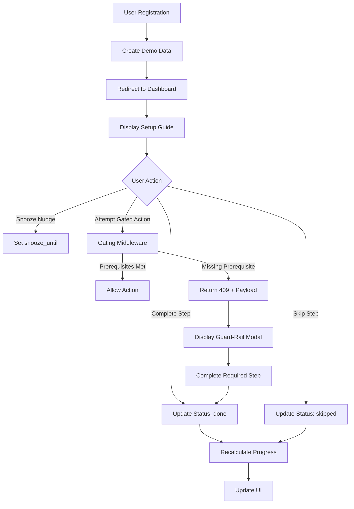
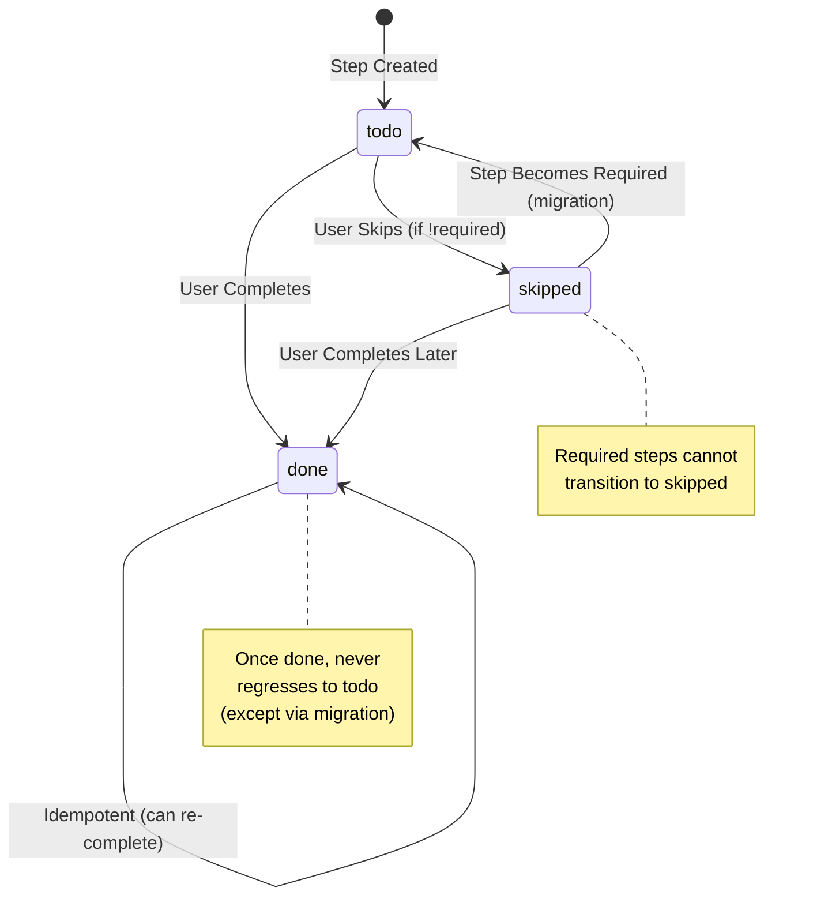

# Design Document - Shopify-Style Onboarding

## Overview

The Shopify-Style Onboarding system is a non-blocking, user-centric onboarding experience that prioritizes immediate value delivery while providing flexible configuration options. The system consists of four main layers:

1. **Data Layer**: PostgreSQL tables managing step definitions, user progress, and versioning
2. **API Layer**: RESTful endpoints with gating middleware for prerequisite enforcement
3. **UI Layer**: React components for checklist, modals, and nudges
4. **Analytics Layer**: Event tracking and experimentation framework

The design follows a "progressive disclosure" pattern where users land on a functional dashboard with demo data, and configuration steps are presented as optional tasks that can be completed, skipped, or snoozed. Critical prerequisites (email verification, payment setup) are enforced contextually only when necessary through guard-rail modals.

## Architecture

### System Flow Diagram



### Component Architecture

```
┌─────────────────────────────────────────────────────────────┐
│                        Dashboard Page                        │
│  ┌────────────────────────────────────────────────────────┐ │
│  │              Setup Guide Card Component                 │ │
│  │  - Progress Bar                                         │ │
│  │  - Step Checklist (Faire/Passer/En savoir plus)       │ │
│  └────────────────────────────────────────────────────────┘ │
│  ┌────────────────────────────────────────────────────────┐ │
│  │         Completion Nudge Banner (if applicable)        │ │
│  │  - "Terminer la configuration (3)"                     │ │
│  │  - Snooze/Dismiss options                              │ │
│  └────────────────────────────────────────────────────────┘ │
└─────────────────────────────────────────────────────────────┘

┌─────────────────────────────────────────────────────────────┐
│                    Gating Middleware Layer                   │
│  - Intercepts critical actions (publish, checkout)          │
│  - Checks prerequisites via hasStepDone()                    │
│  - Returns 409 with structured payload if missing            │
└─────────────────────────────────────────────────────────────┘

┌─────────────────────────────────────────────────────────────┐
│                  Guard-Rail Modal Component                  │
│  - Triggered by 409 responses                                │
│  - Explains missing prerequisite                             │
│  - Provides direct action to complete step                   │
│  - Includes retry logic and error handling                   │
└─────────────────────────────────────────────────────────────┘
```

## Data Models

### Database Schema


```sql
-- Step definitions with versioning and market rules
CREATE TABLE onboarding_step_definitions (
  id TEXT PRIMARY KEY,                    -- e.g., 'payments', 'theme', 'product'
  version INTEGER NOT NULL DEFAULT 1,     -- Version for migration support
  title TEXT NOT NULL,                    -- Display name
  description TEXT,                       -- Detailed explanation
  required BOOLEAN NOT NULL DEFAULT FALSE,-- Gating flag
  weight INTEGER NOT NULL DEFAULT 0,      -- For progress calculation
  market_rule JSONB,                      -- Country-specific requirements
  role_visibility TEXT[] DEFAULT ARRAY['owner', 'staff', 'admin'],
  active_from TIMESTAMPTZ,                -- Lifecycle management
  active_to TIMESTAMPTZ,
  created_at TIMESTAMPTZ NOT NULL DEFAULT now(),
  updated_at TIMESTAMPTZ NOT NULL DEFAULT now(),
  UNIQUE(id, version)
);

-- User progress tracking
CREATE TABLE user_onboarding (
  user_id UUID NOT NULL REFERENCES users(id) ON DELETE CASCADE,
  step_id TEXT NOT NULL,
  version INTEGER NOT NULL DEFAULT 1,
  status TEXT NOT NULL CHECK (status IN ('todo', 'done', 'skipped')),
  snooze_until TIMESTAMPTZ,
  snooze_count INTEGER NOT NULL DEFAULT 0,
  completed_by UUID REFERENCES users(id),  -- Track who completed (for audit)
  completed_at TIMESTAMPTZ,
  updated_at TIMESTAMPTZ NOT NULL DEFAULT now(),
  PRIMARY KEY (user_id, step_id, version),
  FOREIGN KEY (step_id, version) REFERENCES onboarding_step_definitions(id, version)
);

-- Analytics events
CREATE TABLE onboarding_events (
  id UUID PRIMARY KEY DEFAULT gen_random_uuid(),
  user_id UUID NOT NULL REFERENCES users(id) ON DELETE CASCADE,
  event_type TEXT NOT NULL,               -- e.g., 'step_completed', 'nudge_snoozed'
  step_id TEXT,
  version INTEGER,
  metadata JSONB,                         -- Flexible event data
  correlation_id UUID,                    -- For request tracing
  created_at TIMESTAMPTZ NOT NULL DEFAULT now()
);

CREATE INDEX idx_onboarding_events_user_type ON onboarding_events(user_id, event_type);
CREATE INDEX idx_onboarding_events_created ON onboarding_events(created_at);
CREATE INDEX idx_user_onboarding_status ON user_onboarding(user_id, status);
```

### Progress Calculation Logic


```typescript
// Progress calculation: only count required steps + non-skipped optional steps
function calculateProgress(userId: string, market: string): number {
  const activeSteps = getActiveStepsForMarket(userId, market);
  const userProgress = getUserOnboardingStatus(userId);
  
  let totalWeight = 0;
  let completedWeight = 0;
  
  for (const step of activeSteps) {
    const userStep = userProgress.find(p => p.step_id === step.id);
    
    // Include in total if required OR not skipped
    if (step.required || userStep?.status !== 'skipped') {
      totalWeight += step.weight;
      
      if (userStep?.status === 'done') {
        completedWeight += step.weight;
      }
    }
  }
  
  return totalWeight > 0 ? Math.round((completedWeight / totalWeight) * 100) : 0;
}
```

## API Contracts

### GET /api/onboarding

Retrieves all onboarding steps with user progress, filtered by market and role.

**Query Parameters:**
- `market` (optional): ISO country code (e.g., 'FR', 'DE', 'US')

**Response:**
```json
{
  "progress": 45,
  "steps": [
    {
      "id": "email_verification",
      "version": 1,
      "title": "Vérifier votre email",
      "description": "Confirmez votre adresse email pour sécuriser votre compte",
      "required": true,
      "weight": 20,
      "status": "done",
      "completedAt": "2025-11-10T14:30:00Z"
    },
    {
      "id": "payments",
      "version": 2,
      "title": "Configurer les paiements",
      "description": "Ajoutez vos informations de paiement pour encaisser",
      "required": true,
      "weight": 30,
      "status": "todo",
      "roleRestricted": "owner"
    }
  ]
}
```


### PATCH /api/onboarding/steps/:id

Updates the status of a specific onboarding step.

**Request Body:**
```json
{
  "status": "done" | "skipped",
  "snoozeUntil": "2025-11-17T00:00:00Z"  // Optional, for nudge snoozing
}
```

**Response:**
```json
{
  "success": true,
  "step": {
    "id": "theme",
    "status": "skipped",
    "updatedAt": "2025-11-11T10:15:00Z"
  },
  "progress": 60
}
```

**Error Responses:**
- `400 Bad Request`: Invalid status or attempting to skip a required step
- `404 Not Found`: Step ID doesn't exist
- `403 Forbidden`: User doesn't have permission (e.g., staff trying to update owner-only step)

### Gating Middleware Response (409)

When a user attempts an action without required prerequisites:

```json
{
  "error": "PRECONDITION_REQUIRED",
  "message": "Vous devez configurer les paiements avant de publier votre boutique",
  "missingStep": "payments",
  "action": {
    "type": "open_modal",
    "modal": "payments_setup",
    "prefill": {
      "country": "FR",
      "returnUrl": "/store/publish"
    }
  },
  "correlationId": "550e8400-e29b-41d4-a716-446655440000"
}
```

## Components and Interfaces

### SetupGuide Component


```typescript
interface Step {
  id: string;
  version: number;
  title: string;
  description?: string;
  required: boolean;
  weight: number;
  status: 'todo' | 'done' | 'skipped';
  roleRestricted?: 'owner' | 'admin';
  completedAt?: string;
}

interface SetupGuideProps {
  steps: Step[];
  progress: number;
  onStepUpdate: (stepId: string, status: 'done' | 'skipped') => Promise<void>;
  onLearnMore: (stepId: string) => void;
  userRole: 'owner' | 'staff' | 'admin';
}

export default function SetupGuide({ 
  steps, 
  progress, 
  onStepUpdate, 
  onLearnMore,
  userRole 
}: SetupGuideProps) {
  return (
    <div className="rounded-2xl border p-4 bg-white shadow-sm">
      <div className="flex items-center justify-between mb-4">
        <h2 className="text-lg font-semibold">Guide de démarrage</h2>
        <span className="text-sm text-gray-600">{progress}% complété</span>
      </div>
      
      <div className="w-full bg-gray-200 rounded-full h-2 mb-4">
        <div 
          className="bg-blue-600 h-2 rounded-full transition-all duration-300"
          style={{ width: `${progress}%` }}
          role="progressbar"
          aria-valuenow={progress}
          aria-valuemin={0}
          aria-valuemax={100}
        />
      </div>
      
      <ul className="space-y-2">
        {steps.map(step => (
          <StepItem 
            key={step.id} 
            step={step} 
            onUpdate={onStepUpdate}
            onLearnMore={onLearnMore}
            userRole={userRole}
          />
        ))}
      </ul>
    </div>
  );
}
```

### StepItem Component


```typescript
function StepItem({ step, onUpdate, onLearnMore, userRole }: StepItemProps) {
  const [loading, setLoading] = useState(false);
  const canModify = !step.roleRestricted || step.roleRestricted === userRole;
  
  const handleUpdate = async (status: 'done' | 'skipped') => {
    setLoading(true);
    try {
      await onUpdate(step.id, status);
    } finally {
      setLoading(false);
    }
  };
  
  return (
    <li className="flex items-center justify-between rounded-xl border p-3 hover:bg-gray-50 transition-colors">
      <div className="flex-1">
        <div className="flex items-center gap-2">
          <p className="font-medium">{step.title}</p>
          {step.required && (
            <span className="text-xs rounded bg-red-50 text-red-700 px-2 py-0.5 border border-red-200">
              Obligatoire
            </span>
          )}
          {step.status === 'done' && (
            <CheckCircleIcon className="w-5 h-5 text-green-600" />
          )}
        </div>
        {step.description && (
          <p className="text-sm text-gray-500 mt-1">{step.description}</p>
        )}
        {!canModify && (
          <p className="text-sm text-blue-600 mt-1">
            Demander à l'owner
          </p>
        )}
      </div>
      
      {canModify && (
        <div className="flex gap-2 ml-4">
          {step.status !== 'done' && (
            <button
              onClick={() => handleUpdate('done')}
              disabled={loading}
              className="rounded-xl px-3 py-1.5 border border-blue-600 text-blue-600 hover:bg-blue-50 transition-colors disabled:opacity-50"
              aria-label={`Compléter ${step.title}`}
            >
              Faire
            </button>
          )}
          
          {!step.required && step.status !== 'skipped' && (
            <button
              onClick={() => handleUpdate('skipped')}
              disabled={loading}
              className="rounded-xl px-3 py-1.5 border border-gray-300 text-gray-700 hover:bg-gray-50 transition-colors disabled:opacity-50"
              aria-label={`Passer ${step.title} pour l'instant (vous pourrez y revenir depuis le tableau de bord)`}
            >
              Passer
            </button>
          )}
          
          <button
            onClick={() => onLearnMore(step.id)}
            className="rounded-xl px-3 py-1.5 border border-gray-300 text-gray-700 hover:bg-gray-50 transition-colors"
            aria-label={`En savoir plus sur ${step.title}`}
          >
            En savoir plus
          </button>
        </div>
      )}
    </li>
  );
}
```

### CompletionNudge Component


```typescript
interface CompletionNudgeProps {
  remainingSteps: number;
  progress: number;
  onSnooze: (days: number) => Promise<void>;
  onDismiss: () => void;
  snoozeCount: number;
  maxSnoozes: number;
}

export default function CompletionNudge({ 
  remainingSteps, 
  progress,
  onSnooze,
  onDismiss,
  snoozeCount,
  maxSnoozes
}: CompletionNudgeProps) {
  const [isVisible, setIsVisible] = useState(true);
  
  if (!isVisible || progress >= 80) return null;
  
  const handleSnooze = async () => {
    await onSnooze(7);
    setIsVisible(false);
  };
  
  return (
    <div 
      className="bg-blue-50 border border-blue-200 rounded-xl p-4 flex items-center justify-between"
      role="status"
      aria-live="polite"
    >
      <div className="flex items-center gap-3">
        <InfoIcon className="w-5 h-5 text-blue-600" />
        <div>
          <p className="font-medium text-blue-900">
            Terminer la configuration ({remainingSteps})
          </p>
          <p className="text-sm text-blue-700">
            Complétez les étapes restantes pour profiter pleinement de Huntaze
          </p>
        </div>
      </div>
      
      <div className="flex gap-2">
        {snoozeCount < maxSnoozes && (
          <button
            onClick={handleSnooze}
            className="px-3 py-1.5 text-sm text-blue-700 hover:bg-blue-100 rounded-lg transition-colors"
          >
            Masquer 7 jours
          </button>
        )}
        <button
          onClick={onDismiss}
          className="p-1.5 text-blue-700 hover:bg-blue-100 rounded-lg transition-colors"
          aria-label="Fermer"
        >
          <XIcon className="w-5 h-5" />
        </button>
      </div>
    </div>
  );
}
```

### GuardRailModal Component


```typescript
interface GuardRailModalProps {
  isOpen: boolean;
  missingStep: string;
  message: string;
  action: {
    type: 'open_modal' | 'redirect';
    modal?: string;
    url?: string;
    prefill?: Record<string, any>;
  };
  onClose: () => void;
  onComplete: () => void;
}

export default function GuardRailModal({
  isOpen,
  missingStep,
  message,
  action,
  onClose,
  onComplete
}: GuardRailModalProps) {
  const [retryCount, setRetryCount] = useState(0);
  const [error, setError] = useState<string | null>(null);
  
  const handleAction = async () => {
    try {
      setError(null);
      
      if (action.type === 'open_modal') {
        // Open the specific setup modal (e.g., payments_setup)
        await openSetupModal(action.modal!, action.prefill);
      } else if (action.type === 'redirect') {
        window.location.href = action.url!;
      }
      
      onComplete();
    } catch (err) {
      setRetryCount(prev => prev + 1);
      setError('Une erreur est survenue. Veuillez réessayer.');
    }
  };
  
  return (
    <Dialog 
      open={isOpen} 
      onClose={onClose}
      className="relative z-50"
    >
      <div className="fixed inset-0 bg-black/30" aria-hidden="true" />
      
      <div className="fixed inset-0 flex items-center justify-center p-4">
        <Dialog.Panel className="mx-auto max-w-md rounded-2xl bg-white p-6 shadow-xl">
          <Dialog.Title className="text-lg font-semibold mb-2">
            Configuration requise
          </Dialog.Title>
          
          <Dialog.Description className="text-gray-600 mb-4">
            {message}
          </Dialog.Description>
          
          {error && (
            <div className="bg-red-50 border border-red-200 rounded-lg p-3 mb-4">
              <p className="text-sm text-red-700">{error}</p>
            </div>
          )}
          
          <div className="flex gap-3 justify-end">
            <button
              onClick={onClose}
              className="px-4 py-2 text-gray-700 hover:bg-gray-100 rounded-lg transition-colors"
            >
              Annuler
            </button>
            <button
              onClick={handleAction}
              className="px-4 py-2 bg-blue-600 text-white hover:bg-blue-700 rounded-lg transition-colors"
            >
              {retryCount > 0 ? 'Réessayer' : 'Configurer maintenant'}
            </button>
          </div>
        </Dialog.Panel>
      </div>
    </Dialog>
  );
}
```

## State Machine

### Step Status Transitions




### Transition Guards

```typescript
function canTransitionTo(
  currentStatus: StepStatus,
  newStatus: StepStatus,
  isRequired: boolean
): boolean {
  // Cannot skip required steps
  if (newStatus === 'skipped' && isRequired) {
    return false;
  }
  
  // Can always mark as done
  if (newStatus === 'done') {
    return true;
  }
  
  // Can skip from todo if not required
  if (currentStatus === 'todo' && newStatus === 'skipped' && !isRequired) {
    return true;
  }
  
  // Cannot transition from done to skipped
  if (currentStatus === 'done' && newStatus === 'skipped') {
    return false;
  }
  
  return false;
}
```

## Error Handling

### Client-Side Error Handling


```typescript
// Centralized error handler for onboarding actions
async function handleOnboardingAction<T>(
  action: () => Promise<T>,
  options: {
    retryCount?: number;
    fallback?: () => void;
    onError?: (error: Error) => void;
  } = {}
): Promise<T | null> {
  const { retryCount = 2, fallback, onError } = options;
  
  for (let attempt = 0; attempt <= retryCount; attempt++) {
    try {
      return await action();
    } catch (error) {
      const isLastAttempt = attempt === retryCount;
      
      if (isLastAttempt) {
        console.error('[Onboarding] Action failed after retries:', error);
        onError?.(error as Error);
        fallback?.();
        return null;
      }
      
      // Exponential backoff
      await new Promise(resolve => setTimeout(resolve, Math.pow(2, attempt) * 1000));
    }
  }
  
  return null;
}

// Example usage in gating check
async function publishStore() {
  const result = await handleOnboardingAction(
    () => fetch('/api/store/publish', { method: 'POST' }),
    {
      retryCount: 2,
      onError: (error) => {
        toast.error('Impossible de publier la boutique. Veuillez réessayer.');
      }
    }
  );
  
  if (!result) return;
  
  if (result.status === 409) {
    const { missingStep, message, action } = await result.json();
    openGuardRailModal({ missingStep, message, action });
  } else if (result.ok) {
    toast.success('Boutique publiée avec succès!');
  }
}
```

### Server-Side Error Handling


```typescript
// Gating middleware with error resilience
function requireStep(stepId: string) {
  return async (req: Request, res: Response, next: NextFunction) => {
    const correlationId = crypto.randomUUID();
    
    try {
      const isComplete = await hasStepDone(req.user.id, stepId);
      
      if (isComplete) {
        return next();
      }
      
      // Log gating event
      await logEvent({
        type: 'gating.blocked',
        userId: req.user.id,
        stepId,
        route: req.path,
        correlationId
      });
      
      return res.status(409).json({
        error: 'PRECONDITION_REQUIRED',
        message: getStepMessage(stepId),
        missingStep: stepId,
        action: getStepAction(stepId, req.user),
        correlationId
      });
      
    } catch (error) {
      console.error('[Gating] Check failed:', error, { correlationId });
      
      // Fail open for non-critical routes
      if (isNonCriticalRoute(req.path)) {
        console.warn('[Gating] Allowing access due to check failure (non-critical route)');
        return next();
      }
      
      // Fail closed for critical routes
      return res.status(503).json({
        error: 'SERVICE_UNAVAILABLE',
        message: 'Impossible de vérifier les prérequis. Veuillez réessayer.',
        correlationId
      });
    }
  };
}
```

## Analytics Events Schema

### Event Types and Payloads


```typescript
// Event type definitions
type OnboardingEvent = 
  | { type: 'onboarding.viewed'; page: string; userRole: string; variant?: string }
  | { type: 'onboarding.step_started'; stepId: string; version: number; entrypoint: string }
  | { type: 'onboarding.step_completed'; stepId: string; durationMs: number }
  | { type: 'onboarding.step_skipped'; stepId: string; reason?: string }
  | { type: 'onboarding.nudge_snoozed'; durationDays: number; snoozeCount: number }
  | { type: 'gating.blocked'; route: string; missingStep: string }
  | { type: 'merchant.previewed_store'; timestamp: string }
  | { type: 'merchant.first_product_created'; productId: string }
  | { type: 'merchant.first_checkout_attempt'; amount: number };

// Event tracking function
async function trackOnboardingEvent(
  userId: string,
  event: OnboardingEvent,
  metadata?: Record<string, any>
) {
  // Check GDPR consent
  const hasConsent = await checkAnalyticsConsent(userId);
  
  if (!hasConsent && !isEssentialEvent(event.type)) {
    return; // Skip non-essential events without consent
  }
  
  await db.onboarding_events.insert({
    user_id: userId,
    event_type: event.type,
    step_id: 'stepId' in event ? event.stepId : null,
    version: 'version' in event ? event.version : null,
    metadata: { ...event, ...metadata },
    correlation_id: metadata?.correlationId || null
  });
}

// Essential events (always tracked for functionality)
function isEssentialEvent(eventType: string): boolean {
  return eventType.startsWith('gating.') || 
         eventType === 'onboarding.step_completed';
}
```

### Analytics Queries


```sql
-- Skip rate per step (last 7 days)
SELECT 
  step_id,
  COUNT(*) FILTER (WHERE status = 'skipped') AS skip_count,
  COUNT(*) AS total_count,
  ROUND(100.0 * COUNT(*) FILTER (WHERE status = 'skipped') / COUNT(*), 1) AS skip_rate_pct
FROM user_onboarding
WHERE updated_at >= now() - interval '7 days'
GROUP BY step_id
ORDER BY skip_rate_pct DESC;

-- Time to Value (TTV) - time to first preview
SELECT 
  u.id,
  u.created_at AS signup_at,
  MIN(e.created_at) AS first_preview_at,
  EXTRACT(EPOCH FROM (MIN(e.created_at) - u.created_at)) / 60 AS ttv_minutes
FROM users u
LEFT JOIN onboarding_events e ON e.user_id = u.id AND e.event_type = 'merchant.previewed_store'
WHERE u.created_at >= now() - interval '30 days'
GROUP BY u.id, u.created_at
ORDER BY ttv_minutes;

-- D1/D7 Conversion rates
WITH cohorts AS (
  SELECT 
    DATE(created_at) AS cohort_date,
    COUNT(*) AS signups
  FROM users
  WHERE created_at >= now() - interval '30 days'
  GROUP BY DATE(created_at)
),
conversions AS (
  SELECT 
    DATE(u.created_at) AS cohort_date,
    COUNT(DISTINCT CASE WHEN e.created_at <= u.created_at + interval '1 day' THEN u.id END) AS d1_converted,
    COUNT(DISTINCT CASE WHEN e.created_at <= u.created_at + interval '7 days' THEN u.id END) AS d7_converted
  FROM users u
  LEFT JOIN onboarding_events e ON e.user_id = u.id AND e.event_type = 'merchant.first_checkout_attempt'
  WHERE u.created_at >= now() - interval '30 days'
  GROUP BY DATE(u.created_at)
)
SELECT 
  c.cohort_date,
  c.signups,
  ROUND(100.0 * COALESCE(cv.d1_converted, 0) / c.signups, 1) AS d1_conversion_pct,
  ROUND(100.0 * COALESCE(cv.d7_converted, 0) / c.signups, 1) AS d7_conversion_pct
FROM cohorts c
LEFT JOIN conversions cv ON c.cohort_date = cv.cohort_date
ORDER BY c.cohort_date DESC;

-- Modal abandonment rate
SELECT 
  metadata->>'missingStep' AS missing_step,
  COUNT(*) AS blocked_count,
  COUNT(*) FILTER (WHERE NOT EXISTS (
    SELECT 1 FROM onboarding_events e2 
    WHERE e2.user_id = e.user_id 
    AND e2.event_type = 'onboarding.step_completed'
    AND e2.step_id = e.metadata->>'missingStep'
    AND e2.created_at > e.created_at
    AND e2.created_at < e.created_at + interval '1 hour'
  )) AS abandoned_count,
  ROUND(100.0 * COUNT(*) FILTER (WHERE NOT EXISTS (
    SELECT 1 FROM onboarding_events e2 
    WHERE e2.user_id = e.user_id 
    AND e2.event_type = 'onboarding.step_completed'
    AND e2.step_id = e.metadata->>'missingStep'
    AND e2.created_at > e.created_at
    AND e2.created_at < e.created_at + interval '1 hour'
  )) / COUNT(*), 1) AS abandonment_rate_pct
FROM onboarding_events e
WHERE event_type = 'gating.blocked'
AND created_at >= now() - interval '7 days'
GROUP BY metadata->>'missingStep'
ORDER BY blocked_count DESC;
```

## Testing Strategy


### Unit Tests

```typescript
describe('Progress Calculation', () => {
  it('should calculate progress correctly with mixed required and optional steps', () => {
    const steps = [
      { id: 'email', required: true, weight: 20, status: 'done' },
      { id: 'payments', required: true, weight: 30, status: 'todo' },
      { id: 'theme', required: false, weight: 15, status: 'skipped' },
      { id: 'product', required: false, weight: 10, status: 'done' }
    ];
    
    // Total weight = 20 (email) + 30 (payments) + 10 (product) = 60
    // Skipped optional (theme) not counted
    // Completed weight = 20 (email) + 10 (product) = 30
    // Progress = 30/60 * 100 = 50%
    
    expect(calculateProgress(steps)).toBe(50);
  });
  
  it('should not allow skipping required steps', () => {
    const step = { id: 'payments', required: true };
    expect(canTransitionTo('todo', 'skipped', true)).toBe(false);
  });
  
  it('should preserve done status during migration', async () => {
    await migrateStep('payments', 1, 2);
    const userProgress = await getUserStep(userId, 'payments', 2);
    expect(userProgress.status).toBe('done');
  });
});

describe('Gating Middleware', () => {
  it('should block action when prerequisite is missing', async () => {
    const req = { user: { id: 'user123' }, path: '/api/store/publish' };
    const res = { status: jest.fn().mockReturnThis(), json: jest.fn() };
    
    await requireStep('payments')(req, res, jest.fn());
    
    expect(res.status).toHaveBeenCalledWith(409);
    expect(res.json).toHaveBeenCalledWith(
      expect.objectContaining({
        error: 'PRECONDITION_REQUIRED',
        missingStep: 'payments'
      })
    );
  });
  
  it('should allow action when prerequisite is complete', async () => {
    await completeStep('user123', 'payments');
    const next = jest.fn();
    
    await requireStep('payments')(req, res, next);
    
    expect(next).toHaveBeenCalled();
  });
});
```

### Integration Tests


```typescript
describe('Onboarding Flow', () => {
  it('should complete full onboarding journey', async () => {
    // 1. User signs up
    const user = await createUser({ email: 'test@example.com', market: 'FR' });
    
    // 2. Demo data is created
    const products = await getDemoProducts(user.id);
    expect(products).toHaveLength(3);
    
    // 3. User lands on dashboard with setup guide
    const { steps, progress } = await getOnboardingStatus(user.id);
    expect(progress).toBe(0);
    expect(steps.some(s => s.id === 'email_verification' && s.required)).toBe(true);
    
    // 4. User completes email verification
    await completeStep(user.id, 'email_verification');
    
    // 5. User skips theme customization
    await skipStep(user.id, 'theme');
    
    // 6. User attempts to publish without payments
    const publishResponse = await fetch('/api/store/publish', {
      method: 'POST',
      headers: { Authorization: `Bearer ${user.token}` }
    });
    expect(publishResponse.status).toBe(409);
    
    // 7. User completes payment setup
    await completeStep(user.id, 'payments');
    
    // 8. User successfully publishes
    const retryPublish = await fetch('/api/store/publish', {
      method: 'POST',
      headers: { Authorization: `Bearer ${user.token}` }
    });
    expect(retryPublish.status).toBe(200);
  });
  
  it('should handle market-specific requirements', async () => {
    const deUser = await createUser({ market: 'DE' });
    const frUser = await createUser({ market: 'FR' });
    
    const deSteps = await getOnboardingStatus(deUser.id);
    const frSteps = await getOnboardingStatus(frUser.id);
    
    expect(deSteps.steps.some(s => s.id === 'impressum' && s.required)).toBe(true);
    expect(frSteps.steps.some(s => s.id === 'impressum')).toBe(false);
  });
});
```

### E2E Tests (Playwright)


```typescript
test('Skip visible but safe', async ({ page }) => {
  await page.goto('/dashboard');
  
  // Find a non-required step
  const themeStep = page.locator('[data-step-id="theme"]');
  await expect(themeStep.locator('text=Obligatoire')).not.toBeVisible();
  
  // Click skip button
  await themeStep.locator('button:has-text("Passer")').click();
  
  // Verify step is marked as skipped
  await expect(themeStep.locator('text=skipped')).toBeVisible();
  
  // Verify progress recalculated
  const progressBar = page.locator('[role="progressbar"]');
  const progress = await progressBar.getAttribute('aria-valuenow');
  expect(parseInt(progress!)).toBeGreaterThan(0);
  
  // Verify step still accessible
  await page.goto('/onboarding');
  await page.click('text=Afficher les étapes passées');
  await expect(page.locator('[data-step-id="theme"]')).toBeVisible();
});

test('Contextual guard-rail', async ({ page }) => {
  await page.goto('/dashboard');
  
  // Attempt to publish without payments
  await page.click('button:has-text("Publier")');
  
  // Verify 409 triggers modal without page reload
  await expect(page.locator('[role="dialog"]')).toBeVisible();
  await expect(page.locator('text=Configuration requise')).toBeVisible();
  await expect(page.locator('text=paiements')).toBeVisible();
  
  // Complete payment setup from modal
  await page.click('button:has-text("Configurer maintenant")');
  
  // Verify payment modal opens
  await expect(page.locator('[data-modal="payments_setup"]')).toBeVisible();
});

test('Snooze behavior', async ({ page }) => {
  await page.goto('/dashboard');
  
  // Snooze the nudge
  await page.click('button:has-text("Masquer 7 jours")');
  
  // Verify banner disappears
  await expect(page.locator('text=Terminer la configuration')).not.toBeVisible();
  
  // Simulate time passing (mock server time)
  await page.evaluate(() => {
    localStorage.setItem('mock_server_time', new Date(Date.now() + 6 * 24 * 60 * 60 * 1000).toISOString());
  });
  await page.reload();
  
  // Banner should still be hidden
  await expect(page.locator('text=Terminer la configuration')).not.toBeVisible();
  
  // Simulate 7 days passing
  await page.evaluate(() => {
    localStorage.setItem('mock_server_time', new Date(Date.now() + 8 * 24 * 60 * 60 * 1000).toISOString());
  });
  await page.reload();
  
  // Banner should reappear without jarring animation
  await expect(page.locator('text=Terminer la configuration')).toBeVisible();
  await expect(page.locator('text=Terminer la configuration')).toHaveCSS('animation', 'none');
});
```

## Rollout Plan


### Feature Flag Configuration

```typescript
interface OnboardingFeatureFlags {
  enabled: boolean;              // Master kill switch
  skipEnabled: boolean;          // Allow skipping steps
  snoozeEnabled: boolean;        // Allow snoozing nudges
  guardRailsEnabled: boolean;    // Enforce gating
  rolloutPercentage: number;     // 0-100, gradual rollout
  marketWhitelist?: string[];    // Test in specific markets first
  userWhitelist?: string[];      // Test with specific users
}

// Feature flag check
async function isOnboardingEnabled(userId: string, market: string): Promise<boolean> {
  const flags = await getFeatureFlags('shopify_onboarding');
  
  if (!flags.enabled) return false;
  
  // Check whitelist first
  if (flags.userWhitelist?.includes(userId)) return true;
  if (flags.marketWhitelist && !flags.marketWhitelist.includes(market)) return false;
  
  // Check rollout percentage
  const userHash = hashUserId(userId);
  return (userHash % 100) < flags.rolloutPercentage;
}
```

### Rollout Phases

**Phase 1: Internal Testing (Week 1)**
- Rollout: 0% (whitelist only)
- Audience: Internal team + beta users
- Metrics: Functional correctness, bug reports
- Success Criteria: Zero critical bugs, positive internal feedback

**Phase 2: Limited Rollout (Week 2-3)**
- Rollout: 10% of new signups
- Audience: New users in FR market
- Metrics: D1 conversion, skip rates, support tickets
- Success Criteria: D1 conversion ≥ baseline, skip rate < 40%, no increase in support tickets

**Phase 3: Expanded Rollout (Week 4-5)**
- Rollout: 50% of new signups
- Audience: All markets
- Metrics: D7 conversion, TTV, gating block rates
- Success Criteria: D7 conversion ≥ baseline, TTV reduced by 20%, gating blocks < 5%

**Phase 4: Full Rollout (Week 6+)**
- Rollout: 100%
- Audience: All users
- Metrics: Long-term retention, feature adoption
- Success Criteria: Sustained improvement in activation metrics


### Health Metrics and Alerts

```typescript
interface OnboardingHealthMetrics {
  // Conversion metrics
  d1ConversionRate: number;        // Target: ≥ baseline
  d7ConversionRate: number;        // Target: ≥ baseline
  ttv: number;                     // Target: < baseline - 20%
  
  // Engagement metrics
  skipRate: number;                // Target: < 40%
  snoozeRate: number;              // Target: < 30%
  completionRate: number;          // Target: > 60%
  
  // System health
  gatingBlockRate: number;         // Target: < 5%
  modalAbandonmentRate: number;    // Target: < 50%
  apiErrorRate: number;            // Target: < 1%
  
  // User experience
  avgStepsCompleted: number;       // Target: > 3
  avgTimeToComplete: number;       // Target: < 10 minutes
  supportTicketRate: number;       // Target: no increase
}

// Alert configuration
const alerts = [
  {
    metric: 'd1ConversionRate',
    condition: (value, baseline) => value < baseline * 0.9,
    severity: 'critical',
    message: 'D1 conversion dropped 10% below baseline'
  },
  {
    metric: 'gatingBlockRate',
    condition: (value) => value > 0.05,
    severity: 'warning',
    message: 'Gating block rate exceeds 5%'
  },
  {
    metric: 'apiErrorRate',
    condition: (value) => value > 0.01,
    severity: 'critical',
    message: 'API error rate exceeds 1%'
  },
  {
    metric: 'modalAbandonmentRate',
    condition: (value) => value > 0.5,
    severity: 'warning',
    message: 'Modal abandonment rate exceeds 50%'
  }
];

// Monitoring dashboard query
async function getHealthMetrics(timeRange: string): Promise<OnboardingHealthMetrics> {
  const [conversions, engagement, system] = await Promise.all([
    getConversionMetrics(timeRange),
    getEngagementMetrics(timeRange),
    getSystemMetrics(timeRange)
  ]);
  
  return {
    ...conversions,
    ...engagement,
    ...system
  };
}
```

### Kill Switch Procedure


```typescript
// Emergency rollback procedure
async function emergencyRollback(reason: string) {
  console.error('[EMERGENCY] Rolling back Shopify-style onboarding:', reason);
  
  // 1. Disable feature flag immediately
  await setFeatureFlag('shopify_onboarding', { enabled: false });
  
  // 2. Log rollback event
  await logCriticalEvent({
    type: 'feature.rollback',
    feature: 'shopify_onboarding',
    reason,
    timestamp: new Date().toISOString()
  });
  
  // 3. Notify team
  await sendAlert({
    channel: '#engineering-alerts',
    severity: 'critical',
    message: `🚨 Shopify-style onboarding rolled back: ${reason}`
  });
  
  // 4. Revert to legacy onboarding for all users
  await switchToLegacyOnboarding();
  
  // 5. Preserve user progress (don't lose data)
  // Users will continue from where they left off in legacy flow
}

// Trigger conditions for automatic rollback
const rollbackTriggers = [
  {
    condition: () => getMetric('apiErrorRate') > 0.05,
    reason: 'API error rate exceeded 5%'
  },
  {
    condition: () => getMetric('d1ConversionRate') < getBaseline('d1ConversionRate') * 0.8,
    reason: 'D1 conversion dropped 20% below baseline'
  },
  {
    condition: () => getMetric('supportTicketRate') > getBaseline('supportTicketRate') * 1.5,
    reason: 'Support tickets increased 50%'
  }
];

// Monitor and auto-rollback if needed
setInterval(async () => {
  for (const trigger of rollbackTriggers) {
    if (await trigger.condition()) {
      await emergencyRollback(trigger.reason);
      break;
    }
  }
}, 60000); // Check every minute
```

## A/B Testing Framework

### Experiment Configuration


```typescript
interface Experiment {
  id: string;
  name: string;
  variants: Variant[];
  allocation: Record<string, number>;  // variant -> percentage
  metrics: string[];
  startDate: Date;
  endDate?: Date;
}

interface Variant {
  id: string;
  name: string;
  config: {
    skipButtonText?: string;           // "Passer" vs "Passer pour l'instant"
    skipButtonStyle?: 'link' | 'button';
    snoozeEnabled?: boolean;
    snoozeDuration?: number;           // days
    nudgePlacement?: 'top' | 'bottom' | 'card';
  };
}

// Example experiments
const experiments: Experiment[] = [
  {
    id: 'skip_button_text',
    name: 'Skip Button Text Optimization',
    variants: [
      {
        id: 'control',
        name: 'Control - "Passer"',
        config: { skipButtonText: 'Passer' }
      },
      {
        id: 'explicit',
        name: 'Explicit - "Passer pour l\'instant"',
        config: { skipButtonText: 'Passer pour l\'instant' }
      },
      {
        id: 'later',
        name: 'Later - "Faire plus tard"',
        config: { skipButtonText: 'Faire plus tard' }
      }
    ],
    allocation: { control: 33, explicit: 33, later: 34 },
    metrics: ['skipRate', 'resumeRate', 'completionRate'],
    startDate: new Date('2025-11-15')
  },
  {
    id: 'skip_button_style',
    name: 'Skip Button Style',
    variants: [
      {
        id: 'button',
        name: 'Secondary Button',
        config: { skipButtonStyle: 'button' }
      },
      {
        id: 'link',
        name: 'Text Link',
        config: { skipButtonStyle: 'link' }
      }
    ],
    allocation: { button: 50, link: 50 },
    metrics: ['skipRate', 'completionRate'],
    startDate: new Date('2025-11-15')
  }
];

// Assign user to variant
function assignVariant(userId: string, experimentId: string): string {
  const experiment = experiments.find(e => e.id === experimentId);
  if (!experiment) return 'control';
  
  const hash = hashUserId(userId + experimentId);
  const bucket = hash % 100;
  
  let cumulative = 0;
  for (const [variant, percentage] of Object.entries(experiment.allocation)) {
    cumulative += percentage;
    if (bucket < cumulative) {
      return variant;
    }
  }
  
  return 'control';
}

// Track experiment exposure
async function trackExperimentExposure(
  userId: string,
  experimentId: string,
  variant: string
) {
  await trackOnboardingEvent(userId, {
    type: 'experiment.exposed',
    experimentId,
    variant
  });
}
```

## Security Considerations


### Authorization and Access Control

```typescript
// Role-based step visibility
async function getVisibleSteps(userId: string, userRole: string): Promise<Step[]> {
  const allSteps = await getActiveSteps();
  
  return allSteps.filter(step => {
    // Check if step is visible to this role
    if (!step.role_visibility.includes(userRole)) {
      return false;
    }
    
    // Check plan eligibility
    const userPlan = await getUserPlan(userId);
    if (step.required_plan && !planIncludes(userPlan, step.required_plan)) {
      return false;
    }
    
    return true;
  });
}

// Prevent unauthorized step updates
async function updateStepStatus(
  userId: string,
  stepId: string,
  status: StepStatus
): Promise<void> {
  const step = await getStepDefinition(stepId);
  const user = await getUser(userId);
  
  // Check role permission
  if (step.role_visibility && !step.role_visibility.includes(user.role)) {
    throw new ForbiddenError('You do not have permission to update this step');
  }
  
  // Prevent skipping required steps
  if (status === 'skipped' && step.required) {
    throw new ValidationError('Cannot skip required steps');
  }
  
  // Validate state transition
  const currentStatus = await getCurrentStepStatus(userId, stepId);
  if (!canTransitionTo(currentStatus, status, step.required)) {
    throw new ValidationError(`Invalid transition from ${currentStatus} to ${status}`);
  }
  
  // Update with audit trail
  await db.user_onboarding.upsert({
    user_id: userId,
    step_id: stepId,
    version: step.version,
    status,
    completed_by: userId,
    completed_at: status === 'done' ? new Date() : null,
    updated_at: new Date()
  });
}
```

### Rate Limiting


```typescript
// Prevent abuse of skip/snooze functionality
const rateLimits = {
  stepUpdate: { maxRequests: 20, windowMs: 60000 },      // 20 updates per minute
  snooze: { maxRequests: 3, windowMs: 86400000 },        // 3 snoozes per day
  apiOnboarding: { maxRequests: 100, windowMs: 60000 }   // 100 requests per minute
};

async function checkRateLimit(
  userId: string,
  action: string
): Promise<boolean> {
  const limit = rateLimits[action];
  if (!limit) return true;
  
  const key = `ratelimit:${action}:${userId}`;
  const count = await redis.incr(key);
  
  if (count === 1) {
    await redis.expire(key, Math.ceil(limit.windowMs / 1000));
  }
  
  return count <= limit.maxRequests;
}

// Apply rate limiting middleware
app.patch('/api/onboarding/steps/:id', async (req, res) => {
  const allowed = await checkRateLimit(req.user.id, 'stepUpdate');
  
  if (!allowed) {
    return res.status(429).json({
      error: 'RATE_LIMIT_EXCEEDED',
      message: 'Too many requests. Please try again later.'
    });
  }
  
  // Continue with update...
});
```

### Data Privacy (GDPR Compliance)

```typescript
// Consent management for analytics
async function checkAnalyticsConsent(userId: string): Promise<boolean> {
  const consent = await db.user_consent.findOne({
    user_id: userId,
    consent_type: 'analytics'
  });
  
  return consent?.granted ?? false;
}

// Data export (GDPR right to access)
async function exportOnboardingData(userId: string): Promise<object> {
  const [steps, events, progress] = await Promise.all([
    db.user_onboarding.find({ user_id: userId }),
    db.onboarding_events.find({ user_id: userId }),
    getOnboardingStatus(userId)
  ]);
  
  return {
    onboarding_progress: progress,
    completed_steps: steps,
    events: events.map(e => ({
      type: e.event_type,
      timestamp: e.created_at,
      metadata: e.metadata
    }))
  };
}

// Data deletion (GDPR right to erasure)
async function deleteOnboardingData(userId: string): Promise<void> {
  await Promise.all([
    db.user_onboarding.deleteMany({ user_id: userId }),
    db.onboarding_events.deleteMany({ user_id: userId })
  ]);
}
```

## Performance Optimization


### Caching Strategy

```typescript
// Cache onboarding steps (rarely change)
const STEP_CACHE_TTL = 3600; // 1 hour

async function getActiveSteps(market?: string): Promise<Step[]> {
  const cacheKey = `onboarding:steps:${market || 'default'}`;
  
  const cached = await redis.get(cacheKey);
  if (cached) {
    return JSON.parse(cached);
  }
  
  const steps = await db.onboarding_step_definitions.find({
    active_from: { $lte: new Date() },
    $or: [
      { active_to: null },
      { active_to: { $gte: new Date() } }
    ],
    ...(market && { 
      $or: [
        { market_rule: null },
        { 'market_rule.markets': market }
      ]
    })
  });
  
  await redis.setex(cacheKey, STEP_CACHE_TTL, JSON.stringify(steps));
  return steps;
}

// Cache user progress (frequently accessed, invalidate on update)
async function getUserOnboardingStatus(userId: string): Promise<OnboardingStatus> {
  const cacheKey = `onboarding:user:${userId}`;
  
  const cached = await redis.get(cacheKey);
  if (cached) {
    return JSON.parse(cached);
  }
  
  const status = await calculateOnboardingStatus(userId);
  await redis.setex(cacheKey, 300, JSON.stringify(status)); // 5 min TTL
  
  return status;
}

// Invalidate cache on update
async function invalidateUserCache(userId: string): Promise<void> {
  await redis.del(`onboarding:user:${userId}`);
}
```

### Database Indexing

```sql
-- Optimize user progress queries
CREATE INDEX idx_user_onboarding_user_status ON user_onboarding(user_id, status);
CREATE INDEX idx_user_onboarding_step_version ON user_onboarding(step_id, version);

-- Optimize analytics queries
CREATE INDEX idx_onboarding_events_user_type_created ON onboarding_events(user_id, event_type, created_at);
CREATE INDEX idx_onboarding_events_type_created ON onboarding_events(event_type, created_at);
CREATE INDEX idx_onboarding_events_correlation ON onboarding_events(correlation_id) WHERE correlation_id IS NOT NULL;

-- Optimize step definition lookups
CREATE INDEX idx_step_definitions_active ON onboarding_step_definitions(active_from, active_to) WHERE active_to IS NULL OR active_to >= now();
CREATE INDEX idx_step_definitions_market ON onboarding_step_definitions USING gin(market_rule);
```

### Lazy Loading and Code Splitting


```typescript
// Lazy load onboarding components
const SetupGuide = lazy(() => import('@/components/onboarding/SetupGuide'));
const GuardRailModal = lazy(() => import('@/components/onboarding/GuardRailModal'));
const WelcomeScreen = lazy(() => import('@/components/onboarding/WelcomeScreen'));

// Preload critical components
export function preloadOnboardingComponents() {
  import('@/components/onboarding/SetupGuide');
  import('@/components/onboarding/CompletionNudge');
}

// Load on dashboard mount
useEffect(() => {
  preloadOnboardingComponents();
}, []);
```

## Migration Strategy

### Migrating from Existing Onboarding

```typescript
// Migration script for existing users
async function migrateExistingUsers() {
  const users = await db.users.find({ 
    created_at: { $lt: new Date('2025-11-15') },
    onboarding_completed: false 
  });
  
  for (const user of users) {
    // Map old onboarding state to new system
    const oldProgress = await getOldOnboardingProgress(user.id);
    
    for (const [oldStepId, completed] of Object.entries(oldProgress)) {
      const newStepId = mapOldStepToNew(oldStepId);
      
      if (completed) {
        await db.user_onboarding.upsert({
          user_id: user.id,
          step_id: newStepId,
          version: 1,
          status: 'done',
          completed_at: user.created_at,
          updated_at: new Date()
        });
      }
    }
    
    console.log(`Migrated user ${user.id}`);
  }
}

// Step ID mapping
function mapOldStepToNew(oldStepId: string): string {
  const mapping = {
    'verify_email': 'email_verification',
    'setup_payment': 'payments',
    'customize_theme': 'theme',
    'add_product': 'product',
    'connect_domain': 'domain'
  };
  
  return mapping[oldStepId] || oldStepId;
}
```

## Monitoring and Observability


### Logging Strategy

```typescript
// Structured logging for onboarding events
import { logger } from '@/lib/logger';

logger.info('onboarding.step_updated', {
  userId,
  stepId,
  oldStatus,
  newStatus,
  duration: Date.now() - startTime,
  correlationId
});

logger.warn('onboarding.gating_blocked', {
  userId,
  route: req.path,
  missingStep,
  correlationId
});

logger.error('onboarding.api_error', {
  userId,
  endpoint: '/api/onboarding',
  error: error.message,
  stack: error.stack,
  correlationId
});
```

### Metrics Collection

```typescript
// Prometheus-style metrics
import { Counter, Histogram, Gauge } from 'prom-client';

const stepCompletions = new Counter({
  name: 'onboarding_step_completions_total',
  help: 'Total number of step completions',
  labelNames: ['step_id', 'status']
});

const stepDuration = new Histogram({
  name: 'onboarding_step_duration_seconds',
  help: 'Time taken to complete a step',
  labelNames: ['step_id'],
  buckets: [1, 5, 15, 30, 60, 300, 600]
});

const activeOnboardings = new Gauge({
  name: 'onboarding_active_users',
  help: 'Number of users currently in onboarding',
  labelNames: ['progress_bucket']
});

const gatingBlocks = new Counter({
  name: 'onboarding_gating_blocks_total',
  help: 'Total number of gating blocks',
  labelNames: ['route', 'missing_step']
});

// Usage
stepCompletions.inc({ step_id: 'payments', status: 'done' });
stepDuration.observe({ step_id: 'payments' }, durationSeconds);
gatingBlocks.inc({ route: '/api/store/publish', missing_step: 'payments' });
```

### Tracing

```typescript
// Distributed tracing with correlation IDs
import { trace } from '@opentelemetry/api';

async function handleStepUpdate(req: Request, res: Response) {
  const tracer = trace.getTracer('onboarding');
  const correlationId = req.headers['x-correlation-id'] || crypto.randomUUID();
  
  return tracer.startActiveSpan('onboarding.step_update', async (span) => {
    span.setAttribute('user.id', req.user.id);
    span.setAttribute('step.id', req.params.id);
    span.setAttribute('correlation.id', correlationId);
    
    try {
      const result = await updateStepStatus(
        req.user.id,
        req.params.id,
        req.body.status
      );
      
      span.setStatus({ code: SpanStatusCode.OK });
      return res.json(result);
      
    } catch (error) {
      span.setStatus({ 
        code: SpanStatusCode.ERROR,
        message: error.message 
      });
      span.recordException(error);
      throw error;
    } finally {
      span.end();
    }
  });
}
```

## Summary

This design document outlines a comprehensive Shopify-style onboarding system that prioritizes user value and flexibility while maintaining necessary guardrails. Key design principles include:

1. **Non-blocking by default**: Users access a functional dashboard immediately with demo data
2. **Minimal required steps**: Only email verification and payment setup are truly required
3. **Contextual enforcement**: Prerequisites are checked only when necessary via gating middleware
4. **Flexible progress tracking**: Weighted calculation that accounts for skipped optional steps
5. **Role-based visibility**: Steps filtered by user role and plan eligibility
6. **Robust error handling**: Retry logic, fallbacks, and graceful degradation
7. **Comprehensive analytics**: Event tracking with GDPR compliance
8. **Gradual rollout**: Feature flags and A/B testing framework
9. **Production observability**: Metrics, logging, tracing, and automated alerts

The system is designed to be scalable, maintainable, and user-friendly while providing the flexibility needed for experimentation and optimization.
