# Design Document

## Overview

Cette solution automatise le nettoyage des layouts redondants dans l'application Next.js et garantit que tous les builds sont validés localement avant d'être poussés sur Amplify. Le système analyse, supprime et valide les layouts de manière sécurisée avec rollback automatique en cas d'échec.

## Architecture

### Composants Principaux

```
layout-cleanup-validation/
├── scripts/
│   ├── analyze-layouts.ts          # Analyse et catégorise les layouts
│   ├── cleanup-layouts.ts          # Supprime les layouts redondants
│   ├── validate-build.ts           # Valide le build local
│   └── install-git-hooks.sh        # Installe le hook pre-commit
├── .husky/
│   └── pre-commit                  # Hook Git pour validation
└── .kiro/
    └── build-logs/                 # Logs de build
        └── YYYY-MM-DD-HH-mm-ss.log
```

### Flux de Données

```mermaid
graph TD
    A[Développeur modifie code] --> B[git commit]
    B --> C[Hook pre-commit]
    C --> D[npm run build]
    D --> E{Build réussi?}
    E -->|Oui| F[Commit autorisé]
    E -->|Non| G[Afficher erreurs]
    G --> H[Bloquer commit]
    F --> I[git push]
    I --> J[Amplify build]
```



## Components and Interfaces

### 1. Layout Analyzer (`scripts/analyze-layouts.ts`)

**Responsabilité:** Analyser tous les fichiers layout.tsx et les catégoriser

```typescript
interface LayoutAnalysis {
  path: string;
  category: 'redundant' | 'necessary' | 'review';
  reason: string;
  hasLogic: boolean;
  hasStyles: boolean;
  hasImports: boolean;
  childrenOnly: boolean;
}

interface AnalysisReport {
  total: number;
  redundant: LayoutAnalysis[];
  necessary: LayoutAnalysis[];
  review: LayoutAnalysis[];
  timestamp: string;
}

class LayoutAnalyzer {
  async analyzeAll(): Promise<AnalysisReport>;
  async analyzeFile(path: string): Promise<LayoutAnalysis>;
  private isRedundant(content: string): boolean;
  private hasBusinessLogic(content: string): boolean;
  private generateReport(analyses: LayoutAnalysis[]): AnalysisReport;
}
```

**Logique de Détection:**
- **Redundant:** Layout qui fait uniquement `return children` ou `return <>{children}</>`
- **Necessary:** Layout avec imports, logique, styles, ou wrapping components
- **Review:** Layout avec `export const dynamic` mais pas d'autre logique

### 2. Layout Cleaner (`scripts/cleanup-layouts.ts`)

**Responsabilité:** Supprimer les layouts redondants avec sauvegarde et validation

```typescript
interface CleanupOptions {
  dryRun: boolean;
  backup: boolean;
  validate: boolean;
  verbose: boolean;
}

interface CleanupResult {
  removed: string[];
  failed: string[];
  restored: string[];
  buildSuccess: boolean;
  duration: number;
}

class LayoutCleaner {
  constructor(private options: CleanupOptions);
  
  async cleanup(): Promise<CleanupResult>;
  private async backupFile(path: string): Promise<string>;
  private async removeFile(path: string): Promise<void>;
  private async restoreFile(backupPath: string, originalPath: string): Promise<void>;
  private async validateBuild(): Promise<boolean>;
  private generateReport(result: CleanupResult): string;
}
```

**Processus de Nettoyage:**
1. Analyser tous les layouts
2. Pour chaque layout redondant:
   - Créer backup dans `.kiro/backups/layouts/`
   - Supprimer le fichier
   - Exécuter `npm run build`
   - Si échec: restaurer depuis backup
   - Si succès: continuer
3. Générer rapport final

### 3. Build Validator (`scripts/validate-build.ts`)

**Responsabilité:** Valider le build Next.js et logger les résultats

```typescript
interface BuildResult {
  success: boolean;
  duration: number;
  errors: BuildError[];
  warnings: BuildWarning[];
  timestamp: string;
  stats: BuildStats;
}

interface BuildStats {
  pages: number;
  routes: number;
  staticPages: number;
  serverPages: number;
  edgePages: number;
  bundleSize: number;
}

interface BuildError {
  file: string;
  line: number;
  column: number;
  message: string;
  type: 'layout' | 'component' | 'type' | 'other';
}

class BuildValidator {
  async validate(): Promise<BuildResult>;
  private async runBuild(): Promise<{ stdout: string; stderr: string }>;
  private parseOutput(output: string): BuildResult;
  private extractErrors(output: string): BuildError[];
  private extractStats(output: string): BuildStats;
  private async logResult(result: BuildResult): Promise<void>;
}
```

**Détection d'Erreurs:**
- Parse la sortie de `npm run build`
- Identifie les erreurs de layout spécifiquement
- Extrait les métriques de build
- Log dans `.kiro/build-logs/`

### 4. Git Hook Pre-Commit

**Responsabilité:** Bloquer les commits si le build échoue

```bash
#!/bin/sh
# .husky/pre-commit

echo "🔍 Validating build before commit..."

# Run build validation
npm run build:validate

if [ $? -ne 0 ]; then
  echo "❌ Build failed! Fix errors before committing."
  echo "💡 Check .kiro/build-logs/ for details"
  echo "⚠️  Use 'git commit --no-verify' to bypass (not recommended)"
  exit 1
fi

echo "✅ Build successful! Proceeding with commit..."
exit 0
```

## Data Models

### Layout File Structure

```typescript
// Redundant Layout (À SUPPRIMER)
export const dynamic = 'force-dynamic';

export default function RedundantLayout({
  children,
}: {
  children: React.ReactNode;
}) {
  return children; // ❌ Pas de valeur ajoutée
}

// Necessary Layout (À CONSERVER)
import { AppShell } from '@/components/layout/AppShell';

export default function NecessaryLayout({ 
  children 
}: { 
  children: React.ReactNode 
}) {
  return <AppShell>{children}</AppShell>; // ✅ Ajoute un wrapper
}

// Layout with Logic (À CONSERVER)
export const dynamic = 'force-dynamic';

export default function LogicLayout({
  children,
}: {
  children: React.ReactNode;
}) {
  const session = useSession(); // ✅ Logique métier
  
  if (!session) {
    redirect('/auth');
  }
  
  return <div className="protected">{children}</div>;
}
```

### Build Log Format

```json
{
  "timestamp": "2025-11-17T10:30:00Z",
  "success": false,
  "duration": 45.2,
  "errors": [
    {
      "file": "app/(app)/analytics/layout.tsx",
      "line": 5,
      "column": 10,
      "message": "Type 'ReactNode' is not assignable to type 'ReactElement'",
      "type": "layout"
    }
  ],
  "warnings": [
    {
      "message": "Fast Refresh had to perform a full reload",
      "count": 3
    }
  ],
  "stats": {
    "pages": 127,
    "routes": 89,
    "staticPages": 45,
    "serverPages": 44,
    "edgePages": 0,
    "bundleSize": 2.4
  }
}
```

## Error Handling

### Stratégies de Rollback

1. **Backup Automatique:**
   - Avant chaque suppression, copier dans `.kiro/backups/layouts/YYYY-MM-DD/`
   - Conserver les backups pendant 30 jours
   - Nommer: `{original-path}-{timestamp}.tsx`

2. **Validation Incrémentale:**
   - Supprimer UN layout à la fois
   - Build après chaque suppression
   - Si échec: restaurer immédiatement

3. **Mode Dry-Run:**
   - Option `--dry-run` pour simuler sans modifier
   - Afficher ce qui serait supprimé
   - Générer rapport sans action

### Gestion des Erreurs de Build

```typescript
class BuildErrorHandler {
  async handleBuildFailure(error: BuildError): Promise<void> {
    // 1. Identifier le fichier problématique
    const problematicFile = error.file;
    
    // 2. Chercher le backup le plus récent
    const backup = await this.findLatestBackup(problematicFile);
    
    // 3. Restaurer si backup existe
    if (backup) {
      await this.restoreFile(backup, problematicFile);
      console.log(`✅ Restored ${problematicFile} from backup`);
    }
    
    // 4. Logger l'erreur
    await this.logError(error);
    
    // 5. Afficher message d'aide
    this.displayHelp(error);
  }
  
  private displayHelp(error: BuildError): void {
    console.log(`
❌ Build failed in ${error.file}:${error.line}

💡 Suggestions:
  - Check if the layout is actually needed
  - Verify React.ReactNode type usage
  - Ensure all imports are correct
  - Run 'npm run build' locally to debug

📝 Error: ${error.message}
    `);
  }
}
```

## Testing Strategy

### 1. Unit Tests

**Fichier:** `tests/unit/scripts/layout-analyzer.test.ts`

```typescript
describe('LayoutAnalyzer', () => {
  it('should identify redundant layouts', async () => {
    const analyzer = new LayoutAnalyzer();
    const result = await analyzer.analyzeFile('app/test/layout.tsx');
    expect(result.category).toBe('redundant');
  });
  
  it('should preserve layouts with logic', async () => {
    const analyzer = new LayoutAnalyzer();
    const result = await analyzer.analyzeFile('app/(app)/layout.tsx');
    expect(result.category).toBe('necessary');
  });
});
```

### 2. Integration Tests

**Fichier:** `tests/integration/layout-cleanup.test.ts`

```typescript
describe('Layout Cleanup Integration', () => {
  it('should cleanup and validate build', async () => {
    const cleaner = new LayoutCleaner({ dryRun: false, backup: true });
    const result = await cleaner.cleanup();
    
    expect(result.buildSuccess).toBe(true);
    expect(result.removed.length).toBeGreaterThan(0);
    expect(result.failed.length).toBe(0);
  });
  
  it('should rollback on build failure', async () => {
    // Simulate build failure
    const cleaner = new LayoutCleaner({ validate: true });
    const result = await cleaner.cleanup();
    
    expect(result.restored.length).toBeGreaterThan(0);
  });
});
```

### 3. E2E Tests

**Fichier:** `tests/e2e/git-hook.test.ts`

```typescript
describe('Git Hook Pre-Commit', () => {
  it('should block commit on build failure', async () => {
    // Create failing layout
    await fs.writeFile('app/test/layout.tsx', 'invalid code');
    
    // Try to commit
    const result = await exec('git commit -m "test"');
    
    expect(result.exitCode).toBe(1);
    expect(result.stderr).toContain('Build failed');
  });
  
  it('should allow commit on build success', async () => {
    const result = await exec('git commit -m "test"');
    
    expect(result.exitCode).toBe(0);
    expect(result.stdout).toContain('Build successful');
  });
});
```

## Performance Considerations

### Optimisations

1. **Analyse Parallèle:**
   - Analyser plusieurs layouts en parallèle avec `Promise.all()`
   - Limite: 10 fichiers simultanés pour éviter surcharge CPU

2. **Cache de Build:**
   - Utiliser le cache Next.js (`.next/cache/`)
   - Ne pas désactiver avec `NEXT_DISABLE_WEBPACK_PERSISTENT_CACHE`

3. **Suppression Incrémentale:**
   - Supprimer par batch de 5 layouts
   - Build après chaque batch
   - Réduire le nombre de builds complets

4. **Skip Validation (Optionnel):**
   - Option `--skip-validation` pour développement rapide
   - Toujours valider avant push vers staging/production

### Métriques

- **Temps d'analyse:** < 5 secondes pour 100 layouts
- **Temps de cleanup:** < 2 minutes pour 50 layouts redondants
- **Temps de build:** ~45 secondes (baseline actuel)
- **Taille des backups:** ~500KB pour 50 layouts

## Deployment Strategy

### Phase 1: Installation

```bash
# 1. Installer les dépendances
npm install --save-dev husky

# 2. Initialiser Husky
npx husky install

# 3. Créer le hook pre-commit
npm run hooks:install

# 4. Tester le hook
git commit -m "test" --allow-empty
```

### Phase 2: Analyse

```bash
# Analyser tous les layouts
npm run layouts:analyze

# Voir le rapport
cat .kiro/reports/layout-analysis.json
```

### Phase 3: Nettoyage (Dry-Run)

```bash
# Simuler le nettoyage
npm run layouts:cleanup --dry-run

# Vérifier ce qui serait supprimé
```

### Phase 4: Nettoyage Réel

```bash
# Nettoyer avec backup et validation
npm run layouts:cleanup

# Vérifier le build
npm run build

# Commit si succès
git add .
git commit -m "chore: cleanup redundant layouts"
git push
```

### Phase 5: Monitoring

```bash
# Vérifier les logs de build
tail -f .kiro/build-logs/latest.log

# Statistiques
npm run layouts:stats
```

## Security Considerations

1. **Backup Sécurisé:**
   - Backups dans `.kiro/backups/` (gitignored)
   - Permissions: lecture seule après création
   - Nettoyage automatique après 30 jours

2. **Validation des Chemins:**
   - Vérifier que les chemins sont dans `app/`
   - Bloquer suppression de `app/layout.tsx` (root)
   - Interdire suppression de layouts avec `metadata`

3. **Git Hook Bypass:**
   - Documenter `--no-verify` pour urgences
   - Logger tous les bypasses
   - Alerter en cas d'usage fréquent

4. **Build Logs:**
   - Ne pas logger de secrets/tokens
   - Sanitizer les erreurs avant log
   - Rotation automatique des logs (max 100MB)
