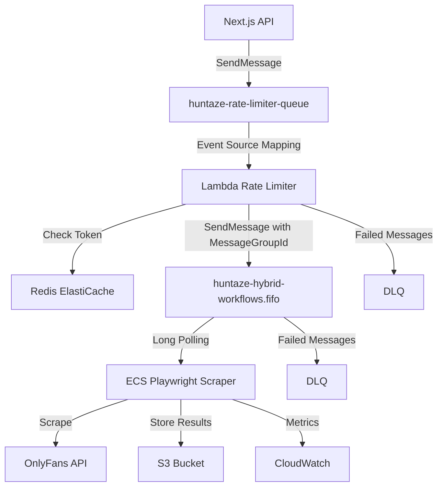

# Design Document

## Overview

This design document specifies the integration of the existing Huntaze rate limiter Lambda with the workflows FIFO queue and Playwright scraper service. The architecture implements a decoupled, scalable pattern where the Lambda acts as a "gate-keeper" for rate limiting, and the ECS Fargate service handles the actual OnlyFans scraping operations.

### Architecture Pattern

```
┌─────────────────────────────────────────────────────────────┐
│                  Huntaze OnlyFans Flow                       │
│                                                              │
│  1. User Request (via Next.js API)                          │
│      │                                                       │
│      ▼                                                       │
│  ┌────────────────┐                                         │
│  │  Next.js API   │                                         │
│  │  /api/onlyfans │                                         │
│  └────────┬───────┘                                         │
│           │                                                  │
│           │ Enqueue message                                 │
│           ▼                                                  │
│  ┌────────────────┐                                         │
│  │  SQS Queue     │                                         │
│  │  rate-limiter  │  (Standard Queue)                       │
│  └────────┬───────┘                                         │
│           │                                                  │
│           │ Trigger (Event Source Mapping)                  │
│           ▼                                                  │
│  ┌────────────────┐         ┌──────────────┐              │
│  │  Lambda        │────────▶│  Redis       │              │
│  │  Rate Limiter  │  Check  │  Token Bucket│              │
│  │                │◀────────│  (ElastiCache)│             │
│  └────────┬───────┘         └──────────────┘              │
│           │                                                  │
│           │ If token available                              │
│           ▼                                                  │
│  ┌────────────────┐                                         │
│  │  SQS FIFO      │                                         │
│  │  workflows     │  (FIFO Queue)                           │
│  └────────┬───────┘                                         │
│           │                                                  │
│           │ Long polling                                    │
│           ▼                                                  │
│  ┌────────────────┐                                         │
│  │  ECS Fargate   │                                         │
│  │  Playwright    │                                         │
│  │  Scraper       │                                         │
│  └────────┬───────┘                                         │
│           │                                                  │
│           │ Actual OnlyFans API call                        │
│           ▼                                                  │
│  ┌────────────────┐                                         │
│  │  OnlyFans API  │                                         │
│  │  (External)    │                                         │
│  └────────────────┘                                         │
└─────────────────────────────────────────────────────────────┘
```

### Key Design Decisions

1. **Decoupling**: Lambda handles rate limiting logic only; ECS handles scraping
2. **Back-pressure**: FIFO queue depth naturally signals when to scale ECS tasks
3. **Ordering**: MessageGroupId per creator ensures sequential processing per creator
4. **Reliability**: Partial batch response + DLQ prevents message loss
5. **Cost**: Fargate Spot + ARM64 Graviton2 reduces compute costs by 60-80%

## Architecture

### Component Diagram



### Data Flow

1. **Request Initiation**: User triggers OnlyFans action via Next.js API
2. **Queue Entry**: API sends message to `huntaze-rate-limiter-queue` (standard SQS)
3. **Rate Limit Check**: Lambda consumes message, checks Redis token bucket
4. **Token Available**: Lambda forwards to `huntaze-hybrid-workflows.fifo` with MessageGroupId
5. **Token Unavailable**: Lambda changes visibility timeout, message retries later
6. **Scraper Consumption**: ECS Playwright service polls FIFO queue
7. **Scraping Execution**: Playwright executes OnlyFans operation
8. **Result Storage**: Results stored in S3, metrics sent to CloudWatch
9. **Message Deletion**: Successful messages deleted from queue

## Components and Interfaces

### 1. Lambda Rate Limiter (Existing - Modified)

**Current Implementation**: `lib/lambda/rate-limiter/index.mjs`

**Modifications Required**:
- Replace `sendToOnlyFansAPI()` function with `sendToWorkflowsQueue()`
- Add SQS SendMessage permissions for workflows FIFO queue
- Add MessageGroupId and MessageDeduplicationId logic
- Add metadata attributes for observability

**Interface**:
```typescript
interface RateLimiterInput {
  Records: Array<{
    messageId: string;
    receiptHandle: string;
    body: string; // JSON payload
  }>;
}

interface MessagePayload {
  action: 'send_message' | 'scrape_profile' | 'download_media';
  creator_id: string;
  user_id: string;
  timestamp: string;
  metadata: Record<string, any>;
}

interface RateLimiterOutput {
  batchItemFailures: Array<{
    itemIdentifier: string;
  }>;
}
```

**Key Methods**:

```javascript
// NEW: Send to workflows FIFO queue
async function sendToWorkflowsQueue(payload) {
  const sqs = new SQSClient({ region: AWS_REGION });
  
  // Determine MessageGroupId (for ordering)
  const messageGroupId = payload.creator_id || payload.user_id || 'default';
  
  // Generate MessageDeduplicationId (for exactly-once)
  const deduplicationId = crypto
    .createHash('sha256')
    .update(JSON.stringify({
      action: payload.action,
      creator_id: payload.creator_id,
      timestamp: payload.timestamp
    }))
    .digest('hex');
  
  await sqs.send(new SendMessageCommand({
    QueueUrl: process.env.WORKFLOWS_QUEUE_URL,
    MessageBody: JSON.stringify(payload),
    MessageGroupId: messageGroupId,
    MessageDeduplicationId: deduplicationId,
    MessageAttributes: {
      rate_limit_timestamp: {
        DataType: 'String',
        StringValue: new Date().toISOString()
      },
      tokens_remaining: {
        DataType: 'Number',
        StringValue: String(remainingTokens)
      },
      rate_limiter_version: {
        DataType: 'String',
        StringValue: '1.0.0'
      }
    }
  }));
}
```

### 2. SQS Workflows FIFO Queue (Existing)

**Queue Name**: `huntaze-hybrid-workflows.fifo`

**Configuration**:
- **Type**: FIFO
- **Content-based deduplication**: Enabled (5-minute window)
- **Visibility timeout**: 300 seconds (5 minutes)
- **Message retention**: 14 days
- **Receive wait time**: 20 seconds (long polling)
- **Max message size**: 256 KB
- **Encryption**: AWS KMS with automatic key rotation
- **DLQ**: Configured with maxReceiveCount=3

**Message Format**:

```json
{
  "MessageId": "uuid",
  "MessageGroupId": "creator_123",
  "MessageDeduplicationId": "sha256_hash",
  "Body": {
    "action": "send_message",
    "creator_id": "creator_123",
    "user_id": "user_456",
    "message_content": "Hello!",
    "timestamp": "2025-10-29T12:00:00Z",
    "metadata": {
      "campaign_id": "campaign_789",
      "priority": "normal"
    }
  },
  "MessageAttributes": {
    "rate_limit_timestamp": "2025-10-29T12:00:00Z",
    "tokens_remaining": "9",
    "rate_limiter_version": "1.0.0"
  }
}
```

### 3. ECS Playwright Scraper Service (New)

**Service Name**: `huntaze-onlyfans-scraper`

**Task Definition**:
- **Family**: `huntaze-onlyfans-scraper`
- **Launch Type**: Fargate
- **CPU**: 1024 (1 vCPU)
- **Memory**: 2048 MB (2 GB)
- **Platform**: ARM64 (Graviton2 for cost savings)
- **Capacity Provider**: FARGATE_SPOT (70%) + FARGATE (30%)

**Container Configuration**:
```yaml
containerDefinitions:
  - name: playwright-scraper
    image: ${AWS_ACCOUNT_ID}.dkr.ecr.${AWS_REGION}.amazonaws.com/huntaze/onlyfans-scraper:latest
    essential: true
    memoryReservation: 1024
    cpu: 512
    environment:
      - name: NODE_ENV
        value: production
      - name: AWS_REGION
        value: us-east-1
      - name: WORKFLOWS_QUEUE_URL
        value: https://sqs.us-east-1.amazonaws.com/317805897534/huntaze-hybrid-workflows.fifo
      - name: PLAYWRIGHT_BROWSERS_PATH
        value: /tmp/browsers
      - name: NODE_OPTIONS
        value: --max-old-space-size=1024
    secrets:
      - name: ONLYFANS_API_KEY
        valueFrom: arn:aws:secretsmanager:us-east-1:317805897534:secret:onlyfans/api-key
    logConfiguration:
      logDriver: awslogs
      options:
        awslogs-group: /huntaze/production/onlyfans-scraper
        awslogs-region: us-east-1
        awslogs-stream-prefix: playwright
```

**Auto Scaling Configuration**:

```yaml
scalingPolicy:
  targetTrackingScaling:
    targetValue: 100  # Target queue depth
    scaleInCooldown: 300  # 5 minutes
    scaleOutCooldown: 60  # 1 minute
    customizedMetricSpecification:
      metricName: ApproximateNumberOfMessagesVisible
      namespace: AWS/SQS
      statistic: Average
      dimensions:
        - name: QueueName
          value: huntaze-hybrid-workflows.fifo
  
  minCapacity: 1
  maxCapacity: 10
```

**Scraper Application Interface**:
```typescript
interface ScraperConfig {
  queueUrl: string;
  batchSize: number;
  waitTimeSeconds: number;
  visibilityTimeout: number;
}

interface ScraperMessage {
  messageId: string;
  receiptHandle: string;
  body: MessagePayload;
  attributes: {
    rate_limit_timestamp: string;
    tokens_remaining: string;
    rate_limiter_version: string;
  };
}

interface ScraperResult {
  success: boolean;
  messageId: string;
  creator_id: string;
  action: string;
  duration_ms: number;
  error?: string;
  data?: any;
}

class PlaywrightScraper {
  async start(): Promise<void>;
  async pollQueue(): Promise<ScraperMessage[]>;
  async processMessage(message: ScraperMessage): Promise<ScraperResult>;
  async deleteMessage(receiptHandle: string): Promise<void>;
  async handleFailure(message: ScraperMessage, error: Error): Promise<void>;
  async shutdown(): Promise<void>;
}
```

## Data Models

### Message Payload Schema

```typescript
interface OnlyFansMessagePayload {
  // Required fields
  action: 'send_message' | 'scrape_profile' | 'download_media' | 'get_messages';
  creator_id: string;
  user_id: string;
  timestamp: string;  // ISO 8601
  
  // Action-specific fields
  message_content?: string;  // For send_message
  media_urls?: string[];     // For download_media
  profile_url?: string;      // For scrape_profile
  
  // Metadata
  metadata: {
    campaign_id?: string;
    priority: 'low' | 'normal' | 'high';
    retry_count?: number;
    correlation_id: string;
  };
}
```

### Redis Token Bucket State

```typescript
interface TokenBucketState {
  key: string;  // "rate_limit:onlyfans:global"
  tokens: number;  // Current available tokens (0-10)
  timestamp: number;  // Last update timestamp (Unix seconds)
  capacity: number;  // Max tokens (10)
  refill_rate: number;  // Tokens per second (10/60 = 0.1667)
}
```

### Scraper Result Schema

```typescript
interface ScraperResultData {
  message_id: string;
  creator_id: string;
  action: string;
  status: 'success' | 'failure' | 'rate_limited';
  timestamp: string;
  duration_ms: number;
  
  // Success data
  response?: {
    status_code: number;
    data: any;
  };
  
  // Error data
  error?: {
    type: 'network' | 'auth' | 'rate_limit' | 'validation' | 'unknown';
    message: string;
    stack?: string;
  };
  
  // Metrics
  metrics: {
    queue_wait_time_ms: number;
    scraping_time_ms: number;
    total_time_ms: number;
  };
}
```

## Error Handling

### Lambda Rate Limiter Error Handling

**Scenario 1: Redis Connection Failure**
- **Action**: Mark message as failed in Partial Batch Response
- **Retry**: SQS automatically retries with exponential backoff
- **DLQ**: After 3 retries, move to DLQ
- **Alert**: CloudWatch alarm triggers on high error rate

**Scenario 2: SQS SendMessage Failure**
- **Action**: Mark message as failed in Partial Batch Response
- **Retry**: SQS automatically retries
- **Logging**: Log error with full context for debugging

**Scenario 3: Rate Limit Exceeded**
- **Action**: Change message visibility timeout to retry_after value
- **Retry**: Message becomes visible again after calculated delay
- **No Failure**: Do NOT mark as failed (natural back-pressure)

### Playwright Scraper Error Handling

**Scenario 1: OnlyFans 429 Rate Limit**

- **Action**: Do NOT delete message, let visibility timeout expire
- **Retry**: Message retries automatically
- **Logging**: Log rate limit event with retry-after header
- **Circuit Breaker**: If 5 consecutive 429s, pause processing for 60 seconds

**Scenario 2: OnlyFans 5xx Server Error**
- **Action**: Retry up to 3 times with exponential backoff (1s, 2s, 4s)
- **Failure**: If all retries fail, do NOT delete message
- **DLQ**: After maxReceiveCount (3), SQS moves to DLQ
- **Alert**: CloudWatch alarm on high 5xx rate

**Scenario 3: OnlyFans 4xx Client Error (except 429)**
- **Action**: Log error and DELETE message (no retry)
- **Reason**: Client errors indicate bad request, retrying won't help
- **Logging**: Log full request/response for debugging
- **Metrics**: Increment client_error_count metric

**Scenario 4: Playwright Browser Crash**
- **Action**: Restart browser, retry message processing
- **Failure**: If crash persists, do NOT delete message
- **Health Check**: ECS health check fails, task replaced
- **Logging**: Log crash dump and stack trace

**Scenario 5: Network Timeout**
- **Action**: Retry with increased timeout (30s → 60s → 120s)
- **Failure**: After 3 retries, do NOT delete message
- **DLQ**: SQS moves to DLQ after maxReceiveCount
- **Alert**: CloudWatch alarm on high timeout rate

### Circuit Breaker Pattern

```typescript
class CircuitBreaker {
  private state: 'CLOSED' | 'OPEN' | 'HALF_OPEN' = 'CLOSED';
  private failureCount: number = 0;
  private lastFailureTime: number = 0;
  
  private readonly FAILURE_THRESHOLD = 5;
  private readonly TIMEOUT_MS = 60000;  // 60 seconds
  
  async execute<T>(fn: () => Promise<T>): Promise<T> {
    if (this.state === 'OPEN') {
      if (Date.now() - this.lastFailureTime > this.TIMEOUT_MS) {
        this.state = 'HALF_OPEN';
      } else {
        throw new Error('Circuit breaker is OPEN');
      }
    }
    
    try {
      const result = await fn();
      this.onSuccess();
      return result;
    } catch (error) {
      this.onFailure();
      throw error;
    }
  }
  
  private onSuccess(): void {
    this.failureCount = 0;
    this.state = 'CLOSED';
  }
  
  private onFailure(): void {
    this.failureCount++;
    this.lastFailureTime = Date.now();
    
    if (this.failureCount >= this.FAILURE_THRESHOLD) {
      this.state = 'OPEN';
    }
  }
}
```

## Testing Strategy

### Unit Tests

**Lambda Rate Limiter**:
- Test token bucket algorithm with various scenarios
- Test MessageGroupId generation logic
- Test MessageDeduplicationId generation
- Test error handling for Redis failures
- Test error handling for SQS failures
- Test Partial Batch Response formatting

**Playwright Scraper**:
- Test message parsing and validation
- Test OnlyFans API error handling (429, 4xx, 5xx)
- Test circuit breaker state transitions
- Test graceful shutdown with in-flight messages
- Test message deletion logic

### Integration Tests

**End-to-End Flow**:
- Send message to rate limiter queue
- Verify Lambda processes and forwards to workflows queue
- Verify Playwright scraper consumes and processes message
- Verify results stored in S3
- Verify metrics published to CloudWatch

**Rate Limiting**:
- Send 20 messages rapidly
- Verify only 10 processed in first minute
- Verify remaining 10 processed in second minute
- Verify no messages lost

**Failure Scenarios**:
- Simulate Redis failure, verify retry behavior
- Simulate OnlyFans 429, verify back-pressure
- Simulate OnlyFans 5xx, verify exponential backoff
- Simulate message processing failure, verify DLQ

### Load Tests

**Throughput Test**:
- Send 1000 messages over 10 minutes
- Verify all messages processed successfully
- Verify rate limit respected (10 msg/min)
- Verify auto-scaling behavior

**Burst Test**:
- Send 500 messages instantly
- Verify queue depth increases
- Verify ECS scales out to handle load
- Verify processing completes within SLA

**Sustained Load Test**:
- Send 10 msg/min for 24 hours
- Verify no message loss
- Verify consistent latency
- Verify cost within budget

## Monitoring and Observability

### CloudWatch Metrics

**Lambda Rate Limiter**:
- `rate_limit_allowed_count` - Messages forwarded to workflows queue
- `rate_limit_rejected_count` - Messages delayed due to rate limit
- `lambda_invocations` - Total Lambda invocations
- `lambda_errors` - Lambda execution errors
- `lambda_duration` - Lambda execution time
- `lambda_throttles` - Lambda throttling events

**SQS Workflows Queue**:
- `ApproximateNumberOfMessagesVisible` - Queue depth
- `ApproximateAgeOfOldestMessage` - Message age
- `NumberOfMessagesSent` - Messages sent to queue
- `NumberOfMessagesReceived` - Messages consumed from queue
- `NumberOfMessagesDeleted` - Successfully processed messages

**Playwright Scraper**:
- `scraping_success_rate` - Percentage of successful scrapes
- `scraping_duration_ms` - Average scraping time
- `onlyfans_429_count` - Rate limit responses from OnlyFans
- `onlyfans_5xx_count` - Server errors from OnlyFans
- `onlyfans_4xx_count` - Client errors from OnlyFans
- `circuit_breaker_open_count` - Circuit breaker activations

**ECS Service**:
- `CPUUtilization` - Task CPU usage
- `MemoryUtilization` - Task memory usage
- `RunningTaskCount` - Number of running tasks
- `DesiredTaskCount` - Target task count from auto-scaling

### CloudWatch Alarms

**Critical Alarms** (Page on-call):

- `workflows_queue_age_critical` - Oldest message > 1800 seconds (30 min)
- `lambda_errors_critical` - Lambda errors > 50 in 5 minutes
- `scraper_failure_rate_critical` - Failure rate > 50% for 10 minutes
- `dlq_messages_critical` - DLQ messages > 100

**Warning Alarms** (Slack notification):
- `workflows_queue_depth_high` - Queue depth > 500 messages
- `workflows_queue_age_high` - Oldest message > 600 seconds (10 min)
- `lambda_throttles_high` - Lambda throttles > 10 in 5 minutes
- `scraper_5xx_rate_high` - 5xx errors > 20% for 5 minutes
- `ecs_cpu_high` - CPU utilization > 70% for 10 minutes

### CloudWatch Logs Insights Queries

**Rate Limit Decisions**:
```
fields @timestamp, @message
| filter @message like /Token bucket result/
| parse @message /allowed: (?<allowed>\w+), retryAfter: (?<retry>\d+), remainingTokens: (?<tokens>\d+)/
| stats count() by allowed
```

**Scraping Performance**:
```
fields @timestamp, duration_ms, creator_id, action, status
| filter status = "success"
| stats avg(duration_ms) as avg_duration, max(duration_ms) as max_duration, count() as total by action
```

**Error Analysis**:
```
fields @timestamp, error.type, error.message, creator_id
| filter status = "failure"
| stats count() by error.type
| sort count desc
```

### CloudWatch Dashboard

**Dashboard Name**: `Huntaze-OnlyFans-Scraper`

**Widgets**:
1. **Rate Limiter Metrics** - Allowed vs Rejected count
2. **Queue Depth** - Workflows queue depth over time
3. **Queue Age** - Oldest message age over time
4. **Lambda Performance** - Duration, errors, throttles
5. **Scraper Success Rate** - Success vs failure percentage
6. **OnlyFans API Errors** - 429, 4xx, 5xx breakdown
7. **ECS Auto Scaling** - Running vs desired task count
8. **ECS Resource Usage** - CPU and memory utilization
9. **Processing Latency** - End-to-end message processing time
10. **Cost Tracking** - Estimated hourly cost

## Security Considerations

### IAM Roles and Policies

**Lambda Execution Role**:
```json
{
  "Version": "2012-10-17",
  "Statement": [
    {
      "Effect": "Allow",
      "Action": [
        "sqs:ReceiveMessage",
        "sqs:DeleteMessage",
        "sqs:GetQueueAttributes",
        "sqs:ChangeMessageVisibility"
      ],
      "Resource": "arn:aws:sqs:us-east-1:317805897534:huntaze-rate-limiter-queue"
    },
    {
      "Effect": "Allow",
      "Action": [
        "sqs:SendMessage"
      ],
      "Resource": "arn:aws:sqs:us-east-1:317805897534:huntaze-hybrid-workflows.fifo"
    },
    {
      "Effect": "Allow",
      "Action": [
        "secretsmanager:GetSecretValue"
      ],
      "Resource": "arn:aws:secretsmanager:us-east-1:317805897534:secret:redis/auth-token-*"
    },
    {
      "Effect": "Allow",
      "Action": [
        "logs:CreateLogStream",
        "logs:PutLogEvents"
      ],
      "Resource": "arn:aws:logs:us-east-1:317805897534:log-group:/aws/lambda/huntaze-rate-limiter:*"
    }
  ]
}
```

**ECS Task Role**:
```json
{
  "Version": "2012-10-17",
  "Statement": [
    {
      "Effect": "Allow",
      "Action": [
        "sqs:ReceiveMessage",
        "sqs:DeleteMessage",
        "sqs:GetQueueAttributes",
        "sqs:ChangeMessageVisibility"
      ],
      "Resource": "arn:aws:sqs:us-east-1:317805897534:huntaze-hybrid-workflows.fifo"
    },
    {
      "Effect": "Allow",
      "Action": [
        "s3:PutObject",
        "s3:PutObjectAcl"
      ],
      "Resource": "arn:aws:s3:::huntaze-onlyfans-results/*"
    },
    {
      "Effect": "Allow",
      "Action": [
        "secretsmanager:GetSecretValue"
      ],
      "Resource": "arn:aws:secretsmanager:us-east-1:317805897534:secret:onlyfans/api-key-*"
    },
    {
      "Effect": "Allow",
      "Action": [
        "cloudwatch:PutMetricData"
      ],
      "Resource": "*",
      "Condition": {
        "StringEquals": {
          "cloudwatch:namespace": "Huntaze/OnlyFans"
        }
      }
    }
  ]
}
```

### Encryption

**At Rest**:
- SQS queues encrypted with AWS KMS (automatic key rotation)
- S3 results bucket encrypted with SSE-S3
- ElastiCache Redis encrypted at rest
- CloudWatch Logs encrypted with KMS

**In Transit**:
- TLS 1.2+ for all AWS service communication
- Redis connections use TLS
- VPC endpoints for SQS, S3, Secrets Manager

### Secrets Management

**OnlyFans API Credentials**:
- Stored in AWS Secrets Manager
- Automatic rotation every 90 days
- Access logged in CloudTrail
- Least-privilege IAM policies

**Redis AUTH Token**:
- Stored in AWS Secrets Manager
- Rotated manually (no automatic rotation for ElastiCache)
- Access logged in CloudTrail

### Network Security

**VPC Configuration**:
- ECS tasks in private subnets (no public IP)
- VPC endpoints for AWS services (no NAT Gateway)
- Security groups with least-privilege rules
- Network ACLs for additional layer

**Security Group Rules**:
```yaml
ECS_Scraper_SG:
  ingress: []  # No inbound traffic
  egress:
    - protocol: tcp
      port: 443
      destination: 0.0.0.0/0  # HTTPS for OnlyFans API
    - protocol: tcp
      port: 443
      destination: VPC_Endpoint_SG  # AWS services
```

## Cost Optimization

### Estimated Monthly Costs

**Lambda Rate Limiter**:
- Invocations: 432,000/month (10 msg/min * 60 min * 24 hr * 30 days)
- Duration: 200ms average
- Memory: 256 MB
- **Cost**: ~$0.50/month (within free tier)

**SQS Workflows Queue**:
- Requests: 864,000/month (send + receive)
- **Cost**: ~$0.35/month

**ECS Fargate Scraper**:
- Tasks: 1-10 concurrent
- CPU: 1 vCPU
- Memory: 2 GB
- Spot: 70% of time
- **Cost**: ~$15-30/month (with Spot savings)

**ElastiCache Redis**:
- Instance: cache.t4g.micro (ARM64)
- **Cost**: ~$12/month

**CloudWatch**:
- Logs: 5 GB/month
- Metrics: 50 custom metrics
- Alarms: 10 alarms
- **Cost**: ~$10/month

**Total Estimated Cost**: ~$40-55/month

### Cost Optimization Strategies

1. **Fargate Spot**: 70% cost reduction vs On-Demand
2. **ARM64 Graviton2**: 20% cost reduction vs x86
3. **Right-sizing**: 1 vCPU / 2 GB (down from typical 2 vCPU / 4 GB)
4. **VPC Endpoints**: Eliminate NAT Gateway costs ($32/month savings)
5. **Log Retention**: 7 days (vs 30 days default)
6. **Reserved Concurrency**: Limit Lambda to prevent runaway costs
7. **Auto-scaling**: Scale to zero during low traffic periods

## Deployment Strategy

### Phase 1: Lambda Modification (Week 1)
1. Update Lambda code to send to workflows queue
2. Add IAM permissions for workflows queue
3. Deploy to staging environment
4. Run integration tests
5. Deploy to production with feature flag

### Phase 2: Playwright Scraper Development (Week 2-3)
1. Create Dockerfile with Playwright
2. Implement SQS consumer logic
3. Implement OnlyFans scraping logic
4. Add error handling and circuit breaker
5. Add CloudWatch metrics and logging
6. Test locally with LocalStack

### Phase 3: Infrastructure Deployment (Week 4)
1. Create ECS task definition
2. Create ECS service with auto-scaling
3. Configure CloudWatch alarms
4. Create CloudWatch dashboard
5. Deploy to staging environment
6. Run load tests

### Phase 4: Production Rollout (Week 5)
1. Deploy to production with 10% traffic
2. Monitor metrics and errors
3. Gradually increase to 50% traffic
4. Monitor for 48 hours
5. Increase to 100% traffic
6. Decommission old direct API call path

### Rollback Plan
- Feature flag to disable workflows queue integration
- Lambda reverts to direct API calls
- ECS service scaled to zero
- No data loss (messages remain in queue)

## Performance Targets

### Latency
- **Lambda processing**: < 500ms p99
- **Queue wait time**: < 60 seconds p95
- **Scraping duration**: < 10 seconds p95
- **End-to-end**: < 90 seconds p95

### Throughput
- **Rate limit**: 10 messages per minute (hard limit)
- **Queue capacity**: 10,000 messages
- **Concurrent scrapers**: 1-10 tasks
- **Daily volume**: 14,400 messages/day

### Reliability
- **Message delivery**: 99.9% success rate
- **Lambda availability**: 99.95%
- **ECS availability**: 99.9%
- **Data loss**: 0% (guaranteed by SQS)

### Scalability
- **Horizontal scaling**: 1-10 ECS tasks
- **Queue depth**: Up to 10,000 messages
- **Burst capacity**: 500 messages instantly
- **Geographic**: Single region (us-east-1)

## Future Enhancements

### Phase 2 Features
1. **Multi-region**: Deploy to eu-west-1 for European creators
2. **Priority queues**: Separate queues for high-priority messages
3. **Batch processing**: Process multiple messages per scraper invocation
4. **Caching**: Cache creator profiles to reduce API calls
5. **Webhooks**: Real-time notifications for scraping completion

### Advanced Features
1. **ML-based rate limiting**: Predict optimal rate limits per creator
2. **Smart retry**: Exponential backoff with jitter
3. **A/B testing**: Test different scraping strategies
4. **Cost attribution**: Track costs per creator/campaign
5. **Compliance**: GDPR data retention and deletion

---

**Document Version**: 1.0  
**Last Updated**: 2025-10-29  
**Author**: Kiro AI  
**Status**: Ready for Review
