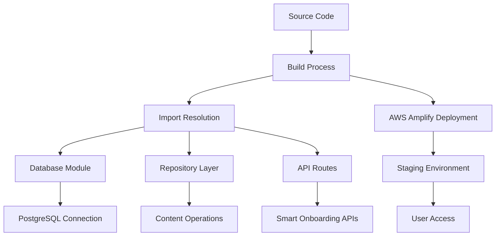

# Smart Onboarding Deployment Fix Design

## Overview

This design addresses the critical deployment failures preventing the Smart Onboarding system from being accessible on AWS Amplify. The solution focuses on resolving import/export issues, database connection problems, and build configuration errors that are blocking successful deployment.

## Architecture

### Current State Analysis

The deployment failure analysis reveals several key issues:

1. **Database Export Issues**: The `query` function is not properly exported from `@/lib/db`
2. **Repository Export Mismatches**: Content repository exports `create` but imports expect `createContentItem`
3. **Build Configuration**: AWS Amplify build process has different requirements than local development
4. **Parameter Template Issues**: SQL query parameters may have template literal formatting problems

### Target Architecture



## Components and Interfaces

### 1. Database Module Standardization

**Purpose**: Ensure consistent database exports across all modules

**Interface**:
```typescript
// lib/db/index.ts
export interface DatabaseModule {
  query: (text: string, params?: any[]) => Promise<QueryResult>;
  getPool: () => Pool;
  getClient: () => Promise<PoolClient>;
}
```

**Implementation Strategy**:
- Consolidate all database exports in a single index file
- Provide both named and default exports for compatibility
- Ensure query function is available as both `query` and `db.query`

### 2. Repository Export Alignment

**Purpose**: Align repository exports with API route imports

**Interface**:
```typescript
// Repository Export Pattern
export interface RepositoryExports {
  // Direct function exports
  createContentItem: (data: CreateContentItemData) => Promise<ContentItem>;
  findContentItemById: (id: string) => Promise<ContentItem | null>;
  updateContentItem: (id: string, data: UpdateContentItemData) => Promise<ContentItem | null>;
  
  // Repository class export
  ContentItemsRepository: typeof ContentItemsRepository;
  
  // Default repository object
  contentItemsRepository: typeof contentItemsRepository;
}
```

**Implementation Strategy**:
- Export individual functions with expected names
- Maintain backward compatibility with existing class exports
- Provide multiple export patterns to support different import styles

### 3. Build Configuration Optimization

**Purpose**: Optimize AWS Amplify build process for Smart Onboarding system

**Configuration Elements**:
- Environment variable validation
- Database connection string handling
- TypeScript compilation settings
- Next.js build optimization

### 4. Error Handling and Diagnostics

**Purpose**: Provide clear error reporting for deployment issues

**Components**:
- Build error detection and reporting
- Database connection validation
- Import/export verification
- Deployment health checks

## Data Models

### Build Error Tracking

```typescript
interface BuildError {
  type: 'import' | 'export' | 'database' | 'configuration';
  file: string;
  line?: number;
  message: string;
  suggestion?: string;
}

interface DeploymentStatus {
  phase: 'build' | 'deploy' | 'validate' | 'complete';
  status: 'success' | 'error' | 'warning';
  errors: BuildError[];
  timestamp: Date;
}
```

### Database Connection Configuration

```typescript
interface DatabaseConfig {
  connectionString: string;
  ssl: boolean | { rejectUnauthorized: boolean };
  pool: {
    max: number;
    idleTimeoutMillis: number;
    connectionTimeoutMillis: number;
  };
}
```

## Error Handling

### Build Error Resolution Strategy

1. **Import/Export Errors**:
   - Scan all files for import statements
   - Verify corresponding exports exist
   - Generate missing exports automatically where possible
   - Provide clear error messages with suggested fixes

2. **Database Connection Errors**:
   - Validate environment variables during build
   - Test database connectivity in staging environment
   - Provide fallback configurations for development
   - Implement connection retry logic

3. **TypeScript Compilation Errors**:
   - Enable strict type checking for deployment builds
   - Resolve type mismatches in Smart Onboarding components
   - Ensure all interfaces are properly exported
   - Fix any remaining type errors

### Deployment Validation

1. **Pre-deployment Checks**:
   - Verify all required environment variables
   - Test database connection
   - Validate Smart Onboarding API endpoints
   - Check ML model availability

2. **Post-deployment Validation**:
   - Health check all Smart Onboarding endpoints
   - Verify database operations work correctly
   - Test ML personalization features
   - Validate real-time analytics functionality

## Testing Strategy

### Build Testing

1. **Local Build Validation**:
   - Run production build locally
   - Test with production environment variables
   - Verify all imports resolve correctly
   - Check database operations work

2. **Staging Environment Testing**:
   - Deploy to staging environment
   - Run automated health checks
   - Test Smart Onboarding user flows
   - Validate ML prediction accuracy

### Integration Testing

1. **Database Integration**:
   - Test all repository operations
   - Verify connection pooling works
   - Check query parameter handling
   - Validate transaction support

2. **API Integration**:
   - Test all Smart Onboarding endpoints
   - Verify authentication works
   - Check error handling
   - Validate response formats

### Performance Testing

1. **Load Testing**:
   - Test with 100+ concurrent users
   - Verify ML prediction performance
   - Check database connection limits
   - Monitor memory usage

2. **Stress Testing**:
   - Test system limits
   - Verify graceful degradation
   - Check error recovery
   - Monitor system stability

## Deployment Process

### Phase 1: Fix Import/Export Issues
- Standardize database module exports
- Align repository function names
- Fix template literal parameter issues
- Verify all imports resolve correctly

### Phase 2: Build Configuration
- Update AWS Amplify build settings
- Configure environment variables
- Optimize TypeScript compilation
- Set up proper error reporting

### Phase 3: Database Configuration
- Validate connection strings
- Configure SSL settings for production
- Set up connection pooling
- Test database operations

### Phase 4: Deployment and Validation
- Deploy to staging environment
- Run comprehensive health checks
- Test Smart Onboarding functionality
- Validate ML features work correctly

### Phase 5: Monitoring and Optimization
- Set up deployment monitoring
- Configure alerting for failures
- Optimize performance based on metrics
- Document deployment procedures