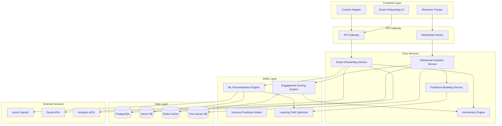

# Smart Onboarding System Design Document

## Overview

The Smart Onboarding System represents a next-generation user onboarding experience that leverages artificial intelligence, machine learning, and real-time behavioral analytics to create hyper-personalized user journeys. Built as an evolution of Huntaze's existing adaptive onboarding, this system proactively anticipates user needs, predicts optimal learning paths, and dynamically adapts the experience based on continuous behavioral analysis.

The system operates on three core principles:
1. **Predictive Intelligence**: Anticipate user needs before they express them
2. **Adaptive Personalization**: Continuously adjust the experience based on real-time data
3. **Proactive Intervention**: Detect and resolve user struggles before they lead to abandonment

## Architecture

### High-Level Architecture



### Service Architecture

The system follows a microservices architecture with event-driven communication:

- **Smart Onboarding Service**: Central orchestrator managing user journeys
- **Behavioral Analytics Service**: Real-time user behavior tracking and analysis
- **ML Personalization Engine**: Machine learning models for user profiling and prediction
- **Predictive Modeling Service**: Success prediction and risk assessment
- **Intervention Engine**: Proactive assistance and help system
- **Learning Path Optimizer**: Dynamic path optimization based on user cohorts

## Components and Interfaces

### 1. Smart Onboarding Service

**Responsibilities:**
- Orchestrate user onboarding journeys
- Coordinate between AI services and user interface
- Manage onboarding state and progression
- Handle user profile creation and updates

**Key Methods:**
```typescript
interface SmartOnboardingService {
  initializeUserJourney(userId: string, profileData: UserProfile): Promise<OnboardingJourney>
  updateUserProgress(userId: string, stepId: string, interactionData: InteractionEvent): Promise<void>
  getNextOptimalStep(userId: string): Promise<OnboardingStep>
  handleUserStruggle(userId: string, struggleIndicators: StruggleMetrics): Promise<InterventionPlan>
  completeOnboarding(userId: string): Promise<OnboardingResult>
}
```

### 2. ML Personalization Engine

**Responsibilities:**
- Analyze user profiles and predict preferences
- Generate personalized content recommendations
- Continuously learn from user interactions
- Maintain user behavioral models

**Key Methods:**
```typescript
interface MLPersonalizationEngine {
  analyzeUserProfile(profileData: UserProfile): Promise<UserPersona>
  predictOptimalPath(userId: string, currentContext: OnboardingContext): Promise<LearningPath>
  updateUserModel(userId: string, behaviorData: BehaviorEvent[]): Promise<void>
  generateContentRecommendations(userId: string, contentType: string): Promise<ContentRecommendation[]>
  assessTechnicalProficiency(interactionPatterns: InteractionPattern[]): Promise<ProficiencyLevel>
}
```

### 3. Behavioral Analytics Service

**Responsibilities:**
- Track real-time user interactions
- Analyze engagement patterns
- Detect struggle indicators
- Generate behavioral insights

**Key Methods:**
```typescript
interface BehavioralAnalyticsService {
  trackInteraction(userId: string, event: InteractionEvent): Promise<void>
  analyzeEngagementPatterns(userId: string, timeWindow: number): Promise<EngagementAnalysis>
  detectStruggleIndicators(userId: string): Promise<StruggleMetrics>
  generateBehavioralInsights(userId: string): Promise<BehavioralInsights>
  calculateEngagementScore(interactionHistory: InteractionEvent[]): Promise<number>
}
```

### 4. Intervention Engine

**Responsibilities:**
- Monitor user progress and engagement
- Trigger proactive assistance
- Provide contextual help
- Escalate complex issues

**Key Methods:**
```typescript
interface InterventionEngine {
  monitorUserProgress(userId: string): Promise<void>
  triggerIntervention(userId: string, triggerReason: InterventionTrigger): Promise<InterventionPlan>
  provideContextualHelp(userId: string, context: OnboardingContext): Promise<HelpContent>
  escalateToHuman(userId: string, issue: ComplexIssue): Promise<EscalationTicket>
  trackInterventionEffectiveness(interventionId: string, outcome: InterventionOutcome): Promise<void>
}
```

## Data Models

### User Profile Model
```typescript
interface UserProfile {
  id: string
  email: string
  socialConnections: SocialConnection[]
  technicalProficiency: ProficiencyLevel
  contentCreationGoals: CreationGoal[]
  platformPreferences: PlatformPreference[]
  learningStyle: LearningStyle
  timeConstraints: TimeConstraints
  previousExperience: ExperienceLevel
}
```

### Onboarding Journey Model
```typescript
interface OnboardingJourney {
  id: string
  userId: string
  currentStep: OnboardingStep
  completedSteps: OnboardingStep[]
  personalizedPath: LearningPath
  engagementHistory: EngagementMetric[]
  interventions: Intervention[]
  predictedSuccessRate: number
  estimatedCompletionTime: number
  adaptationHistory: AdaptationEvent[]
}
```

### Behavioral Event Model
```typescript
interface BehaviorEvent {
  id: string
  userId: string
  timestamp: Date
  eventType: BehaviorEventType
  stepId: string
  interactionData: {
    mouseMovements: MouseMovement[]
    clickPatterns: ClickPattern[]
    timeSpent: number
    scrollBehavior: ScrollBehavior
    hesitationIndicators: HesitationMetric[]
  }
  engagementScore: number
  contextualData: ContextualData
}
```

### ML Model Schemas
```typescript
interface UserPersona {
  personaType: PersonaType
  confidenceScore: number
  characteristics: PersonaCharacteristic[]
  predictedBehaviors: PredictedBehavior[]
  recommendedApproach: OnboardingApproach
}

interface LearningPath {
  pathId: string
  steps: OptimizedStep[]
  estimatedDuration: number
  difficultyProgression: DifficultyLevel[]
  personalizedContent: PersonalizedContent[]
  adaptationPoints: AdaptationPoint[]
}
```

## Error Handling

### Error Categories

1. **ML Model Errors**
   - Model prediction failures
   - Training data inconsistencies
   - Model drift detection

2. **Real-time Processing Errors**
   - WebSocket connection failures
   - Event processing delays
   - Data synchronization issues

3. **User Experience Errors**
   - Intervention timing failures
   - Content adaptation errors
   - Progress tracking inconsistencies

### Error Recovery Strategies

```typescript
interface ErrorRecoveryStrategy {
  // Graceful degradation to adaptive onboarding
  fallbackToAdaptiveOnboarding(userId: string): Promise<void>
  
  // Retry mechanisms for ML predictions
  retryWithBackoff(operation: MLOperation, maxRetries: number): Promise<MLResult>
  
  // Circuit breaker for external services
  handleServiceUnavailable(service: ExternalService): Promise<FallbackResponse>
  
  // Data consistency recovery
  reconcileUserState(userId: string): Promise<ConsistentState>
}
```

## Testing Strategy

### 1. Unit Testing
- **ML Model Testing**: Validate prediction accuracy and model performance
- **Service Logic Testing**: Test individual service methods and business logic
- **Data Processing Testing**: Verify behavioral analytics and event processing

### 2. Integration Testing
- **Service Communication**: Test inter-service communication and event flow
- **Database Integration**: Validate data persistence and retrieval
- **External API Integration**: Test social platform and AI service integrations

### 3. AI/ML Testing
- **Model Validation**: Cross-validation and performance metrics
- **Prediction Accuracy**: Test prediction quality against historical data
- **Bias Detection**: Ensure fair and unbiased personalization

### 4. User Experience Testing
- **A/B Testing Framework**: Compare smart onboarding vs. adaptive onboarding
- **Behavioral Simulation**: Simulate different user personas and behaviors
- **Performance Testing**: Ensure real-time responsiveness under load

### 5. End-to-End Testing
- **Complete User Journeys**: Test full onboarding flows for different personas
- **Intervention Scenarios**: Validate proactive assistance triggers and effectiveness
- **Adaptation Testing**: Verify dynamic content and path adjustments

### Testing Infrastructure

```typescript
interface TestingFramework {
  // Behavioral simulation
  simulateUserBehavior(persona: UserPersona, scenario: TestScenario): Promise<BehaviorSimulation>
  
  // ML model testing
  validateModelPredictions(model: MLModel, testData: TestDataset): Promise<ValidationResults>
  
  // Performance benchmarking
  benchmarkRealTimeProcessing(eventVolume: number): Promise<PerformanceMetrics>
  
  // User experience validation
  validateUserExperience(journey: OnboardingJourney): Promise<UXValidationResults>
}
```

## Performance Considerations

### Real-time Processing Requirements
- **Event Processing**: < 100ms for behavioral event processing
- **ML Predictions**: < 2 seconds for personalization predictions
- **Intervention Triggers**: < 3 seconds for struggle detection and response
- **Content Adaptation**: < 1 second for dynamic content updates

### Scalability Design
- **Horizontal Scaling**: Microservices can scale independently
- **Caching Strategy**: Redis for frequently accessed predictions and user states
- **Event Streaming**: Kafka for high-volume behavioral event processing
- **Database Optimization**: Partitioned tables for time-series behavioral data

### Resource Optimization
- **ML Model Efficiency**: Optimized models for real-time inference
- **Memory Management**: Efficient caching of user sessions and predictions
- **Network Optimization**: WebSocket connections for real-time updates
- **Database Indexing**: Optimized queries for behavioral analytics

## Security and Privacy

### Data Protection
- **Behavioral Data Encryption**: End-to-end encryption for sensitive behavioral data
- **Model Privacy**: Federated learning approaches where applicable
- **Data Retention**: Configurable retention policies for behavioral analytics
- **Anonymization**: User data anonymization for ML training

### Access Control
- **Service Authentication**: JWT-based service-to-service authentication
- **User Consent**: Explicit consent for behavioral tracking and AI personalization
- **Data Access Logging**: Comprehensive audit trails for data access
- **Privacy Controls**: User controls for data sharing and personalization levels

## Monitoring and Observability

### Key Metrics
- **User Success Rates**: Onboarding completion rates by persona type
- **Engagement Metrics**: Real-time engagement scores and trends
- **Intervention Effectiveness**: Success rates of proactive interventions
- **Model Performance**: ML model accuracy and prediction quality
- **System Performance**: Response times and error rates

### Alerting Strategy
- **Model Drift Detection**: Alerts when ML models show performance degradation
- **User Experience Issues**: Alerts for high abandonment rates or low engagement
- **System Health**: Infrastructure and service health monitoring
- **Data Quality**: Monitoring for data inconsistencies or processing delays