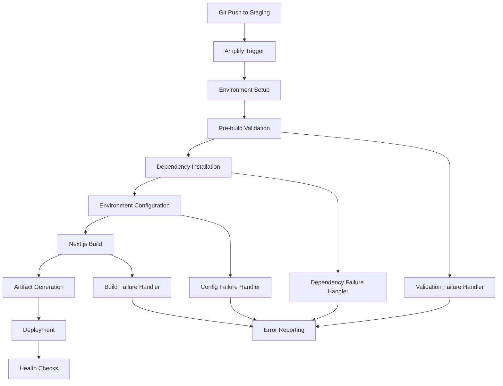
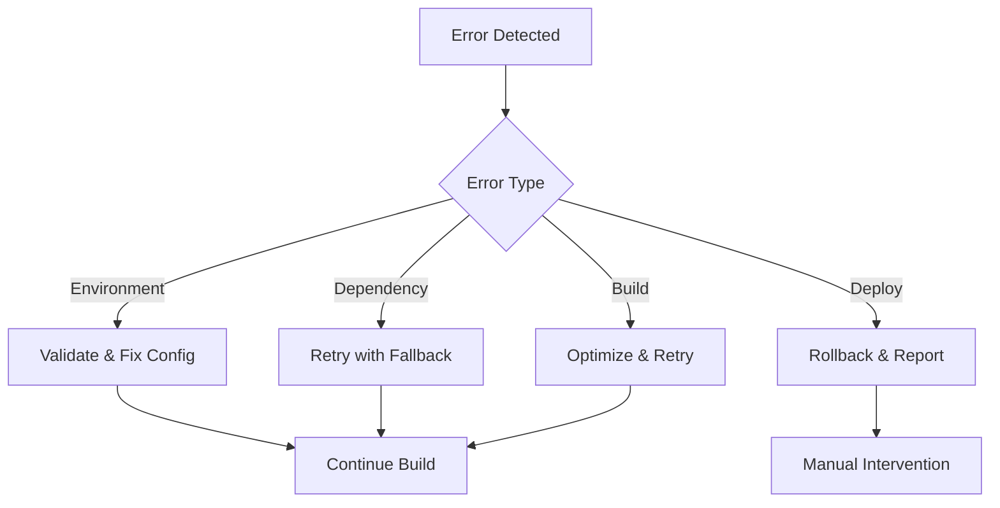

# Staging Deployment Fix Design

## Overview

This design addresses the systematic resolution of AWS Amplify staging deployment failures. The solution focuses on optimizing the build configuration, implementing robust error handling, and ensuring reliable environment setup. The approach includes immediate fixes for current failures and long-term improvements for deployment stability.

## Architecture

### Build Pipeline Architecture



### Component Interaction Flow

1. **Trigger Phase**: Git push initiates Amplify build
2. **Validation Phase**: Pre-build checks ensure environment readiness
3. **Setup Phase**: Dependencies and environment configuration
4. **Build Phase**: Next.js compilation with optimizations
5. **Deploy Phase**: Artifact deployment and health validation

## Components and Interfaces

### 1. Build Configuration Component

**Purpose**: Optimize Amplify build settings for reliability and performance

**Key Features**:
- Streamlined amplify.yml configuration
- Environment-specific build commands
- Proper caching strategies
- Memory and timeout optimizations

**Interface**:
```yaml
# Optimized amplify.yml structure
version: 1
frontend:
  phases:
    preBuild:
      commands:
        - echo "=== PRE-BUILD VALIDATION ==="
        - node --version && npm --version
        - node scripts/pre-build-validation.js
        - npm ci --prefer-offline --no-audit
    build:
      commands:
        - echo "=== BUILD PHASE ==="
        - export SKIP_ENV_VALIDATION=1
        - export NODE_OPTIONS="--max-old-space-size=4096"
        - npx next build
        - echo "=== BUILD COMPLETE ==="
  artifacts:
    baseDirectory: .next
    files:
      - '**/*'
  cache:
    paths:
      - node_modules/**/*
      - .next/cache/**/*
```

### 2. Pre-build Validation Component

**Purpose**: Validate environment and dependencies before build starts

**Key Features**:
- Environment variable validation
- Dependency version checking
- Build prerequisite verification
- Early failure detection

**Interface**:
```javascript
// scripts/pre-build-validation.js
class PreBuildValidator {
  validateEnvironment()
  validateDependencies()
  validateBuildPrerequisites()
  reportValidationResults()
}
```

### 3. Environment Configuration Component

**Purpose**: Ensure proper environment variable setup and validation

**Key Features**:
- Comprehensive environment variable checking
- Secure credential handling
- Environment-specific configurations
- Fallback value management

**Interface**:
```javascript
// lib/config/amplify-env-config.js
class AmplifyEnvironmentConfig {
  validateRequiredVars()
  setupEnvironmentDefaults()
  handleMissingVariables()
  generateConfigReport()
}
```

### 4. Build Optimization Component

**Purpose**: Optimize Next.js build process for Amplify environment

**Key Features**:
- Memory usage optimization
- Build performance improvements
- Error handling enhancements
- Artifact validation

**Interface**:
```javascript
// scripts/amplify-build-optimizer.js
class AmplifyBuildOptimizer {
  optimizeMemoryUsage()
  configureBuildSettings()
  handleBuildErrors()
  validateArtifacts()
}
```

### 5. Deployment Monitoring Component

**Purpose**: Monitor deployment health and provide feedback

**Key Features**:
- Real-time deployment status
- Health check validation
- Performance monitoring
- Alert generation

**Interface**:
```javascript
// lib/monitoring/deployment-monitor.js
class DeploymentMonitor {
  trackDeploymentStatus()
  runHealthChecks()
  generateAlerts()
  reportMetrics()
}
```

## Data Models

### Build Configuration Model
```typescript
interface BuildConfig {
  nodeVersion: string;
  buildCommands: string[];
  environmentVars: Record<string, string>;
  cacheSettings: CacheConfig;
  optimizations: BuildOptimizations;
}

interface CacheConfig {
  paths: string[];
  enabled: boolean;
  strategy: 'aggressive' | 'conservative';
}

interface BuildOptimizations {
  memoryLimit: number;
  timeoutMinutes: number;
  parallelBuilds: boolean;
  compressionEnabled: boolean;
}
```

### Validation Result Model
```typescript
interface ValidationResult {
  success: boolean;
  errors: ValidationError[];
  warnings: ValidationWarning[];
  recommendations: string[];
  timestamp: Date;
}

interface ValidationError {
  type: 'environment' | 'dependency' | 'configuration';
  message: string;
  resolution: string;
  critical: boolean;
}
```

### Deployment Status Model
```typescript
interface DeploymentStatus {
  id: string;
  phase: 'setup' | 'build' | 'deploy' | 'complete' | 'failed';
  startTime: Date;
  duration: number;
  errors: DeploymentError[];
  metrics: DeploymentMetrics;
}

interface DeploymentMetrics {
  buildTime: number;
  artifactSize: number;
  memoryUsage: number;
  successRate: number;
}
```

## Error Handling

### Error Categories and Responses

1. **Environment Setup Errors**
   - Missing environment variables
   - Invalid configuration values
   - Network connectivity issues
   - Response: Detailed error messages with resolution steps

2. **Dependency Installation Errors**
   - Package resolution failures
   - Network timeouts
   - Version conflicts
   - Response: Retry mechanisms with fallback strategies

3. **Build Process Errors**
   - Memory exhaustion
   - Compilation failures
   - Asset generation issues
   - Response: Optimized build settings and clear error reporting

4. **Deployment Errors**
   - Artifact upload failures
   - Health check failures
   - Configuration mismatches
   - Response: Rollback mechanisms and detailed diagnostics

### Error Recovery Strategies



## Testing Strategy

### 1. Build Configuration Testing
- Validate amplify.yml syntax and structure
- Test build commands in isolated environment
- Verify caching behavior and performance
- Validate artifact generation and integrity

### 2. Environment Validation Testing
- Test with missing environment variables
- Validate error handling for invalid configurations
- Test fallback mechanisms and defaults
- Verify secure credential handling

### 3. Integration Testing
- End-to-end deployment pipeline testing
- Cross-environment compatibility testing
- Performance and load testing
- Failure scenario testing

### 4. Monitoring and Alerting Testing
- Test health check implementations
- Validate alert generation and delivery
- Test monitoring dashboard functionality
- Verify metric collection and reporting

## Implementation Phases

### Phase 1: Immediate Fixes (Critical)
- Fix current amplify.yml configuration issues
- Implement pre-build validation script
- Add proper error handling for common failures
- Optimize memory and timeout settings

### Phase 2: Enhanced Validation (High Priority)
- Comprehensive environment variable validation
- Dependency version conflict detection
- Build prerequisite checking
- Improved error messaging

### Phase 3: Monitoring and Optimization (Medium Priority)
- Deployment health monitoring
- Performance optimization
- Advanced caching strategies
- Automated rollback mechanisms

### Phase 4: Advanced Features (Low Priority)
- Predictive failure detection
- Automated optimization recommendations
- Advanced analytics and reporting
- Integration with external monitoring tools

## Security Considerations

1. **Environment Variable Security**
   - Secure handling of sensitive credentials
   - Proper masking in build logs
   - Encryption of stored configurations

2. **Build Process Security**
   - Validation of build artifacts
   - Secure dependency installation
   - Protection against supply chain attacks

3. **Deployment Security**
   - Secure artifact transfer
   - Access control validation
   - Security scanning integration

## Performance Considerations

1. **Build Performance**
   - Optimized dependency installation
   - Efficient caching strategies
   - Parallel processing where possible
   - Memory usage optimization

2. **Deployment Performance**
   - Fast artifact upload
   - Efficient health checks
   - Minimal downtime during updates
   - Quick rollback capabilities

3. **Monitoring Performance**
   - Low-overhead metric collection
   - Efficient alert processing
   - Fast dashboard loading
   - Scalable monitoring infrastructure