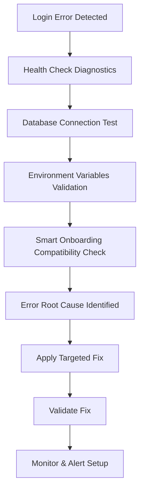

# Design Document

## Overview

Ce document décrit l'approche systématique pour diagnostiquer et résoudre l'erreur de serveur interne (500) sur l'endpoint de login dans l'environnement staging, suite au déploiement du Smart Onboarding System. La solution se concentre sur l'identification rapide de la cause racine et la restauration de la fonctionnalité d'authentification.

## Architecture

### Diagnostic Flow



### System Components

1. **Diagnostic Tools**
   - Health check endpoints
   - Database connection validator
   - Environment configuration checker
   - Dependency conflict analyzer

2. **Error Analysis**
   - Structured logging system
   - Error categorization
   - Performance monitoring
   - Context capture

3. **Fix Implementation**
   - Targeted code corrections
   - Configuration updates
   - Database schema validation
   - Dependency resolution

## Components and Interfaces

### 1. Health Check System

```typescript
interface HealthCheckResult {
  service: string;
  status: 'healthy' | 'unhealthy' | 'degraded';
  timestamp: Date;
  details: Record<string, any>;
  error?: string;
}

interface DatabaseHealthCheck {
  connection: boolean;
  queryExecution: boolean;
  migrationStatus: boolean;
  poolStatus: {
    total: number;
    idle: number;
    waiting: number;
  };
}
```

### 2. Error Diagnostic Service

```typescript
interface ErrorDiagnostic {
  errorId: string;
  timestamp: Date;
  endpoint: string;
  errorType: 'database' | 'auth' | 'config' | 'dependency';
  stackTrace: string;
  context: {
    userId?: string;
    userAgent: string;
    ip: string;
    requestBody: Record<string, any>;
  };
  resolution?: string;
}
```

### 3. Configuration Validator

```typescript
interface ConfigValidation {
  requiredVars: string[];
  optionalVars: string[];
  validationRules: Record<string, (value: string) => boolean>;
  results: {
    missing: string[];
    invalid: string[];
    warnings: string[];
  };
}
```

## Data Models

### Error Log Schema

```sql
CREATE TABLE IF NOT EXISTS error_logs (
  id SERIAL PRIMARY KEY,
  error_id VARCHAR(255) UNIQUE NOT NULL,
  timestamp TIMESTAMPTZ DEFAULT NOW(),
  endpoint VARCHAR(255) NOT NULL,
  error_type VARCHAR(50) NOT NULL,
  error_message TEXT NOT NULL,
  stack_trace TEXT,
  user_id INTEGER,
  user_agent TEXT,
  ip_address INET,
  request_data JSONB,
  resolution TEXT,
  resolved_at TIMESTAMPTZ,
  created_at TIMESTAMPTZ DEFAULT NOW()
);
```

### Health Check Schema

```sql
CREATE TABLE IF NOT EXISTS health_checks (
  id SERIAL PRIMARY KEY,
  service_name VARCHAR(100) NOT NULL,
  status VARCHAR(20) NOT NULL,
  timestamp TIMESTAMPTZ DEFAULT NOW(),
  details JSONB,
  response_time_ms INTEGER,
  created_at TIMESTAMPTZ DEFAULT NOW()
);
```

## Error Handling

### 1. Database Connection Errors

```typescript
class DatabaseConnectionError extends Error {
  constructor(
    message: string,
    public readonly connectionString: string,
    public readonly originalError: Error
  ) {
    super(message);
    this.name = 'DatabaseConnectionError';
  }
}
```

### 2. Authentication Errors

```typescript
class AuthenticationError extends Error {
  constructor(
    message: string,
    public readonly errorCode: string,
    public readonly userId?: string
  ) {
    super(message);
    this.name = 'AuthenticationError';
  }
}
```

### 3. Configuration Errors

```typescript
class ConfigurationError extends Error {
  constructor(
    message: string,
    public readonly missingVars: string[],
    public readonly invalidVars: string[]
  ) {
    super(message);
    this.name = 'ConfigurationError';
  }
}
```

## Testing Strategy

### 1. Diagnostic Tests

- **Database Connection Tests**: Vérifier la connectivité et les requêtes
- **Environment Variable Tests**: Valider toutes les variables requises
- **Authentication Flow Tests**: Tester le processus complet de login
- **Smart Onboarding Integration Tests**: Vérifier la compatibilité

### 2. Error Simulation Tests

- **Network Failure Simulation**: Tester la résilience aux pannes réseau
- **Database Timeout Simulation**: Vérifier le comportement lors de timeouts
- **Invalid Configuration Tests**: Tester avec des configurations incorrectes
- **High Load Tests**: Vérifier les performances sous charge

### 3. Recovery Tests

- **Rollback Tests**: Vérifier que le rollback fonctionne correctement
- **Fix Validation Tests**: Confirmer que les corrections résolvent les problèmes
- **Monitoring Tests**: Vérifier que les alertes fonctionnent

## Implementation Plan

### Phase 1: Diagnostic Implementation (1-2 heures)

1. **Create Health Check Endpoints**
   - `/api/health/database` - Test de connexion DB
   - `/api/health/auth` - Test du système d'authentification
   - `/api/health/config` - Validation des variables d'environnement
   - `/api/health/overall` - Status global du système

2. **Implement Error Logging**
   - Structured logging pour tous les endpoints auth
   - Capture du contexte complet des erreurs
   - Stockage sécurisé des logs (sans données sensibles)

3. **Configuration Validator**
   - Vérification de toutes les variables d'environnement
   - Validation des formats et valeurs
   - Rapport détaillé des problèmes de configuration

### Phase 2: Root Cause Analysis (30 minutes - 1 heure)

1. **Database Analysis**
   - Test de connectivité PostgreSQL
   - Vérification des migrations appliquées
   - Analyse des performances des requêtes

2. **Smart Onboarding Impact Analysis**
   - Vérification des conflits de dépendances
   - Analyse des exports/imports
   - Test d'isolation des composants

3. **Environment Comparison**
   - Comparaison staging vs production
   - Identification des différences de configuration
   - Validation des secrets et variables

### Phase 3: Fix Implementation (30 minutes - 2 heures)

1. **Targeted Fixes Based on Root Cause**
   - Database connection fixes
   - Configuration corrections
   - Dependency conflict resolution
   - Code corrections si nécessaire

2. **Validation and Testing**
   - Test des corrections en local
   - Déploiement sur staging
   - Validation complète du flow d'authentification

3. **Monitoring Setup**
   - Configuration des alertes
   - Mise en place du monitoring continu
   - Documentation des corrections appliquées

### Phase 4: Prevention and Documentation (30 minutes)

1. **Rollback Plan Documentation**
   - Procédure de rollback détaillée
   - Scripts de restauration
   - Points de contrôle de validation

2. **Monitoring and Alerting**
   - Configuration des alertes proactives
   - Dashboards de monitoring
   - Procédures d'escalation

## Security Considerations

### 1. Log Security
- Aucune donnée sensible (mots de passe, tokens) dans les logs
- Chiffrement des logs contenant des informations utilisateur
- Rotation automatique des logs

### 2. Health Check Security
- Authentification requise pour les endpoints de diagnostic détaillés
- Rate limiting sur les endpoints de health check
- Pas d'exposition d'informations système sensibles

### 3. Error Handling Security
- Messages d'erreur génériques pour les utilisateurs finaux
- Logs détaillés uniquement accessibles aux administrateurs
- Protection contre les attaques par timing

## Performance Considerations

### 1. Health Check Performance
- Cache des résultats de health check (30 secondes)
- Timeouts appropriés pour éviter les blocages
- Exécution asynchrone des vérifications

### 2. Error Logging Performance
- Logging asynchrone pour éviter l'impact sur les performances
- Batch processing pour les logs
- Compression des logs anciens

### 3. Database Performance
- Connection pooling optimisé
- Requêtes optimisées pour les diagnostics
- Monitoring des performances des requêtes

## Rollback Strategy

### 1. Immediate Rollback (si nécessaire)
```bash
# Rollback to previous commit
git checkout [previous-working-commit]
git push huntaze staging --force

# Revert database migrations if needed
npm run db:rollback
```

### 2. Selective Rollback
- Rollback uniquement des composants Smart Onboarding
- Préservation des autres fonctionnalités
- Test de régression après rollback

### 3. Configuration Rollback
- Restauration des variables d'environnement précédentes
- Rollback des configurations AWS Amplify
- Validation de la restauration

## Monitoring and Alerting

### 1. Real-time Monitoring
- Monitoring des erreurs 500 sur `/api/auth/login`
- Alertes sur les échecs de connexion DB
- Monitoring des performances des requêtes

### 2. Proactive Alerts
- Seuils d'alerte configurables
- Notifications Slack/email pour les erreurs critiques
- Escalation automatique si non résolu

### 3. Dashboard Metrics
- Taux de succès des authentifications
- Temps de réponse des endpoints auth
- Santé globale du système