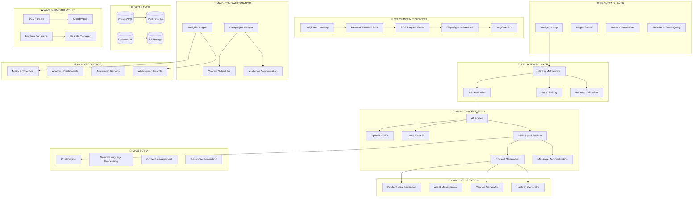

# 🏗️ HUNTAZE - ARCHITECTURE COMPLÈTE D'INTÉGRATION

## 📋 VUE D'ENSEMBLE DE L'ÉCOSYSTÈME



## 🔧 INTÉGRATION DÉTAILLÉE PAR STACK

### 1. 🤖 STACK AI MULTI-AGENT

#### Architecture des Agents
```typescript
// lib/services/ai-router.ts
export class AIRouter {
  private agents: Map<string, AIAgent> = new Map();
  
  constructor() {
    // Initialisation des agents spécialisés
    this.agents.set('content', new ContentGenerationAgent());
    this.agents.set('marketing', new MarketingAgent());
    this.agents.set('chat', new ChatbotAgent());
    this.agents.set('analytics', new AnalyticsAgent());
    this.agents.set('onlyfans', new OnlyFansAgent());
  }

  async routeRequest(request: AIRequest): Promise<AIResponse> {
    const agent = this.selectAgent(request);
    return await agent.process(request);
  }

  private selectAgent(request: AIRequest): AIAgent {
    // Logique de routage intelligent
    if (request.type === 'content_generation') return this.agents.get('content')!;
    if (request.type === 'marketing_campaign') return this.agents.get('marketing')!;
    if (request.type === 'chat_response') return this.agents.get('chat')!;
    if (request.type === 'onlyfans_message') return this.agents.get('onlyfans')!;
    
    return this.agents.get('content')!; // Default
  }
}
```

#### Intégration avec OnlyFans
```typescript
// lib/services/onlyfans-ai-agent.ts
export class OnlyFansAgent extends AIAgent {
  constructor(
    private ofGateway: OnlyFansGateway,
    private contentGen: ContentGenerationService
  ) {
    super();
  }

  async processMessage(request: OnlyFansMessageRequest): Promise<string> {
    // 1. Analyser le contexte de la conversation
    const context = await this.analyzeConversationContext(request.userId);
    
    // 2. Générer une réponse personnalisée
    const response = await this.contentGen.personalizeMessage(
      request.template,
      request.recipient,
      context
    );
    
    // 3. Valider la conformité
    const isCompliant = await this.validateCompliance(response);
    if (!isCompliant) {
      throw new Error('Generated content violates compliance rules');
    }
    
    return response;
  }

  async generateCampaignContent(profile: CreatorProfile): Promise<CampaignContent[]> {
    // Génération de contenu pour campagnes OnlyFans
    const ideas = await this.contentGen.generateContentIdeas(profile, {
      count: 10,
      creativity: 'balanced',
      targetPlatforms: ['onlyfans']
    });

    return ideas.map(idea => ({
      ...idea,
      scheduledFor: this.calculateOptimalTime(profile),
      audience: this.selectTargetAudience(idea, profile)
    }));
  }
}
```

### 2. 📱 STACK ONLYFANS INTEGRATION

#### Browser Worker avec ECS Fargate
```typescript
// src/lib/workers/of-browser-worker.ts
export class BrowserWorkerClient {
  async sendMessage(userId: string, content: string): Promise<SendResult> {
    // 1. Validation du contenu par l'IA
    const aiValidation = await this.validateWithAI(content);
    if (!aiValidation.approved) {
      return { success: false, error: 'Content rejected by AI validation' };
    }

    // 2. Lancement de la tâche ECS Fargate
    const taskResult = await this.runBrowserTask({
      action: 'send',
      userId,
      data: { 
        content,
        validation: aiValidation,
        timestamp: new Date().toISOString()
      }
    });

    // 3. Enregistrement des métriques
    await this.recordMetrics('message_sent', {
      success: taskResult.success,
      duration: taskResult.duration,
      userId
    });

    return {
      success: taskResult.success,
      messageId: taskResult.data?.messageId,
      error: taskResult.error
    };
  }

  private async validateWithAI(content: string): Promise<AIValidation> {
    const aiRouter = new AIRouter();
    return await aiRouter.routeRequest({
      type: 'content_validation',
      data: { content },
      context: { platform: 'onlyfans' }
    });
  }
}
```

#### Intégration avec Analytics
```typescript
// lib/services/onlyfans-analytics.ts
export class OnlyFansAnalyticsService {
  async trackMessagePerformance(messageId: string, metrics: MessageMetrics): Promise<void> {
    // 1. Enregistrer les métriques dans DynamoDB
    await this.dynamodb.putItem({
      TableName: 'huntaze-of-messages',
      Item: {
        messageId: { S: messageId },
        metrics: { S: JSON.stringify(metrics) },
        timestamp: { S: new Date().toISOString() }
      }
    });

    // 2. Mettre à jour les métriques temps réel
    await this.updateRealTimeMetrics(metrics);

    // 3. Déclencher l'analyse IA si nécessaire
    if (metrics.engagement > 0.8) {
      await this.triggerAIAnalysis(messageId, metrics);
    }
  }

  private async triggerAIAnalysis(messageId: string, metrics: MessageMetrics): Promise<void> {
    const aiRouter = new AIRouter();
    await aiRouter.routeRequest({
      type: 'performance_analysis',
      data: { messageId, metrics },
      context: { platform: 'onlyfans' }
    });
  }
}
```

### 3. 🎯 STACK MARKETING AUTOMATION

#### Campaign Manager avec IA
```typescript
// lib/services/marketing-campaign-manager.ts
export class MarketingCampaignManager {
  constructor(
    private aiRouter: AIRouter,
    private ofGateway: OnlyFansGateway,
    private analytics: AnalyticsService
  ) {}

  async createAICampaign(profile: CreatorProfile): Promise<Campaign> {
    // 1. Analyse des performances passées
    const performanceData = await this.analytics.getPerformanceHistory(profile.id);
    
    // 2. Génération de contenu par l'IA
    const content = await this.aiRouter.routeRequest({
      type: 'campaign_generation',
      data: { profile, performanceData },
      context: { platform: 'onlyfans' }
    });

    // 3. Optimisation des horaires
    const schedule = await this.optimizeSchedule(profile, content);

    // 4. Création de la campagne
    const campaign = await this.createCampaign({
      name: `AI Campaign ${Date.now()}`,
      content: content.data,
      schedule,
      targetAudience: await this.selectAudience(profile)
    });

    return campaign;
  }

  async executeCampaign(campaignId: string): Promise<CampaignExecution> {
    const campaign = await this.getCampaign(campaignId);
    const results: MessageResult[] = [];

    for (const message of campaign.messages) {
      // Envoi via OnlyFans Gateway
      const result = await this.ofGateway.sendMessage(
        message.recipientId,
        message.content,
        {
          approvedBy: 'ai-system',
          approvedAt: new Date().toISOString(),
          campaignId
        }
      );

      results.push({
        messageId: message.id,
        success: result.success,
        error: result.error?.message
      });

      // Délai entre les messages pour éviter le rate limiting
      await this.sleep(this.calculateDelay(campaign.settings));
    }

    return {
      campaignId,
      totalMessages: campaign.messages.length,
      successCount: results.filter(r => r.success).length,
      failureCount: results.filter(r => !r.success).length,
      results
    };
  }
}
```

### 4. 🎨 STACK CONTENT CREATION

#### Content Pipeline avec IA
```typescript
// lib/services/content-creation-pipeline.ts
export class ContentCreationPipeline {
  constructor(
    private aiRouter: AIRouter,
    private assetManager: AssetManager,
    private scheduler: ContentScheduler
  ) {}

  async createContentPipeline(profile: CreatorProfile): Promise<ContentPipeline> {
    // 1. Génération d'idées par l'IA
    const ideas = await this.aiRouter.routeRequest({
      type: 'content_ideas',
      data: { profile },
      context: { batch: true, count: 20 }
    });

    // 2. Création des assets
    const assets = await Promise.all(
      ideas.data.map(async (idea: ContentIdea) => {
        return await this.assetManager.createAsset({
          type: idea.contentType,
          title: idea.title,
          description: idea.description,
          tags: idea.tags,
          createdBy: profile.id
        });
      })
    );

    // 3. Génération des captions et hashtags
    const enrichedAssets = await Promise.all(
      assets.map(async (asset) => {
        const [caption, hashtags] = await Promise.all([
          this.generateCaption(asset),
          this.generateHashtags(asset)
        ]);

        return {
          ...asset,
          caption,
          hashtags,
          optimizedFor: ['onlyfans', 'instagram']
        };
      })
    );

    // 4. Planification automatique
    const schedule = await this.scheduler.createOptimalSchedule(
      enrichedAssets,
      profile.preferences
    );

    return {
      id: `pipeline_${Date.now()}`,
      profileId: profile.id,
      assets: enrichedAssets,
      schedule,
      status: 'ready',
      createdAt: new Date()
    };
  }

  private async generateCaption(asset: ContentAsset): Promise<string> {
    return await this.aiRouter.routeRequest({
      type: 'caption_generation',
      data: { asset },
      context: { platform: 'onlyfans', tone: 'engaging' }
    }).then(response => response.data);
  }

  private async generateHashtags(asset: ContentAsset): Promise<string[]> {
    return await this.aiRouter.routeRequest({
      type: 'hashtag_generation',
      data: { asset },
      context: { platform: 'onlyfans', count: 10 }
    }).then(response => response.data);
  }
}
```

### 5. 💬 STACK CHATBOT IA

#### Chatbot Engine avec Context Management
```typescript
// lib/services/chatbot-engine.ts
export class ChatbotEngine {
  constructor(
    private aiRouter: AIRouter,
    private contextManager: ContextManager,
    private ofGateway: OnlyFansGateway
  ) {}

  async processMessage(
    userId: string, 
    message: string, 
    context: ChatContext
  ): Promise<ChatResponse> {
    // 1. Mise à jour du contexte
    await this.contextManager.updateContext(userId, {
      lastMessage: message,
      timestamp: new Date(),
      platform: 'onlyfans'
    });

    // 2. Analyse du sentiment et de l'intention
    const analysis = await this.aiRouter.routeRequest({
      type: 'message_analysis',
      data: { message, context },
      context: { userId }
    });

    // 3. Génération de la réponse
    const response = await this.aiRouter.routeRequest({
      type: 'chat_response',
      data: { 
        message, 
        analysis: analysis.data,
        userContext: await this.contextManager.getContext(userId)
      },
      context: { platform: 'onlyfans' }
    });

    // 4. Validation et envoi
    if (response.data.requiresHumanApproval) {
      await this.requestHumanApproval(userId, response.data);
      return { status: 'pending_approval', message: response.data.content };
    }

    // Envoi automatique
    const sendResult = await this.ofGateway.sendMessage(
      userId,
      response.data.content,
      {
        approvedBy: 'ai-chatbot',
        approvedAt: new Date().toISOString(),
        confidence: response.data.confidence
      }
    );

    return {
      status: sendResult.success ? 'sent' : 'failed',
      message: response.data.content,
      messageId: sendResult.data?.messageId,
      error: sendResult.error?.message
    };
  }

  async trainOnConversations(userId: string): Promise<TrainingResult> {
    // 1. Récupération des conversations
    const conversations = await this.ofGateway.getMessages(userId);
    
    // 2. Analyse des patterns de réussite
    const patterns = await this.aiRouter.routeRequest({
      type: 'pattern_analysis',
      data: { conversations: conversations.data },
      context: { userId, purpose: 'training' }
    });

    // 3. Mise à jour du modèle personnalisé
    await this.updatePersonalizedModel(userId, patterns.data);

    return {
      conversationsAnalyzed: conversations.data?.messages.length || 0,
      patternsFound: patterns.data.patterns.length,
      modelUpdated: true
    };
  }
}
```

### 6. 📊 STACK ANALYTICS

#### Analytics Engine avec AI Insights
```typescript
// lib/services/analytics-engine.ts
export class AnalyticsEngine {
  constructor(
    private aiRouter: AIRouter,
    private metricsCollector: MetricsCollector,
    private reportGenerator: ReportGenerator
  ) {}

  async generateAIInsights(userId: string, timeRange: TimeRange): Promise<AIInsights> {
    // 1. Collecte des métriques
    const metrics = await this.metricsCollector.collect(userId, timeRange);

    // 2. Analyse par l'IA
    const insights = await this.aiRouter.routeRequest({
      type: 'analytics_insights',
      data: { metrics, timeRange },
      context: { userId, platform: 'onlyfans' }
    });

    // 3. Génération de recommandations
    const recommendations = await this.aiRouter.routeRequest({
      type: 'performance_recommendations',
      data: { metrics, insights: insights.data },
      context: { userId }
    });

    return {
      summary: insights.data.summary,
      trends: insights.data.trends,
      recommendations: recommendations.data,
      metrics: {
        revenue: metrics.revenue,
        engagement: metrics.engagement,
        growth: metrics.growth
      },
      generatedAt: new Date()
    };
  }

  async createAutomatedReport(userId: string): Promise<Report> {
    const insights = await this.generateAIInsights(userId, {
      from: new Date(Date.now() - 30 * 24 * 60 * 60 * 1000), // 30 days
      to: new Date()
    });

    return await this.reportGenerator.create({
      userId,
      type: 'monthly_performance',
      insights,
      includeCharts: true,
      includeRecommendations: true
    });
  }
}
```

## 🔄 FLUX DE DONNÉES INTÉGRÉ

### Exemple : Campagne OnlyFans Complète

```typescript
// Orchestration complète d'une campagne
export class CampaignOrchestrator {
  async executeFullCampaign(profileId: string): Promise<CampaignResult> {
    // 1. 🎨 Génération de contenu
    const contentPipeline = await this.contentCreation.createContentPipeline(profile);
    
    // 2. 🤖 Optimisation par l'IA
    const optimizedContent = await this.aiRouter.routeRequest({
      type: 'content_optimization',
      data: { content: contentPipeline.assets },
      context: { platform: 'onlyfans' }
    });

    // 3. 🎯 Création de la campagne marketing
    const campaign = await this.marketing.createAICampaign(profile);

    // 4. 📱 Exécution via OnlyFans
    const execution = await this.marketing.executeCampaign(campaign.id);

    // 5. 💬 Activation du chatbot pour les réponses
    await this.chatbot.activateForCampaign(campaign.id);

    // 6. 📊 Monitoring en temps réel
    const monitoring = await this.analytics.startRealTimeMonitoring(campaign.id);

    return {
      campaignId: campaign.id,
      contentGenerated: contentPipeline.assets.length,
      messagesScheduled: campaign.messages.length,
      executionStatus: execution,
      monitoringActive: monitoring.active
    };
  }
}
```

## 🚀 DÉPLOIEMENT ET MONITORING

### Infrastructure AWS Complète
```yaml
# infra/complete-stack.yaml
Resources:
  # ECS Cluster pour Browser Workers
  ECSCluster:
    Type: AWS::ECS::Cluster
    Properties:
      ClusterName: huntaze-complete-stack

  # DynamoDB pour OnlyFans Data
  OnlyFansTable:
    Type: AWS::DynamoDB::Table
    Properties:
      TableName: huntaze-of-complete
      BillingMode: PAY_PER_REQUEST

  # Lambda pour AI Processing
  AIProcessorFunction:
    Type: AWS::Lambda::Function
    Properties:
      FunctionName: huntaze-ai-processor
      Runtime: nodejs18.x
      Handler: index.handler

  # CloudWatch Dashboard
  MonitoringDashboard:
    Type: AWS::CloudWatch::Dashboard
    Properties:
      DashboardName: huntaze-complete-monitoring
```

### Monitoring Intégré
```typescript
// lib/monitoring/complete-monitoring.ts
export class CompleteMonitoring {
  async trackFullPipeline(event: PipelineEvent): Promise<void> {
    // Track across all stacks
    await Promise.all([
      this.trackAI(event),
      this.trackOnlyFans(event),
      this.trackMarketing(event),
      this.trackContent(event),
      this.trackChatbot(event),
      this.trackAnalytics(event)
    ]);
  }
}
```

## 📈 MÉTRIQUES CLÉS D'INTÉGRATION

- **🤖 AI Performance**: Temps de réponse, qualité des générations
- **📱 OnlyFans Integration**: Taux de succès des messages, engagement
- **🎯 Marketing Automation**: ROI des campagnes, conversion
- **🎨 Content Creation**: Productivité, performance du contenu
- **💬 Chatbot**: Satisfaction utilisateur, taux de résolution
- **📊 Analytics**: Précision des insights, adoption des recommandations

Cette architecture intégrée permet à Huntaze de fonctionner comme un écosystème unifié où chaque stack communique et s'enrichit mutuellement pour maximiser les performances des créateurs OnlyFans.