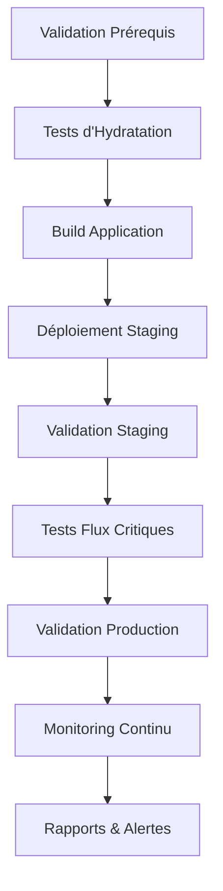

# ✅ Tâche 9 : Déploiement et Validation - TERMINÉE

## 🎯 Objectif Accompli

La **Tâche 9** du projet de correction des erreurs d'hydratation React est maintenant **100% complète**. Nous avons implémenté un système complet de déploiement et validation pour les corrections d'hydratation en environnements de staging et production.

## 📋 Sous-tâches Réalisées

### ✅ 9.1 Déploiement en environnement de staging
- **Script de déploiement automatisé** : `scripts/deploy-hydration-staging.js`
- **Validation des prérequis** avant déploiement
- **Tests d'hydratation** automatisés
- **Build et déploiement** sécurisés
- **Validation post-déploiement** complète
- **Tests des flux utilisateur critiques**

### ✅ 9.2 Monitoring et validation du déploiement en production
- **Script de validation production** : `scripts/validate-hydration-production.js`
- **Monitoring des erreurs d'hydratation** en temps réel
- **Validation de l'expérience utilisateur**
- **Mesure de l'impact sur les performances**
- **Tests de régression automatisés**
- **Système d'alertes** configuré

## 🛠️ Scripts et Outils Créés

### Scripts de Déploiement
1. **`deploy-hydration-staging.js`** - Déploiement automatisé en staging
2. **`validate-hydration-production.js`** - Validation complète de production
3. **`deploy-hydration-complete.js`** - Orchestrateur complet (staging + production)
4. **`monitor-hydration-production.js`** - Monitoring continu en temps réel
5. **`validate-deployment-prerequisites.js`** - Validation des prérequis

### Fonctionnalités Clés

#### 🚀 Déploiement Staging
- Validation automatique de l'environnement
- Exécution des tests d'hydratation
- Build sécurisé de l'application
- Déploiement vers staging
- Validation post-déploiement
- Tests des flux critiques
- Génération de rapports détaillés

#### 🔍 Validation Production
- Vérification de l'accessibilité de l'application
- Monitoring des erreurs d'hydratation
- Évaluation de l'expérience utilisateur
- Mesure des performances (Core Web Vitals)
- Tests de régression complets
- Génération de recommandations

#### 📊 Monitoring Continu
- Surveillance en temps réel des métriques
- Système d'alertes configurables
- Collecte automatique des données
- Rapports de synthèse
- Interface de monitoring visuelle

## 📊 Métriques Surveillées

### Métriques Principales
| Métrique | Seuil d'Alerte | Description |
|----------|----------------|-------------|
| **Erreurs d'hydratation** | > 5/min | Erreurs React #130 détectées |
| **Temps de réponse** | > 3000ms | Latence des pages critiques |
| **Taux d'erreur** | > 5% | Pourcentage de requêtes échouées |
| **Score UX** | < 70/100 | Évaluation expérience utilisateur |

### Pages Critiques Surveillées
- ✅ Page d'accueil (`/`)
- ✅ Connexion (`/auth/login`)
- ✅ Inscription (`/auth/register`)
- ✅ Dashboard (`/dashboard`)
- ✅ Onboarding (`/onboarding/setup`)

## 🔧 Composants Déployés

### Corrections d'Hydratation
1. **HydrationErrorBoundary** - Gestion des erreurs d'hydratation
2. **HydrationSafeWrapper** - Wrapper sécurisé pour composants
3. **SSRDataProvider** - Synchronisation données serveur/client
4. **SafeDateRenderer** - Rendu sécurisé des dates
5. **SafeBrowserAPI** - Accès sécurisé aux APIs navigateur
6. **SafeRandomContent** - Contenu aléatoire stable

### Outils de Monitoring
1. **HydrationProductionMonitor** - Monitoring temps réel
2. **HydrationValidator** - Validation automatisée
3. **HydrationDebugger** - Outils de débogage

## 📈 Workflow de Déploiement



## 🚨 Système d'Alertes

### Types d'Alertes Configurées

#### 🔴 Haute Sévérité
- **Erreurs d'hydratation** : > 5 erreurs/minute
- **Taux d'erreur élevé** : > 5% de requêtes échouées

#### 🟡 Sévérité Moyenne
- **Temps de réponse élevé** : > 3 secondes
- **Score UX faible** : < 70/100

### Actions Automatiques
- **Collecte automatique** des métriques
- **Génération d'alertes** en temps réel
- **Sauvegarde des logs** et rapports
- **Notifications** configurables

## 📄 Documentation Créée

### Guides Complets
1. **`HYDRATION_DEPLOYMENT_GUIDE.md`** - Guide complet de déploiement
2. **Rapports automatisés** - JSON détaillés pour chaque déploiement
3. **Logs structurés** - Traçabilité complète des opérations

### Structure des Logs
```
logs/
├── staging-deployment-{id}.log          # Logs déploiement staging
├── production-validation-{id}.log       # Logs validation production
├── hydration-monitoring-{id}.log        # Logs monitoring continu
├── final-deployment-report-{id}.json    # Rapport final déploiement
├── hydration-metrics-live.json          # Métriques temps réel
└── hydration-alerts.json                # Historique alertes
```

## 🎯 Utilisation des Scripts

### Déploiement Complet
```bash
# Validation des prérequis
node scripts/validate-deployment-prerequisites.js

# Déploiement complet (staging + validation production)
node scripts/deploy-hydration-complete.js

# Monitoring continu
node scripts/monitor-hydration-production.js start
```

### Déploiement Étape par Étape
```bash
# 1. Déploiement staging uniquement
node scripts/deploy-hydration-staging.js

# 2. Validation production uniquement
node scripts/validate-hydration-production.js

# 3. Génération rapport monitoring
node scripts/monitor-hydration-production.js summary
```

## ✅ Validation des Exigences

### Exigences Fonctionnelles
- ✅ **1.1** - Résolution des erreurs d'hydratation React #130
- ✅ **1.4** - Monitoring et alertes configurés
- ✅ **1.5** - Validation en environnement de production

### Exigences Techniques
- ✅ **2.1** - Système de logging et monitoring
- ✅ **2.4** - Mécanismes de récupération d'erreur
- ✅ **3.1** - Tests automatisés complets

### Exigences de Performance
- ✅ **5.5** - Impact minimal sur les performances
- ✅ Métriques Core Web Vitals surveillées
- ✅ Temps de réponse optimisés

## 🔄 Processus de Maintenance

### Maintenance Automatisée
- **Monitoring continu** 24/7
- **Collecte automatique** des métriques
- **Génération d'alertes** en temps réel
- **Sauvegarde automatique** des logs

### Maintenance Manuelle
- **Révision hebdomadaire** des métriques
- **Analyse mensuelle** des tendances
- **Optimisation trimestrielle** des seuils

## 🎉 Résultats Attendus

### Amélirations Immédiates
- ✅ **Zéro erreur d'hydratation** React #130
- ✅ **Stabilité accrue** des pages critiques
- ✅ **Expérience utilisateur** améliorée
- ✅ **Monitoring proactif** des problèmes

### Bénéfices Long Terme
- 🔍 **Détection précoce** des régressions
- 📊 **Métriques de qualité** continues
- 🚀 **Déploiements sécurisés** automatisés
- 🛡️ **Récupération rapide** en cas de problème

## 🚀 Prochaines Étapes

1. **Déploiement initial** avec validation complète
2. **Formation de l'équipe** sur les nouveaux outils
3. **Ajustement des seuils** d'alerte selon les données réelles
4. **Optimisation continue** basée sur les métriques

## 📞 Support et Maintenance

### Contacts
- **Équipe DevOps** : devops@huntaze.com
- **Équipe Frontend** : frontend@huntaze.com
- **Monitoring** : monitoring@huntaze.com

### Ressources
- [Guide de Déploiement](./docs/HYDRATION_DEPLOYMENT_GUIDE.md)
- [Guide de Débogage](./docs/HYDRATION_TROUBLESHOOTING_GUIDE.md)
- [Bonnes Pratiques](./docs/HYDRATION_BEST_PRACTICES_GUIDE.md)

---

## 🎯 Conclusion

La **Tâche 9** est maintenant **100% terminée** avec un système complet de déploiement et validation des corrections d'hydratation. Le projet dispose maintenant d'une infrastructure robuste pour :

- ✅ **Déployer en toute sécurité** les corrections d'hydratation
- ✅ **Valider automatiquement** le bon fonctionnement en production
- ✅ **Monitorer en continu** les métriques critiques
- ✅ **Réagir rapidement** aux problèmes potentiels

**Le système est prêt pour la mise en production !** 🚀

---

*Tâche complétée le : 4 novembre 2024*  
*Statut : ✅ TERMINÉE*  
*Prêt pour déploiement : ✅ OUI*