# Guide de Déploiement des Corrections d'Hydratation

## Vue d'ensemble

Ce guide détaille la **Tâche 9** du projet de correction des erreurs d'hydratation React : le déploiement et la validation de la solution en environnements de staging et production.

## Objectifs

- ✅ Déployer les corrections d'hydratation en staging
- ✅ Valider le fonctionnement en production
- ✅ Monitorer les métriques d'hydratation
- ✅ Assurer la stabilité des flux utilisateur critiques

## Architecture de Déploiement

### Phase 1: Déploiement Staging (Tâche 9.1)

```mermaid
graph TD
    A[Validation Environnement] --> B[Tests d'Hydratation]
    B --> C[Build Application]
    C --> D[Déploiement Staging]
    D --> E[Validation Déploiement]
    E --> F[Tests Flux Critiques]
    F --> G[Rapport Staging]
```



### Phase 2: Validation Production (Tâche 9.2)

```mermaid
graph TD
    A[Validation Déploiement] --> B[Monitoring Erreurs]
    B --> C[Validation UX]
    C --> D[Impact Performance]
    D --> E[Tests Régression]
    E --> F[Rapport Production]
```



## Scripts de Déploiement

### 1. Déploiement Staging Complet

```bash
# Déploiement automatisé en staging
node scripts/deploy-hydration-staging.js

# Ou déploiement complet (staging + validation production)
node scripts/deploy-hydration-complete.js
```

### 2. Validation Production

```bash
# Validation manuelle de la production
node scripts/validate-hydration-production.js
```

### 3. Monitoring Continu

```bash
# Démarrer le monitoring (intervalle par défaut: 60s)
node scripts/monitor-hydration-production.js start

# Monitoring avec intervalle personnalisé (30s)
node scripts/monitor-hydration-production.js start 30

# Générer un rapport de monitoring
node scripts/monitor-hydration-production.js summary
```

## Composants Déployés

### Corrections d'Hydratation

1. **HydrationErrorBoundary** - Gestion des erreurs d'hydratation
2. **HydrationSafeWrapper** - Wrapper sécurisé pour composants
3. **SSRDataProvider** - Synchronisation données serveur/client
4. **SafeDateRenderer** - Rendu sécurisé des dates
5. **SafeBrowserAPI** - Accès sécurisé aux APIs navigateur
6. **SafeRandomContent** - Contenu aléatoire stable

### Outils de Monitoring

1. **HydrationProductionMonitor** - Monitoring temps réel
2. **HydrationValidator** - Validation automatisée
3. **HydrationDebugger** - Outils de débogage

## Métriques Surveillées

### Métriques Principales

| Métrique | Seuil d'Alerte | Description |
|----------|----------------|-------------|
| Erreurs d'hydratation | > 5/min | Nombre d'erreurs React #130 |
| Temps de réponse | > 3000ms | Latence des pages critiques |
| Taux d'erreur | > 5% | Pourcentage de requêtes échouées |
| Score UX | < 70/100 | Évaluation expérience utilisateur |

### Pages Critiques Surveillées

- **Page d'accueil** (`/`)
- **Connexion** (`/auth/login`)
- **Inscription** (`/auth/register`)
- **Dashboard** (`/dashboard`)
- **Onboarding** (`/onboarding/setup`)

## Flux de Déploiement

### Prérequis

```bash
# Variables d'environnement requises
export DATABASE_URL="postgresql://..."
export NEXTAUTH_SECRET="your-secret"
export NEXTAUTH_URL="https://your-domain.com"
export PRODUCTION_URL="https://huntaze.com"
export STAGING_URL="https://staging.huntaze.com"
```

### Étapes de Déploiement

#### 1. Préparation

```bash
# Vérifier l'environnement
npm run test -- tests/unit/hydration
npm run test -- tests/integration/hydration

# Valider les composants
node scripts/validate-hydration-build.js
```

#### 2. Déploiement Staging

```bash
# Déploiement automatisé
node scripts/deploy-hydration-staging.js

# Vérification manuelle
curl -f https://staging.huntaze.com/api/health/overall
```

#### 3. Validation Production

```bash
# Validation complète
node scripts/validate-hydration-production.js

# Vérification des métriques
curl -s https://huntaze.com/api/monitoring/hydration-production
```

#### 4. Monitoring Continu

```bash
# Démarrer le monitoring
node scripts/monitor-hydration-production.js start

# Surveiller les alertes
tail -f logs/hydration-alerts.json
```

## Gestion des Alertes

### Types d'Alertes

#### 🔴 Haute Sévérité
- **Erreurs d'hydratation** : > 5 erreurs/minute
- **Taux d'erreur élevé** : > 5% de requêtes échouées

#### 🟡 Sévérité Moyenne
- **Temps de réponse élevé** : > 3 secondes
- **Score UX faible** : < 70/100

### Actions Correctives

#### En cas d'erreurs d'hydratation
1. Vérifier les logs d'application
2. Identifier les composants problématiques
3. Appliquer les corrections nécessaires
4. Redéployer les corrections

#### En cas de performance dégradée
1. Analyser les métriques Core Web Vitals
2. Optimiser les composants lents
3. Vérifier la charge serveur
4. Ajuster les ressources si nécessaire

## Rapports et Logs

### Structure des Logs

```
logs/
├── staging-deployment-{id}.log          # Logs de déploiement staging
├── production-validation-{id}.log       # Logs de validation production
├── hydration-monitoring-{id}.log        # Logs de monitoring
├── final-deployment-report-{id}.json    # Rapport final de déploiement
├── hydration-metrics-live.json          # Métriques en temps réel
└── hydration-alerts.json                # Historique des alertes
```

### Exemple de Rapport Final

```json
{
  "orchestrationId": "hydration-deployment-1699123456789",
  "timestamp": "2024-11-04T10:30:00.000Z",
  "status": "success",
  "phases": {
    "staging": {
      "status": "success",
      "url": "https://staging.huntaze.com",
      "componentsFixed": 6,
      "testsRun": 4
    },
    "production": {
      "status": "success",
      "hydrationErrors": 0,
      "userExperienceScore": 85,
      "performanceMetrics": {
        "LCP": 1800,
        "FID": 45,
        "CLS": 0.08
      }
    }
  },
  "summary": {
    "hydrationErrorsResolved": true,
    "stagingDeploymentSuccessful": true,
    "productionValidationSuccessful": true,
    "overallSuccess": true
  }
}
```

## Rollback et Récupération

### Procédure de Rollback

```bash
# En cas de problème critique
git revert HEAD~1  # Annuler le dernier commit
npm run build      # Rebuild
# Redéployer la version précédente
```

### Plan de Récupération

1. **Détection du problème** via monitoring
2. **Évaluation de l'impact** sur les utilisateurs
3. **Décision de rollback** si critique
4. **Communication** aux équipes
5. **Correction** et nouveau déploiement

## Tests de Validation

### Tests Automatisés

```bash
# Tests unitaires d'hydratation
npm run test -- tests/unit/hydration

# Tests d'intégration
npm run test -- tests/integration/hydration

# Tests E2E critiques
npm run test:e2e -- tests/e2e/hydration
```

### Tests Manuels

1. **Navigation** sur toutes les pages critiques
2. **Interactions** utilisateur (formulaires, boutons)
3. **Rechargement** de pages pour tester l'hydratation
4. **Différents navigateurs** et appareils

## Maintenance et Optimisation

### Maintenance Régulière

- **Hebdomadaire** : Révision des métriques et alertes
- **Mensuelle** : Analyse des tendances de performance
- **Trimestrielle** : Optimisation des seuils d'alerte

### Optimisations Continues

1. **Analyse des patterns** d'erreurs d'hydratation
2. **Optimisation des composants** les plus problématiques
3. **Amélioration des outils** de monitoring
4. **Formation de l'équipe** sur les bonnes pratiques

## Ressources Additionnelles

- [Guide de Débogage Hydratation](./HYDRATION_TROUBLESHOOTING_GUIDE.md)
- [Bonnes Pratiques Hydratation](./HYDRATION_BEST_PRACTICES_GUIDE.md)
- [Documentation API Monitoring](../api/MONITORING_API.md)

## Support et Contact

Pour toute question ou problème :
- **Équipe DevOps** : devops@huntaze.com
- **Équipe Frontend** : frontend@huntaze.com
- **Monitoring** : monitoring@huntaze.com

---

*Dernière mise à jour : 4 novembre 2024*